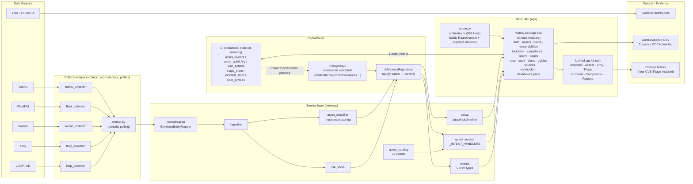

# MORI SOC — Audit-Ready Security Operations

[🇰🇷 한국어 README](./README.md) · **🇬🇧 English (this page)**


-yellow)


## TL;DR

A one-line (`docker compose up -d`) **ISMS-P / ISO 27001 audit-evidence accumulation platform**. Integrates Zabbix · FleetDM · Wazuh · Trivy · Loki to operate assets / vulnerabilities / alerts / incidents + control checks on a single screen (`/ui`), automatically accumulating every change with *who / when / what* metadata.

- 🎯 **Target audience** — Small to mid-sized organizations with 1–2 security staff + IT helpdesk preparing for ISMS-P / ISO 27001
- 🚀 **One-line start** — `./scripts/mori-start-demo.sh` → `http://localhost:18000/ui` (`admin / 1234`, demo only)
- 📊 **Screens** — Unified dashboard · Alert Triage · Incidents · Assets / Vulnerabilities · Compliance PDCA · 5 audit-evidence CSV/PDF reports
- 🌐 **Multi-language UI** — Korean / English toggle on every page (login, dashboard, admin console); moved from a fixed top-right widget into the **account menu (👤)**, persisted in a cookie + localStorage and switches instantly without a reload
- 👤 **User profile + My Servers** — Save name · department · assigned servers to your account, and view only your assets in a dedicated **⭐ My Servers** view
- 🧾 **Automatic evidence** — Asset owner/importance, host/CVE-level remediation plans & exceptions, Triage & Incident state changes
- ⚠️ **Alpha** — Seed + in-memory store based. PostgreSQL persistence and real-time pollers are next milestones (see [Integrations & Roadmap](#-integrations--roadmap))

> ⚠️ **Alpha / Work in Progress** — Day-to-day security operations + audit-evidence accumulation scenarios work, but data persistence and real-time polling are next milestones. Actual data is based on **seed (sample data) + in-memory store**.

A lightweight SOC platform built by integrating open-source security tools so that **evidence, control checks, and remediation history required for ISMS-P / ISO 27001 audits** can be collected, managed, and exported in one place.

> **Goal:** A "Compliance-Evidence Platform" that lets IT helpdesk + 1 designated owner at a small/mid-sized organization deploy with a single `docker compose` command, running ISMS-P / ISO 27001 preparation alongside daily security operations.

| Area | Tool | MORI's role |
|---|---|---|
| Infrastructure monitoring | Zabbix | Asset state / availability evidence |
| Log centralization | Loki + Fluent Bit | Log collection & retention evidence |
| Endpoint management | FleetDM | Asset identification & configuration checks |
| Security events | Wazuh | Alert detection & triage evidence |
| Vulnerability scanning | Trivy | Vulnerability checks, remediation plans & exceptions evidence |
| Visualization | Grafana | Operational dashboards |
| Unified operations UI | **MORI API** (`/ui`) | Unified controls/assets/vulns/alerts/incidents + audit log |

---

## 🗺️ Architecture Diagram



> Solid lines = current operating flow. PostgreSQL holds **normalized seed data** (hosts/alerts/vulns/observations) which is loaded into InMemoryRepository at boot for queries. The 6 UI operational stores (triage / incidents / asset owners / vuln actions / asset audit log / user profiles) currently run in-memory; the **dashed line = next milestone (Postgres persistence + activating real-time pollers)**.
>
> **API structure (Task J done):** `server.py` is now a **thin orchestrator (888 lines)** that assembles in-memory state and helper closures into a `RouteContext`, then registers 16 domain modules. Each endpoint is owned by `register_<domain>(ctx)` in `routes/<domain>.py`, and the 6 in-memory stores are shared across modules via the `RouteContext`.

---

## 🎯 Core Concept — Audit-Ready

The "who, when, with what data, made what decision" trail that audits frequently require is automatically accumulated across every compliance-sensitive area.

| Area | Recorded change | Storage |
|---|---|---|
| Asset owner / team / category / **importance** | `field`, `old_value`, `new_value`, `changed_by`, `changed_at` | `asset_audit_log` (per host) |
| Host-level remediation plan / exception | Same (plan text, target date, exception expiry, reason) | `asset_audit_log` |
| **CVE-level remediation plan / exception** | Labels like `vuln_plan_text [CVE-…]` / `vuln_exception_until [CVE-…]` consolidated into the same host history | `asset_audit_log` (viewed per-host via 📋 history modal) |
| Alert Triage state change (🔴🟡🟢) | `status`, `note`, `analyst`, `changed_by`, `changed_at` | `triage_store` + history |
| Incident change history | State / assignee / impact / note changes + author/time | Incident history (`/incidents/{id}/history`) |

### Host-level vs CVE-level — UX consistency

A guidance modal automatically surfaces so that host-level bulk plans don't conflict with CVE-level detailed plans.

- If a host has **any CVE-level remediation plan/exception**, host-level edits trigger a *"Detailed plans are configured. Please check the totals tab."* modal that directs the user to the totals tab (CVE-level edit screen).
- Change history is consolidated chronologically — host-level + CVE-level changes appear together in a single 📋 history modal per host.

---


## 🗺️ Current Status at a Glance

### ✅ What works now — Seed + in-memory store based

| Category | Feature | Notes |
|---|---|---|
| **Auth/RBAC** | Login / session / RBAC (per-role tab on·off) / signup request & approval | Demo accounts `admin` / `security` / `monitor` (password `1234`) — **seeded sample data only · demo only. Must be changed for production** |
| **Overview** | Asset/alert/vuln summary cards + Critical vulnerability detail modal exposing **plan / exception** columns | Per-host progress visible right on the dashboard |
| **Assets (Server / PC / Trivy)** | Per-host owner/team/category edits + **manual override of server asset importance** | Takes priority over auto-classification (asset_classifier). Audit log records every change |
| **Vulnerability management (Trivy)** | Host-level remediation plan / exception + **per-CVE detailed plan / exception** | Author / target date / expiry / reason recorded. Conflict guidance modal |
| **🚨 Alert Triage** | 3-tier state (🔴🟡🟢) change, analyst·**actor** separation, history display | If actor is omitted on UI, falls back to session user → "unknown" |
| **📋 Incident management** | Create / state change / note / date filter / text search / CSV download + change history | CSV download triggers "history not included" guidance modal |
| **✅ Compliance PDCA** | Plan/Do/Check/Act 4-stage cards, per-category Pass/Fail/Warning table | **Click Do card → unified pending items modal** (controls + Trivy + Alerts) |
| **Pending / overdue** | Control checks (fail/warning) + Trivy critical/high + Alerts critical/high (7-day) unified view | **📥 CSV download** (`/compliance/pdca/pending.csv`) |
| **📥 Audit-evidence reports** | 5 types (asset/account/log/vuln/monthly) CSV + **PDF** (NanumGothic embedded) | **🔍 Preview modal** (top 50 rows + CSV/PDF download buttons) |
| **📡 Source Freshness · Collector Lag** | Per-collector last-success timestamp · lag · SLA threshold visualization (`/dashboard` `source_coverage`) | Card/table shown on Admin Overview + user dashboard |
| **🔀 Cross-validation** | Zabbix × Fleet × Trivy host mapping diff / unmapped asset detection | source_coverage / orphan check |
| **💬 Natural language queries (FAB)** | 12-intent dispatch (alert_summary, offline_hosts, top_vulnerable_hosts, host_timeline, …) | `/interpret` + `/query` |
| **📚 Guide system** | 7 guide types with admin on/off + direct editing | ISMS-P / ISO 27001 operations guides |
| **🌐 Multi-language (KO/EN)** | **In-account-menu** toggle on login, dashboard, and admin pages + `data-i18n` static substitution + `window.t()` dynamic messages | Persisted in cookie / localStorage; active tab re-renders instantly on toggle |
| **👤 User profile / ⭐ My Servers** | Account menu → profile edit (name · department · assigned servers) + **My Servers** sub-tab in Assets | Filters Fleet+Zabbix hosts where `assigned_servers` matches or `owner == display_name` |
| **API docs** | Swagger `/docs` | Auto-generated by FastAPI |

> ⚠️ **Storage separation notice** — PostgreSQL holds **normalized seed security data** (hosts/alerts/vulnerabilities/observations etc.), loaded into InMemoryRepository at boot for queries. Meanwhile, the **6 UI operational state stores** (triage / incidents / asset owners / vuln actions / asset audit log / user profiles) are currently in-memory dicts within the API process, so they **reset on restart**. There is **no dedicated Postgres schema/repository mapping for these 6 stores yet** — `schema/002_phase2_compliance_identity.sql` covers normalized identity/compliance entities (control checks, directory accounts, etc.) and is unrelated to the 6 stores. Persistence requires a new schema (`schema/003_*`) plus a repository-layer extension (Task J consolidated the 6 stores into the `RouteContext`, simplifying the injection point).

### 🟡 In progress / Next steps (next milestone)

| Item | Status | Priority |
|---|---|---|
| **UI operational state → PostgreSQL persistence** | No dedicated schema/repository mapping for the 6 stores yet (needs new `schema/003_*` + repository extension). Injection point simplified via `RouteContext` | 🔴 High |
| **Zabbix API polling** | Collector implementation complete (`collectors/zabbix_events.py`), integration verification ongoing | 🔴 High |
| **Fleet / Wazuh API polling** | Parser·Collector ready, REST poller (`pollers/fleet.py`, `pollers/wazuh.py`) not yet connected | 🔴 High |
| **Trivy JSON ingestion** | Collector implementation complete, scheduled-run packaging in progress | 🔴 High |

### 🔲 Planned / Future work

| Item | Status | Priority |
|---|---|---|
| LDAP authentication operational adoption | Code ready, activates when `LDAP_URL` is set | 🟡 Medium |
| Slack / Email webhook notifications | Not connected (`SLACK_WEBHOOK_URL` slot exists only) | 🟡 Medium |
| Phase 3 — investigative multi-hop pivot agent | Not started | 🟢 Low |

---

## 🚀 Quick Start

### Demo mode (sample data)

```bash
# One line: generate .env → start API → schema/seed → demo incidents → worker
./scripts/mori-start-demo.sh
```

→ Log in at `http://localhost:18000/ui` with `admin / 1234`.

### Stop demo

```bash
./scripts/mori-stop-demo.sh             # Delete seed data + stop containers (preserve real poller data)
./scripts/mori-stop-demo.sh --keep      # Delete seed only, keep containers
./scripts/mori-stop-demo.sh --purge     # Remove containers + volumes entirely
```

### Demo screen preview

When demo mode is started, the platform behaves as follows.

#### 1) Unified dashboard — Asset / alert / vuln status at a glance


- Top cards: Total Hosts / Offline Hosts / High Alerts 24h / Critical Vulns
- Latest Host Status: prioritizes offline / unknown hosts for immediate attention
- **Source Freshness · Collector Lag** card: Fleet/Wazuh/Zabbix/Trivy collector last_sync + lag + SLA
- User dashboard tabs: **Dashboard / Alert Triage / Incidents / Asset status / Compliance PDCA / Guides & Standards** (RBAC per-role on·off)
- **Admin console (/admin) 8 tabs** (Phase 2 reorg): Overview · Compliance · Triage & Incidents · Remediation · Assets / Owners · Access Control · Audit & Logs · Settings (per-role exposed tabs auto-restricted)

#### 2) Natural language queries (NLQ) — `interpret` → `query`


- Enter a Korean question like "오프라인 호스트 보여줘" (Show offline hosts) and it maps to the matching intent out of 12
- **Interpret** → intent shown (`offline_hosts`) / **Run Query** → results + summary text / **Download CSV** → evidence-purpose download
- Result table: Source / Summary / Record ID

#### 3) Vulnerabilities (Trivy) — Per-CVE remediation plans & exceptions


- Per-host Critical / High / Medium / Low totals + recent CVEs / detection date
- **Plan** / **Exception** columns: `+ Add plan` / `+ Set exception` buttons or current value display
- When a host has host-level plan/exception set, "📋 Per-CVE detailed plans" / expiry surfaces immediately, and within the **CVE detail modal (N items ↗ button)** a host-level plan/exception banner + per-CVE row marker ("host-level applied") confirms scope
- **📋 History** button shows unified per-host change history (asset · plan · exception · CVE-level actions)

### Demo public server (Demo Only)

> ⚠️ **The URLs and accounts below are a portfolio-demo instance.** Seed data + in-memory store; not real operational data. In production you **must redeploy with your own domain, HTTPS, and strong passwords**.

| Item | Demo value | Notes |
|---|---|---|
| MORI Web UI (main portal) | `mori.rmstudio.co.kr:37854` | Demo only |
| MORI API / unified ops UI | `mori.rmstudio.co.kr:18000/ui` | Demo only |
| Grafana | `mori.rmstudio.co.kr:13000` | Demo only |
| Zabbix Web | `mori.rmstudio.co.kr:18081` | Demo only |
| FleetDM | `mori.rmstudio.co.kr:1337` | Demo only |
| Demo accounts | `admin` / `security` / `monitor` (password `1234`) | **seeded sample data only · demo only. Must change passwords + reconfigure RBAC immediately for production** |

Deployment behavior: `docker compose down && docker compose up -d` (GitHub Actions rsyncs to `/backup/rmstudio/mori` then runs the same).

### Individual scripts

```bash
./scripts/mori-seed-sample-data.sh        # (Re)insert sample data only
./scripts/mori-run-workers.sh start       # Start workers
./scripts/mori-run-workers.sh status      # Status
./scripts/mori-run-workers.sh cycle       # Manual single collection cycle
./scripts/mori-run-workers.sh logs        # Logs
./scripts/mori-run-workers.sh stop        # Stop workers
./scripts/mori-backup.sh                  # pg_dump → backups/mori-soc-<ts>.dump
./scripts/mori-restore.sh backups/<file>.dump  # pg_restore (confirmation prompt, --force to skip)
./scripts/trivy-fs-scan.sh .              # Filesystem vulnerability scan
./scripts/trivy-image-scan.sh <image>     # Image vulnerability scan
```

---


## 🧱 Architecture / Module Layout

```text
src/mori_soc/
├── api/
│   ├── server.py          ← thin orchestrator (888 lines): builds RouteContext + registers modules
│   ├── routes/            ← 16 domain route modules (register_<domain>(ctx))
│   │   ├── context.py     ← RouteContext (stores + helper closures, ~35 fields)
│   │   ├── auth.py · assets.py · alerts.py · vulnerabilities.py
│   │   ├── incidents.py · compliance.py · query.py · pages.py
│   │   ├── rbac.py · audit.py · plans.py · guides.py · sources.py
│   │   └── webhooks.py · dashboard_prefs.py
│   ├── templates.py       ← /ui · /login · dashboard · console HTML/JS renderers
│   ├── payloads.py        ← dashboard/pdca/query payload builders
│   ├── i18n.py            ← UI localization strings
│   ├── auth.py            ← session middleware · credential verify · default role perms
│   └── contracts.py       ← QueryRequest/Response, EvidenceRef, QueryScope
├── collectors/            ← Fleet · Wazuh · Zabbix · Trivy · LDAP collectors
├── pollers/               ← Per-source periodic pollers (worker.py orchestrates)
├── services/
│   ├── normalization.py   ← EnvelopeEntityMapper (host auto-creation, alias registration)
│   ├── ingestion.py       ← Collection ingestion pipeline
│   ├── risk_score.py      ← Risk score calculation
│   ├── query_catalog.py   ← 12 intent definitions (TemplateQuery)
│   ├── query_service.py   ← Intent dispatch (_INTENT_HANDLERS registry)
│   ├── views.py           ← Logical view aggregation (latest_host_status / risk_summary / timeline)
│   ├── reports.py         ← 5-type audit-evidence report builder + report_to_csv
│   └── asset_classifier.py← Asset auto-classification + importance scoring (manual override supported)
├── repositories/
│   ├── memory.py          ← InMemoryRepository / InMemoryQueryStore (loaded from seed, used for queries — current)
│   └── postgres.py        ← Postgres repository (holds normalized seed + UI state persistence mapping prepared)
├── models/entities.py     ← Host, HostAlias, Alert, Vulnerability, ControlCheckResult …
└── worker.py              ← Poller orchestrator
```

### Storage separation

| Storage area | Current status | Location |
|---|---|---|
| **Normalized security data** (hosts / alerts / vulnerabilities / observations / fleet_query_results / control_checks / directory_accounts / source_syncs …) | PostgreSQL **seed schema + seed data** loaded. Boot-time load into InMemoryRepository for queries | `schema/001_phase1_initial.sql`, `repositories/postgres.py`, `repositories/memory.py` |
| **UI operational state — 6 in-memory stores** (reset on restart) | Created by `server.py`, injected via `RouteContext`, shared/mutated by domain route modules. Postgres persistence not yet connected | `api/server.py` → `api/routes/context.py` |
| Phase 2 persistence (6 stores → Postgres) | 🔲 Planned — no dedicated schema/repository mapping yet (needs new `schema/003_*` + repository extension). `schema/002` is for identity/compliance entities and is unrelated | — |

#### In-memory 6-store detail

| Variable | Content |
|---|---|
| `asset_owners` | hostname → {owner, team, importance, category, …} |
| `asset_audit_log` | hostname → list of {field, old_value, new_value, changed_by, changed_at} |
| `vuln_actions` | vuln_id → {plan_text, plan_target_date, plan_updated_by, exception_until, exception_reason, exception_updated_by} |
| `triage_store` | alert_id → {status, analyst, note, changed_by, changed_at, history[]} |
| `incident_store` | incident_id → {…, history[]} |
| `user_profiles` | username → {display_name, department, assigned_servers[], updated_at} |

→ Phase 2's next milestone is to **map the 6 stores above to PostgreSQL tables** for persistence.

### 12 natural language query intents

| # | intent | Description |
|---|---|---|
| 1 | `alert_summary` | High/critical alert summary for last N hours |
| 2 | `offline_hosts` | Currently offline/unknown hosts |
| 3 | `fleet_checkin_gap` | Hosts missing Fleet check-ins |
| 4 | `top_vulnerable_hosts` | Top N hosts by vulnerability count |
| 5 | `host_timeline` | Host timeline (alert+query+obs merged) |
| 6 | `host_wazuh_alerts` | Wazuh alerts for a specific host |
| 7 | `host_fleet_queries` | Fleet query results for a specific host |
| 8 | `new_high_vulns` | Recent newly-detected high+ vulnerabilities |
| 9 | `risky_hosts` | Hosts with many alerts + offline/unknown |
| 10 | `unmapped_assets` | Assets unmapped across Fleet/Wazuh/Zabbix |
| 11 | `login_failure_spike` | Hosts with login failure spikes |
| 12 | `collection_errors` | Hosts with repeated collection errors |

#### Adding a new intent

`QueryService._INTENT_HANDLERS` is a dict that dispatches intent → handler method. Adding a new intent is 3 steps.

1. `services/query_catalog.py` — Add `TemplateQuery` to `PHASE1_QUERY_CATALOG`
2. `services/query_service.py` — Add `"my_new_intent": "_my_new_intent"` to `_INTENT_HANDLERS` + implement handler method
3. `tests/test_query_service.py` — Add behavior test

`execute()` requires no modification — auto-routes.

---

## 🔌 Key API Endpoints

| Category | Method / Path | Description |
|---|---|---|
| Health / Catalog | `GET /health`, `GET /catalog` | Health check (DB ping + freshness + insecure defaults), query catalog |
| Auth / Profile | `POST /auth/login`, `GET /auth/logout`, `GET /auth/me`, `GET/POST /auth/profile` | Login/session + user profile (name·department·assigned servers) get·upsert. `/auth/me` merges profile |
| Query | `POST /query`, `POST /interpret` | Structured query / NL interpretation |
| Dashboard | `GET /dashboard/summary` | Overview cards + Critical vulnerability detail (plan/exception included) |
| Assets | `GET /assets`, `POST /assets/owners` | Asset list / owner·importance change (audit log) |
| Alert Triage | `PATCH /alerts/{id}/triage` | State/analyst/note change + actor recording |
| Vulnerability Actions | `PUT/DELETE /vulnerabilities/{id}/plan`, `/exception` | Per-CVE plan·exception + audit log |
| Incidents | `GET /incidents`, `POST /incidents`, `PATCH /incidents/{id}`, `GET /incidents/{id}/history`, `GET /incidents?format=csv` | Incident CRUD + history + CSV |
| Compliance | `GET /compliance/pdca`, `GET /compliance/crosscheck` | PDCA aggregation / cross-validation |
| **Compliance CSV** | `GET /compliance/pdca/pending.csv` | Pending/overdue CSV (source/control_id/target/state/owner/due_date/overdue/note) |
| Reports | `GET /compliance/reports`, `GET /compliance/reports/{type}?format=csv\|pdf` | 5-type audit-evidence reports (asset/account/log/vuln/monthly). PDF embeds NanumGothic |

Full spec at Swagger `/docs`.

---


## 🧪 Tests

### Unit tests (Docker)

```bash
# Fastest: run all tests in the running container
docker compose cp tests/test_api_server.py mori-api:/app/tests/test_api_server.py
docker compose exec mori-api python -m unittest tests.test_api_server

# Specific test class only
docker compose exec mori-api python -m unittest tests.test_api_server.FastAPIAppTests

# One-shot when container is not running
docker compose run --rm \
  -v "$(pwd)/tests:/app/tests:ro" \
  mori-api \
  python -m unittest discover -s /app/tests
```

### Test file list

| File | Target |
|---|---|
| `tests/test_api_server.py` | FastAPI endpoints, PDCA payload, Triage actor, Compliance integration |
| `tests/test_query_service.py` | 12 query intents + view aggregation |
| `tests/test_fleet_logs.py` | Fleet osquery log collector |
| `tests/test_wazuh_alerts.py` | Wazuh alert collector |
| `tests/test_zabbix_events.py` | Zabbix trigger/item collector |
| `tests/test_trivy_collector.py` | Trivy vulnerability collector |
| `tests/test_ingestion.py` | Ingestion pipeline |
| `tests/test_intent_parser.py` | NL → intent parser |
| `tests/test_postgres_repository.py` | Postgres repository (requires DB) |

### Manual API tests

```bash
curl http://localhost:18000/health
curl http://localhost:18000/dashboard/summary
curl http://localhost:18000/compliance/pdca
curl -OJ http://localhost:18000/compliance/pdca/pending.csv
curl http://localhost:18000/compliance/crosscheck
curl http://localhost:18000/compliance/reports
curl -OJ "http://localhost:18000/compliance/reports/asset_inspection?format=csv"

curl -X POST http://localhost:18000/interpret \
  -H 'Content-Type: application/json' \
  -d '{"text":"Show offline hosts"}'

curl -X POST http://localhost:18000/query \
  -H 'Content-Type: application/json' \
  -d '{"intent":"offline_hosts","scope":{"time_range":"24h"}}'

# PDF audit-evidence report (NanumGothic embedded)
curl -OJ "http://localhost:18000/compliance/reports/monthly_operations?format=pdf"
```

### Backup / restore

```bash
./scripts/mori-backup.sh                          # Creates backups/mori-soc-<timestamp>.dump
./scripts/mori-restore.sh backups/<file>.dump     # Restore after confirmation
./scripts/mori-restore.sh backups/<file>.dump --force   # Skip confirmation
docker compose restart mori-api                   # Reload snapshot after restore
```

### Code validation (when editing routes / templates)

Task J split routes into `api/routes/` and HTML/JS renderers into `api/templates.py`. To guarantee a lossless refactor, run the **3-gate check** after changes:

```bash
# 1) OpenAPI route diff — registered paths/methods/schema match the baseline
#    compare _routes_snapshot.py output against _routes_baseline.json → must be IDENTICAL
# 2) Rendered-template SHA — 6 hashes (login/signup/dashboard/console) match baseline
#    python /app/_verify_templates.py
# 3) Full unit-test suite
docker compose run --rm --no-deps -e MORI_DEMO_SEED=0 \
  -v "$(pwd)/tests:/app/tests" -v "$(pwd)/src:/app/src" \
  mori-api python -m unittest discover -s tests   # → 115 OK (skipped=2)
```

Each domain's routes are owned by `register_<domain>(ctx)` in `routes/<domain>.py`; shared state/helpers are injected via the `RouteContext` in `routes/context.py`.

---

## 📦 Deployment / Infrastructure

### Public entry points

| Port | Service |
|---|---|
| `37854` | Main Portal (Grafana / Zabbix / Fleet / MORI link hub) |
| `18000` | MORI API + unified ops UI |
| `13000` | Grafana |
| `18081` | Zabbix Web |
| `1337` | FleetDM |
| `127.0.0.1:8443` | Wazuh Dashboard (internal) |

### Service ports

`10051` Zabbix Server · `1514` Wazuh agent · `1515` Wazuh registration · `514/udp` Syslog · `55000` Wazuh API.

### Deployment flow

The GitHub Actions workflow runs in this order:

1. Repo checkout
2. Create/verify `/backup/rmstudio/mori` on the server
3. `rsync` the code
4. Upload `.env` from GitHub Secrets
5. Prepare Wazuh certificates directory (first-run certificate generation)
6. `docker compose pull` → `docker compose up -d --remove-orphans`

**Required GitHub Secrets**: `DEPLOY_HOST`, `DEPLOY_PORT`, `DEPLOY_USER`, `DEPLOY_SSH_KEY`, `DEPLOY_ENV_FILE`, `DEPLOY_KNOWN_HOSTS` (optional).

### Required environment variables (`.env`)

Run `cp .env.example .env` and **change the following values** before deploying:

- `GRAFANA_ADMIN_PASSWORD`
- `ZABBIX_DB_PASSWORD`
- `FLEET_DB_ROOT_PASSWORD`
- `FLEET_DB_PASSWORD`
- `FLEET_SERVER_PRIVATE_KEY`
- `MORI_DB_PASSWORD`
- `MORI_API_PORT` (default 18000), `MORI_DB_NAME` (default mori_soc), `MORI_DB_USER` (default mori)

### Server prerequisites

- Docker Engine + Compose plugin
- Deployment directory: `/backup/rmstudio/mori`
- Wazuh Indexer kernel parameter: `vm.max_map_count=262144`

### Rebuild without cache (preserve data volumes)

```bash
docker builder prune -f
docker compose build --no-cache mori-api
docker compose up -d mori-api
```

---


## 🌱 Seeded sample data

The seed script (`mori-seed-sample-data.sh`) **loads into PostgreSQL** (then loaded into InMemoryRepository at boot for queries):

| Item | Count | Description |
|---|---|---|
| Hosts | 10 | Servers, PCs, firewall, VPN — mixed asset types |
| Host Aliases | 13 | Per-source (Zabbix/Fleet/Trivy) mapping |
| Alerts | 8 | Wazuh/Zabbix — SSH brute force, rootkit, disk/CPU alerts, etc. |
| Vulnerabilities | 8 | Trivy 6 + Fleet 2 — CVE-based critical to medium |
| Observations | 9 | Zabbix/Fleet — CPU, Disk, Memory, encryption status |
| Fleet Query Results | 8 | osquery — installed apps, disk encryption, startup programs, etc. |
| Control Checks | 12 | ISO 27001 / ISMS-P control check results |
| Directory Accounts | 7 | LDAP users (admin, developer, DBA, etc.) |
| Privilege Bindings | 6 | sudo, domain_admin, db_admin permissions |
| Group Memberships | 8 | Domain Admins, Developers, DBA, etc. |
| Source Syncs | 4 | Zabbix/Fleet/Trivy/Wazuh collection state |

Items generated in the API's in-memory store (reset on restart):

| Item | Count | Generated when |
|---|---|---|
| Incidents | 3 | `mori-start-demo.sh` calls `POST /incidents` after seeding |
| Triage / asset owners / user profiles | Seeded when `MORI_DEMO_SEED=1` | Injected in-memory at app startup (see below) |
| Vulnerability actions / incident changes | 0 | Accumulate as you edit in the UI |

> 🌱 **`MORI_DEMO_SEED`** — When `1/true`, the app injects demo data in-memory at startup: `triage_store` (4 entries across reviewing/resolved/pending), `asset_owners` (web-server-01·02 / db-primary / app-server-01), and `user_profiles` (`admin`=System Admin / `security`=Security Officer with assigned-server mappings). Hostnames/alert IDs match the SQL seed so the **⭐ My Servers** view lines up with real assets. Default `1` in `docker-compose.yml`; **set to `0` for production deployments**.

---

## 📖 Reference documents

| Document | Content |
|---|---|
| `docs/FUNCTIONAL_SPEC.md` | Original functional spec (Korean) |
| `docs/SECURITY_CONTROL_MAPPING.md` | Security controls mapping |
| `docs/IMPLEMENTATION_ROADMAP.md` | Implementation roadmap against the functional spec |
| `docs/SECURITY_DATA_QUERY_PLATFORM.md` | Data-centric security query platform design |
| `docs/MORI_IMPLEMENTATION_SUMMARY.md` | Implementation status / ops strategy / next steps |
| `docs/PHASE1_INPUT_SOURCES_AND_SCHEMA.md` | Phase 1 input sources, schema, query specs |
| `docs/PHASE1_LOGICAL_SCHEMA.md` | Phase 1 logical schema, table relations |
| `docs/DEPLOYMENT.md` | Server deployment / ops / troubleshooting |
| `docs/ZABBIX_AGENT_ACTIVE_SETUP.md` | Zabbix Agent onboarding |
| `docs/TRIVY_USAGE.md` | Trivy filesystem / image scanning guide |
| `docs/FLEET_MACBOOK_ENROLLMENT_AND_TEST.md` | Fleet macOS enrollment + verification |
| `docs/FLEET_RESET_AND_REINSTALL_GUIDE.md` | Fleet reset / reinstall |
| `docs/collection-standards.md` | Collection standards |
| `schema/001_phase1_initial.sql` | Phase 1 Postgres initial DDL |
| `schema/002_phase2_compliance_identity.sql` | Phase 2 Compliance / Identity DDL |

> ℹ️ Most documents under `docs/` are currently in Korean. Translation is on the roadmap; see [`docs/MORI_IMPLEMENTATION_SUMMARY.md`](docs/MORI_IMPLEMENTATION_SUMMARY.md) for the implementation summary that has been kept up to date in English-friendly form.

---


## 🔌 Integrations & expansion roadmap

MORI SOC combines open-source security tools to provide a single ops screen, with the longer-term ambition to **distribute it as a Zabbix-ecosystem template / lightweight Agent package**. The goal is that organizations running Zabbix only can also partially adopt MORI's asset / control-check / evidence-accumulation concepts.

### Current integrations (Phase 1 / Phase 2 Alpha)

| Tool | Integration | Status |
|---|---|---|
| **Zabbix** | trigger / item collector (`collectors/zabbix_events.py`) → ingestion. Accumulates asset availability + CPU/Disk/Memory observations | 🟡 Integration verification in progress |
| **FleetDM** | osquery results + host registration normalization. Asset identification + unmapped (orphan) detection | 🟡 Parser/collector ready, REST poller not yet connected |
| **Wazuh** | alert ingestion → triage pipeline. SSH brute force / rootkit and other security event evidence | 🟡 Parser/collector ready, REST poller not yet connected |
| **Trivy** | JSON result ingest → per-CVE remediation plan / exception + host-level bulk apply | 🟡 Auto-ingestion packaging in progress |
| **Loki + Fluent Bit** | Log centralization (Grafana visualization downstream) | ✅ Operational |
| **LDAP / AD** | Directory account + privilege binding consistency checks (seed) | 🔲 Activates with `LDAP_URL` in production |
| **Grafana** | Operational dashboards that query Postgres / Loki directly | ✅ Operational |

## 🗺️ Phase roadmap (Phase 2 → 4)

> MORI is at **Phase 1 (data collection/normalization core) complete + Phase 2 Alpha (Audit-Ready ops & evidence UI)**. The following is the long-term direction; each Phase builds on the previous one — Phase 2 (make it operational) → Phase 3 (assist judgment) → Phase 4 (adoption & ecosystem).

### Phase 2 — Persistent Evidence & Security Signal Integration

*Persist the operational state that currently lives in memory to PostgreSQL, and connect Zabbix/Trivy/CVE Lite/Fleet/Wazuh signals into real operational data flows.*

| ID | Work | Status |
|---|---|---|
| **J** (foundation) | Split `server.py` into modules — i18n / templates / auth / payloads + a `routes/` package (16 domain modules, `RouteContext`). **2,962→888 lines (-70%)**, lossless-verified (OpenAPI diff · SHA · 115 tests). A refactor that lowers regression risk for the persistence/poller work that follows | ✅ Done |
| **M2-1** | Persist the 6 UI operational state stores (`asset_owners`·`asset_audit_log`·`vuln_actions`·`triage_store`·`incident_store`·`user_profiles`) to PostgreSQL — needs a new `schema/003_*` + repository-layer extension (no dedicated schema/mapping for the 6 stores today). Injection simplified by the `RouteContext` seam | 🔲 Top priority |
| **M2-2** | Zabbix API polling integration verification — trigger/item → ingestion → alert/observation → triage → incident | 🟡 Collector done, verifying |
| **M2-3** | Fleet / Wazuh REST poller connection — host/osquery·alert → asset/triage, reflect `source_syncs` freshness | 🔲 Parser·Collector ready |
| **M2-4** | Trivy JSON ingestion automation — `trivy-*-scan.sh` output → vulnerabilities → vuln_actions → reports | 🟡 Automation packaging |
| **M2-5** | Add CVE Lite collector — JS/TS lockfile dependency vulnerability source (`source=cve_lite`, direct/transitive, fix_command) | 🔲 New |
| **M2-6** | MORI → Zabbix Template/export — `templates/zabbix/mori-soc-template.yaml` + `mori-zabbix-export-metrics.py` (critical/high/pending/lag metrics) | 🔲 New |

### Phase 3 — Guided Investigation & Evidence Assistant

*Based on the accumulated data/evidence, help a single security operator decide "what to look at first." Not AI auto-patching — limited to investigation/summary assistance.*

| ID | Work |
|---|---|
| **P3-1** | Evidence Gap Detector — Critical/High without a plan, exceptions expiring soon, completed items without a rescan, untriaged alerts, closed incidents without an exported report |
| **P3-2** | Guided Triage Summary — alert/finding summary + affected assets · related CVEs/triggers · recent observations · recommended check points |
| **P3-3** | Multi-source Investigation Pivot — Zabbix problem → host → Fleet/Wazuh/Trivy → user/ip/process → expand to same owner/team assets |
| **P3-4** | Audit Report Draft — monthly Critical/High · remediated/pending/exception · evidence gaps · SLA breaches summary draft |
| **P3-5** | Control Mapping Assistant — map Findings/Incidents to ISMS-P / ISO 27001 control candidates (applied after operator approval) |

> 🚫 **Phase 3 hard limits**: no auto-patch / auto-exception-approval / auto-incident-close. **Judgment assistance only.**

### Phase 4 — Deployment, Ecosystem & Small-Team Adoption

*Real adoptability and ecosystem. So that a small/mid org with no dedicated infra staff can drive ISMS-P/ISO 27001 compliance with a single security operator.*

| ID | Work |
|---|---|
| **P4-1** | MORI Lite packaging — lightweight stack (API/UI + PostgreSQL + Trivy + CVE Lite) vs MORI Full Demo (Zabbix/Fleet/Wazuh/Loki/Grafana) |
| **P4-2** | Zabbix-only Adoption Pack — Zabbix template + export script + `docs/zabbix-only.md` (Trivy/CVE Lite results → zabbix_sender without a full MORI install) |
| **P4-3** | ISMS-P / ISO 27001 Evidence Pack — per-control sample reports (`docs/evidence-pack/`): vulnerability management, logging/monitoring, monthly report, exception register, action plan |
| **P4-4** | Integration Marketplace structure — organize `integrations/{zabbix,trivy,cvelite,wazuh,fleet,ldap}` connector structure/docs (real plugin system later) |
| **P4-5** | Operational hardening — HTTPS/reverse proxy, LDAP/AD production rollout, backup/restore verification, upgrade guide, `SECURITY.md`·`CONTRIBUTING.md`·`CHANGELOG.md`, release checklist |
| **P4-6** | Demo scenario / video — compose up → Trivy import → Zabbix alert → CVE plan → exception → Incident → audit PDF → check via Zabbix template (5–8 min) |

### Other backlog

- **Webhook integrations** — Slack / Teams / Email notifications (`SLACK_WEBHOOK_URL` slot exists only)
- **SQL-based read optimization** — gradually move snapshot reads to Postgres views

---

## 🔁 Prompt to resume work elsewhere

Fastest context-restoration prompt when continuing work in a different environment:

```
This repo is MORI SOC-lite (Audit-Ready Compliance-Evidence Platform).
Phase 1 (data collection/normalization core) is complete; Phase 2 (ops query
engine + ops UI) is in Alpha. Read the "Current Status at a Glance" section of
Task J (server.py modularization) is done — the API is now src/mori_soc/api/server.py
(orchestrator) + src/mori_soc/api/routes/ (16 domain modules, RouteContext).
Read the README, routes/context.py, docs/SECURITY_DATA_QUERY_PLATFORM.md,
and schema/*.sql, then continue with the next priorities (persistence + real-time polling).
```

### Short version

```
Continue Phase 2 persistence / real-time polling work for this MORI SOC-lite repo.
Read the README's "🗺️ Current Status", src/mori_soc, and schema/*.sql, then proceed.
```

---

## 📌 Current status summary

| Area | Status |
|---|---|
| Auth · RBAC · Assets · Vulns · Triage · Incidents · PDCA · Evidence reports | ✅ Operational (in-memory; resets on restart) |
| Admin console 8 tabs (Phase 2 layout) + per-role tab auto-restriction | ✅ Operational |
| KO/EN language toggle (moved to account menu) + user profile + ⭐ My Servers view | ✅ Operational |
| Asset / Vuln / Triage / Incident **change audit log** | ✅ Accumulates (with per-CVE label) |
| Click PDCA Do card → pending modal + CSV download | ✅ Operational |
| Audit-evidence report preview modal + **PDF download** (NanumGothic) | ✅ Operational (5 types CSV + PDF) |
| Source Freshness · Collector Lag · SLA card | ✅ Operational (Admin Overview + user dashboard) |
| pg_dump-based backup/restore scripts | ✅ Operational (`scripts/mori-backup.sh` / `mori-restore.sh`) |
| Incident CSV "history not included" guidance modal | ✅ Operational |
| Dashboard asset / alert data | ⚠️ Seed + in-memory based (real-time polling not connected) |
| PostgreSQL — normalized security data (Phase 1 schema) | ✅ Seeded + loaded at boot |
| PostgreSQL — UI operational state 6-store persistence (Phase 2) | 🔲 Incomplete (no dedicated schema/mapping for the 6 stores — needs new `schema/003_*` + repository extension) |
| Zabbix API polling | 🟡 In progress (collector complete, integration verification) |
| Fleet / Wazuh API polling | 🔲 Incomplete (Parser·Collector ready, REST poller not connected) |
| Trivy JSON ingestion | 🟡 In progress (collector complete, automation packaging) |

Try the full feature set with `./scripts/mori-start-demo.sh`.
For production deployments, apply changes with `docker compose down && docker compose up -d`.
