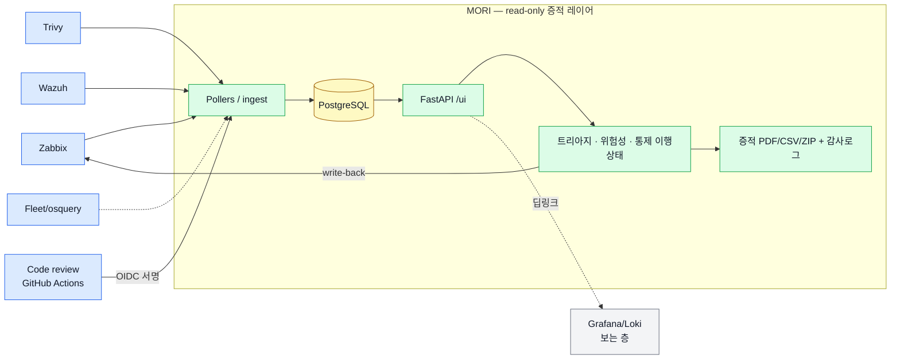

# MORI SOC — 감사 대응형 보안 운영 플랫폼

[English](./README.md) · **한국어 (이 페이지)** · [상세 가이드](./README_FULL.ko.md)

[](https://github.com/saranf/mori-soc/actions/workflows/test.yml)

-yellow)


---

`docker compose up -d` 한 줄로 띄우는 **ISMS-P / ISO 27001 증적 자동 누적 플랫폼**.
기존 **Zabbix · FleetDM · Wazuh · Trivy · Loki** 위에 read-only로 얹혀, 자산·취약점·경보·인시던트·통제 점검을 한 화면(`/ui`)에서 운영하고 **모든 변경을 _누가·언제·무엇을·어떤 근거로_ 자동 기록**합니다.

> **"보는 층"이 아니라 "증적 층"** — 시계열·로그 시각화는 Grafana/Loki에 위임하고, MORI는 그 위에서 **판단·기록·증명**(트리아지 → 조치 → 통제 매핑 → 증적 PDF → 감사 로그)을 담당합니다.

**MORI가 중심으로 삼는 단 하나의 흐름** (아래 모든 기능은 이걸 위해 존재):

```
소스 → 수집 → 사람의 판단 → 통제 → 증적 승인 → 감사 패키지
```

1. **수집** — 기술 신호를 받음(Zabbix/Fleet/Trivy/코드 스캔이 구조화 결과를 push, MORI는 코드를 읽지 않음)
2. **기록** — 사람의 판단을 남김(트리아지·확정/예외·담당자 확인)
3. **보존** — 버전·해시체인 통제 증적으로 고정(승인 → 불변 스냅샷)
4. **재현** — 감사 기준일의 상태를 그대로 복원(as-of 재생 + 서명된 증적 번들)

대표 시나리오 3개: **운영 경보 → 판단 → 증적** · **코드 개인정보 → 담당자 확인 → 개인정보 패키지** · **통제 버전 변경 → 증적 영향**. 나머지(모니터링·취약점·인시던트·**개인정보/코드리뷰/계정 거버넌스는 확장 모듈**)는 이 중심축에 붙는 소스·버티컬이지 헤드라인이 아닙니다.

> **대상 — 한 플랫폼, 두 청중**: **(1) ISMS-P를 준비하는 국내 팀** — 국내 인증 실무 흐름, 한국어 우선. **(2) 자체 호스팅 ISO 27001 증적 레이어가 필요한 해외 팀** — 이미 쓰는 도구 위에 read-only로 얹는, Vanta/Drata의 오픈·셀프호스트 대안.

> **정직함이 기본** — 카탈로그는 현재 **194개 중 58개 검토완료(reviewed)**, 나머지 136개는 초안(draft)으로 **UI에 `draft` 라벨** 표시됩니다. 커버리지 %는 검토완료 **+ 증적 연결** 통제만 집계 — 부풀리지 않습니다. 감사 신뢰성이 핵심이라 숫자는 정직하게 둡니다.

<!-- ═══════════════════════════════════════════════════════════════════════
      스크린샷 가이드 ① — 대표 이미지(README 맨 위에 크게 들어가는 첫 화면)
     "히어로 이미지"라고도 부릅니다. README를 열면 가장 먼저 보이는 한 장이라,
     이 스크린샷이 MORI를 "한 장으로 설명"하는 얼굴입니다. 가장 잘 나온 화면으로.

     ▸ 어디서   : admin 계정으로 로그인 → /ui 첫 화면(통합 대시보드)
     ▸ 무엇을   : 아래가 한 프레임(스크롤 없이)에 모두 보이게 캡처
                  · 상단 KPI 카드 4개 — Total Hosts / Offline Hosts /
                    High Alerts 24h / Critical Vulns (숫자가 0이 아닌 데모 시드 상태)
                  · Latest Host Status 표 (offline/unknown 호스트가 위로)
                  · 좌측(또는 상단) 탭 메뉴 — 대시보드/Triage/인시던트/자산/Compliance
     ▸ 팁       : 브라우저 폭 ≈1280px, 라이트 테마, 실호스트명·개인정보 없는 데모 데이터.
                  가로로 길게(파노라마)보다 상단 영역이 꽉 차게 찍어야 대표 이미지로 좋음.
     ▸ 저장     : docs/images/01-dashboard.png  (지금 걸린 demo-dashboard.png 교체)
     ▸ 넣는 법  : 위 경로에 저장 → 아래 27번째 줄의 이미지 경로에서
                  demo-dashboard.png → 01-dashboard.png 로만 바꾸면 끝
     ═══════════════════════════════════════════════════════════════════════ -->


---

## 아키텍처 한눈에



> **설계 문서:** [아키텍처 & DB ERD](docs/DB_ERD.md) · [API 설계](docs/API_DESIGN.md) · [수집 기준](docs/collection-standards.md). 상세 → [상세 가이드](./README_FULL.md).

---

## 한눈에

- **대상** — 보안 담당자 1~2명 + IT 헬프데스크로 ISMS-P / ISO 27001을 준비하는 중소형 조직
- **한 줄 시작** — `./scripts/mori-start-demo.sh` → `http://localhost:18000/ui` (`admin / 1234`, 데모 전용)
- **핵심 가치** — 기존 도구를 **대체하지 않고**, 그 운영 데이터를 감사 증적으로 전환하는 기본 read-only 레이어

> **기본은 읽기 전용.** MORI는 명시적으로 켜지 않는 한 소스 시스템에 쓰지 않습니다. 유일한 예외는 **옵트인·감사되는 Zabbix write-back**(triage 코멘트/ack/suppress) — `MORI_ZABBIX_WRITEBACK_MODE`를 설정해야만 동작하고, 모든 쓰기는 감사로그에 남습니다. 그 외는 전부 수집/읽기 전용입니다.

## 핵심 기능

MORI는 **3층 구조**입니다 — 코어가 제품이고, 나머지는 코어에 꽂힙니다:

- **코어(제품)** — 통제 ↔ 판단 ↔ 증적: 통제 거버넌스·증적 신뢰/승인/신선도·Gap 워크플로·감사 패키지.
- **증적 소스(플러그인)** — Zabbix · Fleet · Trivy · Wazuh · 코드 리뷰가 구조화 신호를 넣어줌.
- **버티컬(확장 모듈)** — 개인정보(3.x) · 계정 거버넌스 · 취약점 조치.

아래 표는 그 3층에 걸친 전체 목록입니다(평평한 기능 나열이 아님):

| 기능 | 요약 |
|---|---|
| **통합 운영 UI** | 대시보드 · Alert Triage · 인시던트 · 자산/취약점 · Compliance PDCA를 한 화면(`/ui`)에서 |
| **위험성 평가** | CVE별 3×3 매트릭스 = 영향도(자산 중요도) × 발생가능성 → **점수(1~9)** + 위험처리 결정·잔여위험·DoA 자동분류 (admin·security) |
| **통제 카탈로그** | ISMS-P 101 + ISO 27001:2022 93 = **194 인증기준**(한/영) — **58 검토완료 · 136 초안**(초안은 UI에 라벨; 커버리지는 검토완료+증적 연결만 집계) — 트리 + 이행상태 편집·영속 + **admin 직접 편집(추가/수정/삭제)** + **법령 텍스트 NLP 임포트**(Claude/휴리스틱) + **수기 증적 문서화 + 실증적 상세 자동 스냅샷(정기·일괄)** + **증적 문서**(자산 인벤토리 표) **CSV/PDF 다운로드** |
| **코드 보안 리뷰 증적 (SDLC / 2.8)** | 개발보안(ISMS-P 2.8.1·2.8.5 · ISO A.8.25·A.8.28)용 6번째 증적 소스 — 각 레포 CI가 **무료 Semgrep(SAST, 기본)** 또는 **유료 Claude 심층 리뷰**를 돌려 `/ingest/code-review`로 결과를 보냄. **MORI는 코드를 가져오지 않음.** findings는 호스트 없는 `code_review` alert(트리아지 재사용) + **스캔 런 → 2.8 통제 증적 자동 승격**(0건이어도 "통제 작동"). 출처(repo·commit·run)는 **GitHub OIDC 서명으로 검증** — 위조 차단. findings CSV·과거 스캔 소급 반영. UI에서 repo URL+토큰으로 `workflow_dispatch` 원격 스캔. |
| **개인정보 처리흐름도 (개인정보 3.x)** | 스캔이 발견한 **개인정보(주민번호·전화·카드·이메일·성별·생년월일·주소…)**로 **수집→저장→이용→파기** 라이프사이클을 자동 생성 — **무료**(Prisma 스키마·관례 파서: 후보 생성) / **유료 Claude**(시맨틱 보강: 암호화·마스킹·제3자·파기 갭 제안). **기술적 후보 지도이지 법적 판단이 아니며, 모든 결과는 사람 검토가 필요**. 흐름도(SVG)·요약카드·CSV·**감사관용 PDF**, **3.1.1·3.2.1·3.4.1 통제 증적 승격**. 어드민이 **PII 기준(정규식) + 고급 옵션(라우트 매칭·추가 ORM)**을 옵트인. 읽기 전용 증적. (admin·security) |
| **증적 신뢰 층** | 모든 결과에 **출처(provenance)**(CODE/API/RULE/AI/HUMAN/POLICY — 왜 믿을 수 있는가) · **스캔 재현성**(input_signature: repo·commit·scanner·ruleset·model) · **스캔 diff·변경 사유**(신규/삭제 → 코드 vs 룰셋 vs AI) · **증적 승인·버전·불변성**(draft→reviewed→approved→superseded, PDF SHA-256, 과거본 보존) · **기술 Gap 워크플로**(후보→확정→조치→재검증, 조치 기한·예외 만료 — 예외 자동연장 금지) |
| **개인정보 흐름 완성 (3.x)** | 스캔된 개인정보를 **처리업무 초안**으로 자동 그룹화 · **외부 수신자 구분**(위탁/제3자/국외이전 후보 — 담당자 확인) · **처리방침 vs 코드 불일치**(고지 항목·보유기간 vs 현실) · **흐름별 담당자 확인**(사람 판단을 증적으로 고정) · **ISMS-P 3.x 증적 패키지**(ZIP: manifest + CSV + PDF) |
| **감사 실사용** | **통제 증적 신선도·품질**(증적없음/오래됨/검토필요/담당자검증 — '초록 Compliant' 하나로 안 뭉침) · **인증범위 태그·커버리지**(인증범위 자산의 기술 신호 커버 비율) · **위험 기반 감사 표본**(결정적: 고위험 전수 + 계통추출, 재현 가능 패키지) · **월별 evidence change report**(새 증적·승인·Gap·전이를 MORI 데이터에서) |
| **통제 운영 플랫폼** | Framework · Version(불변·content-hash·supersedes) · ControlDefinition(uid 계보 + 해석층 분리) · OrganizationControl(내부통제 하나가 여러 기준 충족) · AssuranceCycle · CycleControl(**증적 상태 ≠ 평가 상태**, append-only history, **as-of 재현**) · EvidenceContract · 버전 diff·운영주기 마이그레이션(담당자·적용성 승계, 평가 초기화) · crosswalk · base+overlay. [통제 운영 플랫폼](docs/CONTROL_GOVERNANCE.md) 참조. |
| **계정 거버넌스** | 서버·PC 로컬 계정(osquery) × LDAP × 승인대장 대조 → 퇴사자 잔존·미등록 특권·미승인 sudo·휴면 검출 · IP 팀/용도 선별 CSV (기본 admin·security, admin이 열람 역할 조정) |
| **자동 증적** | 자산 담당자·중요도, CVE 조치·예외, 위험성 평가, Triage·인시던트 변경을 _who/when/what_ 으로 누적 → **6종 CSV/PDF** |
| **역할별 화면** | 위험성 평가·통제는 admin·security 전용, 인프라·헬프데스크는 **내 담당 서버 조치율**만 |
| **LDAP 통합 (선택)** | 계정 하나로 MORI·Grafana·Zabbix·Fleet 로그인, 가입 승인 시 LDAP 계정 생성, 어드민 콘솔에서 직접 관리 |
| **다국어 UI** | 로그인·대시보드·어드민 전 페이지 한국어/영어 즉시 토글 |
| **영속화** | UI 운영 상태 10종 store를 PostgreSQL에 write-through — 재시작 후에도 유지 |

## 지금 되는 것 / 다음 — 30초 요약

| 지금 되는 것 | 부분 통합 | 다음 |
|---|---|---|
| **Zabbix 실시간 폴링 → alert (실 API 검증)**<br>**Fleet 라이브 폴러 → PC 자산 (실 API 검증)** | Trivy collector 로컬 폴링 | **Fleet 취약점 — 실 CVE 검증** |
| **Trivy/CSOP 원격 push 증적 인제스트** (토큰) | Source freshness / Worker cycle | **Wazuh 라이브 폴러** |
| **코드 리뷰 증적 인제스트** — GitHub OIDC 검증 provenance (2.8/A.8.25) | 실 GitHub Actions 런(실 Postgres E2E 검증, 첫 CI 런 대기) | Reusable workflow · 다중 레포 대시보드 |
| **브라운필드 연결** — `.env` config만으로 | | LDAP/AD 운영 연동 |
| Alert Triage / 인시던트 / **위험성 평가** | | Slack / Email 알림 |
| 로그인·RBAC · PostgreSQL 영속 · CSV/PDF 증적 | | 라이브 조회 캐싱 |

> **Zabbix**는 _problem → 수집 → Triage → Incident → 증적 → 해소_ 전 구간이 실 API로 검증됨. **Fleet**은 **자산 경로가 실 API로 검증**됨(실 osquery 호스트 enroll → 폴링 1주기 → `/assets` 에 PC 자산 + Fleet 딥링크). 취약점 매핑은 구현됐으나 **실 CVE로는 아직 미검증** — [Fleet 연동](docs/FLEET_SETUP_AND_OPERATIONS.md#6-mori-연동-라이브-rest--설정만으로-동작) 참고. **Wazuh** 라이브 폴러는 여전히 스캐폴드 단계입니다.

---

## 빠른 시작

**데모 (샘플 데이터)**
```bash
./scripts/mori-start-demo.sh          # .env 생성 → 기동 → 스키마/시드 → 워커
# → http://localhost:18000/ui  (admin / 1234, 데모 전용)
```

**브라운필드 (기존 Zabbix/Wazuh/Fleet 위에 얹기)**
```bash
docker compose up -d                  # MORI 코어만 (api + worker + postgres)
# .env 에서 기존 인프라 연결:
#   MORI_ZABBIX_API_URL=https://zabbix.your-corp.com/api_jsonrpc.php
#   MORI_ZABBIX_API_TOKEN=<토큰>
docker compose up -d mori-worker      # 재적용
```

> **코어 = 3개 서비스**(postgres · api · worker). 나머지는 opt-in 프로필: `--profile observability`
> (grafana·loki·fluent-bit) · `--profile identity`(openldap·phpldapadmin) · `--profile demo`(데모 풀스택) ·
> `--profile bundled`(자체 Zabbix/Wazuh/Fleet — 무거움, 실API 검증용; 개별 `--profile zabbix`/`fleet`/`wazuh`)
> Wazuh TLS 인증서는 `generate-indexer-certs` 서비스가 자동 생성합니다(수동 작업 없음). **인증서를 파일 단위로 bind-mount 하지 마세요 — 파일이 없으면 Docker가 같은 이름의 빈 디렉터리를 만들고, 서비스는 `is a directory` 로 죽습니다.** 디렉터리 단위로 마운트하세요. → [Wazuh 인증서](docs/WAZUH_CERTS.md)
> 자세한 절차는 [브라운필드 연결 가이드](docs/BROWNFIELD_CONNECT.md).

> **데모 자격증명** — `admin`/`security`/`monitor` (비번 `1234`)는 격리된 **데모 전용**입니다. 운영 배포 시 `.env`의 `MORI_ADMIN_PASSWORD` 변경 + `MORI_DEMO_MODE=false`로 반드시 교체하세요.

---

## 화면 미리보기

> 아래는 데모 모드 기준 화면입니다. `<!-- -->` 블록은 **캡처해서 넣을 스크린샷 가이드**입니다(대상·구도·저장 파일명). 캡처 후 바로 아래 이미지 태그의 주석을 해제하세요.

### 1) 자연어 질의 (NLQ)
"오프라인 호스트 보여줘" 같은 한국어 질문 → 12개 인텐트 중 매칭 → 결과 + 요약 + CSV.


### 2) 취약점 (Trivy) — CVE별 조치 계획·예외
호스트별 Critical/High 합계 + CVE별 조치 계획/예외/만료일 + 변경 이력.


### 3) 위험성 평가 매트릭스


### 4) 통제 카탈로그 (ISMS-P × ISO 27001)


**admin은 카탈로그를 직접 편집**합니다 — 트리에서 통제 수정/삭제, "통제 추가", 그리고
**"법령 텍스트 임포트(NLP)"** 로 CISA·개인정보보호법·고시 전문을 붙여넣으면 통제 초안(draft)으로
자동 변환·저장됩니다(Claude API 키가 있으면 정밀 구조화, 없으면 조항 단위 휴리스틱). 키는
**어드민 UI("Claude 키" 버튼)** 에서 저장하거나 `MORI_ANTHROPIC_API_KEY` 환경변수로 지정합니다 —
**환경변수가 우선**하고, 화면엔 마스킹(`…abcd`)해 보여줍니다. 통제별로 **수기 증적을 문서화**하거나, **"실증적 자동 기록"** 으로 현재 라이브 집계를
**날짜 찍힌 상세 증적으로 스냅샷**할 수 있습니다(통제 취지·이행상태 + 라이브 **실제 호스트 목록**(hostname·IP·상태)까지 캡처).
**정기 스냅샷**(off/매일/매주/매월)을 admin이 설정하면 **부팅·열람 시 도래분을 전 통제 일괄 스냅샷**하고,
**"지금 일괄 스냅샷"** 수동 실행도 됩니다. **증적 문서**는 **CSV 또는 PDF**로 내려받습니다 — 통제 팩이 아니라 **자산 인벤토리 표**(호스트명·IP·상태·소스,
전체) + **문서화 증적 표**만 깔끔하게(화면에선 3건까지만 보이고 "더보기", 다운로드는 항상 전체). 상단
**"전체 증적 ZIP"** 로 전 통제 증적을 **폴더별(프레임워크/통제)로 묶어 한방에 ZIP**(+`INDEX.csv`).
편집·정기설정은 admin 전용, 증적 문서화·ZIP은 admin·security.

### 5) 계정 거버넌스 (접근권한 검토)


계정 탭의 **IP 리스트**는 **팀·용도(자산 소유자 메타)로 선별** 후 **CSV로 내보내기**를 지원합니다
(호스트/IP 검색 + 팀·용도 드롭다운 → `hostname,ip,importance,team,category,status`).

**열람 권한은 admin이 조정합니다.** 기본은 **admin·security** 전용이지만, 어드민 콘솔 **권한 탭 →
"계정 거버넌스 열람 역할"** 에서 인프라(monitor)·감사자 등 다른 역할에게도 열어줄 수 있습니다
(admin은 항상 포함). 저장 후 대상 사용자가 재로그인하면 계정 탭이 보입니다.

### 6) 어드민 콘솔 (/admin)


---

## 문서

| 문서 | 내용 |
|---|---|
| [**상세 가이드 (README_FULL)**](./README_FULL.ko.md) | 아키텍처·API·테스트·배포·로드맵 전체 레퍼런스 |
| [시작하기 (신규 사용자)](docs/GETTING_STARTED.md) | 데모 기동 → 첫 운영 → 운영 전환 (한/영) |
| [기존 스택 연결 (브라운필드)](docs/BROWNFIELD_CONNECT.md) | `.env`만으로 read-only 연결 (한/영) |
| [LDAP 통합 인증](docs/LDAP_INTEGRATION.md) | 계정 하나로 MORI·Grafana·Zabbix·Fleet (한/영) |
| [코드 리뷰 증적](docs/CODE_REVIEW_EVIDENCE.md) | SDLC/2.8 증적 소스 · 무료/유료 2모드 · OIDC provenance · 고객 셋업 |
| [개인정보 처리흐름도](docs/PERSONAL_DATA_FLOW.md) | 개인정보 3.x · 수집→저장→이용→파기 · 처리업무 그룹화 · 외부수신자 구분 · 처리방침 대조 · 담당자 확인 · 3.x 패키지 |
| [통제 운영 플랫폼](docs/CONTROL_GOVERNANCE.md) | 기준 버전·계보·운영주기·증적계약·버전 diff·as-of·crosswalk·overlay |
| [배포 가이드](docs/DEPLOYMENT.md) | 서버 배포·운영·트러블슈팅 |
| [백업·복구](docs/BACKUP_RESTORE.md) | PostgreSQL 덤프=전체 백업 · 복구 · 재해복구 런북 |
| [HTTPS 설정](docs/HTTPS_SETUP.md) | Let's Encrypt·포트 충돌 없는 nginx vhost·서버 실행 |
| [기능 정의서](docs/FUNCTIONAL_SPEC.md) · [로드맵](docs/IMPLEMENTATION_ROADMAP.md) | 기능 명세 / Phase 0~5 구현 로드맵 |

---

## 감사의 글 (Acknowledgements)

MORI의 초기 문제 정의는 보안 운영·개인정보보호·제품 기획을 담당하는 실무자와의 대화를 통해 구체화되었습니다. 그의 피드백은 소규모 팀이 일상적인 운영 활동을 ISMS-P / ISO 27001 증적 준비와 연결할 때 겪는 어려움을 짚어주었습니다.

MORI의 아키텍처·설계 결정, ISMS-P / ISO 27001 통제 매핑, 실 Zabbix·Fleet 환경 통합 테스트는 프로젝트 메인테이너가 수행했습니다.

**AI 사용에 대해 — 있는 그대로:** 구현과 문서의 상당 부분은 AI 코딩 어시스턴트(Claude / Claude Code)로 작성한 뒤 메인테이너가 검토·테스트·수정했습니다. 또한 MORI는 두 곳에서 LLM을 **옵트인 제품 기능**으로 사용합니다 — 법령 텍스트를 **초안(draft)** 통제로 변환하는 기능과, 선택적 심층 코드 리뷰 모드입니다. 둘 다 결과물을 *초안 / 사람 검토 필요* 로 표시하며, **검증된 증적으로 취급하지 않습니다.** 이 프로젝트의 전제는 감사 증적이 정직해야 한다는 것이고, 따라서 모델의 추측을 사실로 제시하지 않습니다.

---

> **Alpha / Work in Progress** — 일상 보안 운영 + 감사 증적 시나리오가 동작하며 UI 운영 상태는 PostgreSQL에 영속화됩니다. Zabbix 실시간 폴링과 Fleet 자산 폴링은 실 API로 검증됨(다른 시드 데이터는 데모용). Wazuh 라이브 연동과 Fleet 취약점(실 CVE) 검증은 다음 단계입니다.
>
> 라이선스: Apache 2.0 · 전체 기능 체험은 `./scripts/mori-start-demo.sh` 한 줄로.
