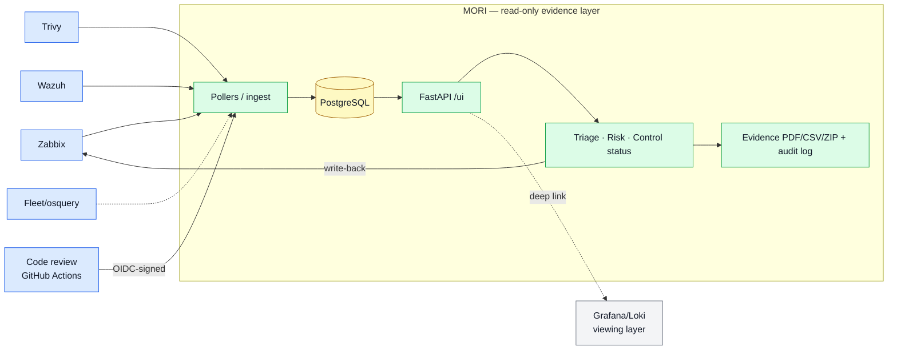

# MORI SOC — Audit-Ready Security Operations

**English (this page)** · [한국어](./README.ko.md) · [Full Guide](./README_FULL.md)

[](https://github.com/saranf/mori-soc/actions/workflows/test.yml)

-yellow)


---

A one-command **ISMS-P / ISO 27001 audit-evidence platform** (`docker compose up -d`).
It sits **read-only on top of your existing** **Zabbix · FleetDM · Wazuh · Trivy · Loki**, runs assets, vulnerabilities, alerts, incidents and control checks from a single screen (`/ui`), and **records every change as _who · when · what · on what basis_ automatically**.

> **An "evidence layer," not a "viewing layer"** — time-series and log visualization are delegated to Grafana/Loki; MORI sits above them to handle **judge → record → prove** (triage → remediation → control mapping → evidence PDF → audit log).

> **Who it's for** — two audiences, one platform: **(1) Korean teams preparing ISMS-P** — the domestic certification workflow, Korean-first; **(2) overseas teams wanting a self-hosted ISO 27001 evidence layer** — an open, self-host alternative to Vanta/Drata that runs read-only on the tools you already have.

> **Honest by design** — the catalog is **58 / 194 controls reviewed** today; the other 136 are draft skeletons, **labeled `draft` in the UI**. Coverage % counts only reviewed **and** evidence-wired controls — no inflation. Audit trust is the whole point, so the numbers stay honest.

<!-- ═══════════════════════════════════════════════════════════════════════
      SCREENSHOT GUIDE ① — hero image (the big first screen at the top of the README)
     It's the first thing readers see, so this one shot is MORI's "explained in a
     single picture" face. Use your best-looking screen.

     ▸ Where    : log in as admin → /ui landing screen (unified dashboard)
     ▸ What      : capture all of the below in one frame (no scrolling)
                  · the 4 KPI cards — Total Hosts / Offline Hosts /
                    High Alerts 24h / Critical Vulns (with non-zero demo-seed numbers)
                  · the Latest Host Status table (offline/unknown hosts on top)
                  · the left (or top) tab menu — Dashboard/Triage/Incidents/Assets/Compliance
     ▸ Tips      : browser width ≈1280px, light theme, demo data (no real hostnames/PII).
                  Fill the top area rather than a wide panorama — reads better as a hero.
     ▸ Save as   : docs/images/01-dashboard.png  (replace the current demo-dashboard.png)
     ▸ How to add: save to that path → on line 27 below, just change the image path
                   demo-dashboard.png → 01-dashboard.png
     ═══════════════════════════════════════════════════════════════════════ -->


---

## Architecture in one look



> **Design docs:** [Architecture & DB ERD](docs/DB_ERD.md) · [API design](docs/API_DESIGN.md) · [collection standards](docs/collection-standards.md). Deep dive → [Full Guide](./README_FULL.md).

---

## At a glance

- **Who it's for** — small/mid orgs preparing ISMS-P / ISO 27001 with 1–2 security staff + IT help desk
- **One-line start** — `./scripts/mori-start-demo.sh` → `http://localhost:18000/ui` (`admin / 1234`, demo only)
- **Core value** — a read-only layer that **does not replace** your tools; it turns their operational data into audit evidence

## Key features

| Feature | Summary |
|---|---|
| **Unified operations UI** | Dashboard · Alert Triage · Incidents · Assets/Vulns · Compliance PDCA on one screen (`/ui`) |
| **Risk assessment** | Per-CVE 3×3 matrix = impact (asset criticality) × likelihood → **score (1–9)** + treatment decision, residual risk, DoA auto-classify (admin·security) |
| **Control catalog** | ISMS-P 101 + ISO 27001:2022 93 = **194 controls** (KO/EN) — **58 reviewed · 136 draft** (drafts labeled in UI; coverage counts reviewed+evidence-wired only) — tree + editable/persisted status + **admin direct edit (add/edit/delete)** + **regulation-text NLP import** (Claude/heuristic) + **documented manual evidence + detailed live-evidence snapshot (scheduled/bulk)** + **evidence document** (asset-inventory tables) **CSV/PDF** |
| **Code-review evidence (SDLC / 2.8)** | A 6th evidence source for **secure development** (ISMS-P 2.8.1·2.8.5 · ISO A.8.25·A.8.28) — each repo's CI runs **free Semgrep (SAST, default)** or **paid Claude deep review** and pushes findings to `/ingest/code-review`; **MORI never fetches code**. Findings become hostless `code_review` alerts (reused in Triage) + **scan run → auto-promoted to 2.8 control evidence** (even 0 findings = "control operated"). Provenance (repo·commit·run) is **verified by GitHub OIDC signature** — forgery-resistant. Findings CSV · backfill past scans. On-demand scan from the UI via `workflow_dispatch`. |
| **Personal-data lifecycle map (Privacy 3.x)** | From PII found by the scan (resident-reg no.·phone·card·email·gender·birth·address…), auto-builds the **collect→store→use→dispose** lifecycle — **free** (Prisma-schema/convention parser, "roughly there") / **paid Claude** (semantic: encryption·masking·3rd-party·disposal gaps, "perfect"). Flow diagram (SVG)·summary cards·CSV·**auditor PDF**, promoted to controls **3.1.1·3.2.1·3.4.1**. Admin opts into **PII criteria (regex) + advanced options (route matching·extra ORM)**. Read-only evidence. (admin·security) |
| **Account governance** | Server/PC local accounts (osquery) × LDAP × approval ledger → detects leavers, unregistered privilege, unapproved sudo, dormant · IP team/purpose CSV export (defaults to admin·security, admin configures view roles) |
| **Automatic evidence** | Asset owner/criticality, CVE remediation/exception, risk assessment, triage & incident changes accrued as _who/when/what_ → **6 CSV/PDF reports** |
| **Role-based views** | Risk & controls are admin·security only; infra/help-desk see **only their own servers'remediation rate** |
| **LDAP SSO (optional)** | One account for MORI·Grafana·Zabbix·Fleet; approval creates the LDAP account; manage users from the admin console |
| **Bilingual UI** | Instant KO/EN toggle across login, dashboard and admin |
| **Persistence** | 10 UI operational-state stores write-through to PostgreSQL — survive restarts |

## Works now / Next — 30-second status

| Works now | Partially integrated | Next |
|---|---|---|
| **Zabbix live polling → alert (real-API verified)** | Trivy collector local polling | **FleetDM live poller** |
| **Trivy/CSOP remote push evidence ingest** (token) | Source freshness / worker cycle | **Wazuh live poller** |
| **Code-review evidence ingest** — GitHub OIDC-verified provenance (2.8/A.8.25) | Live GitHub Actions run (E2E via real Postgres; first CI run pending) | Reusable workflow · multi-repo dashboard |
| **Brownfield connect** — via `.env` config only | | LDAP/AD operational sync |
| Alert Triage / Incidents / **risk assessment** | | Slack / Email alerts |
| Login·RBAC · PostgreSQL persistence · CSV/PDF evidence | | Live-query caching |

> **Zabbix** is verified end-to-end via the real API (_problem → collect → triage → incident → evidence → resolve_). **Fleet / Wazuh** collectors/parsers are ready; live integration is next.

---

## Quick start

**Demo (sample data)**
```bash
./scripts/mori-start-demo.sh          # .env → boot → schema/seed → worker
# → http://localhost:18000/ui  (admin / 1234, demo only)
```

**Brownfield (on top of existing Zabbix/Wazuh/Fleet)**
```bash
docker compose up -d                  # MORI core only (api + worker + postgres)
# Wire existing infra in .env:
#   MORI_ZABBIX_API_URL=https://zabbix.your-corp.com/api_jsonrpc.php
#   MORI_ZABBIX_API_TOKEN=<token>
docker compose up -d mori-worker      # re-apply
```

> Bundled demo stack: `docker compose --profile bundled up -d` (individual: `--profile zabbix`/`fleet`/`wazuh`)
> Full steps in the [Brownfield connect guide](docs/BROWNFIELD_CONNECT.en.md).

> **Demo credentials** — `admin`/`security`/`monitor` (password `1234`) are for the **isolated demo only**. For any real deployment, change `MORI_ADMIN_PASSWORD` in `.env` and set `MORI_DEMO_MODE=false`.

---

## Screenshots

> Screens below are from demo mode. The `<!-- -->` blocks are **capture guides** (what to shoot, framing, target filename). Uncomment the image tag right below each once you've captured it.

### 1) Natural-language query (NLQ)
Ask a question ("show offline hosts") → matched to one of 12 intents → results + summary + CSV.


### 2) Vulnerabilities (Trivy) — per-CVE plans & exceptions
Per-host Critical/High counts + per-CVE remediation plan/exception/expiry + change history.


### 3) Risk assessment matrix
<!-- SCREENSHOT GUIDE ②
     Capture : /ui → Risk Assessment tab (log in as admin or security)
     Include : the 3×3 matrix (impact × likelihood, counts per cell) + treatment-decision column
     Save as : docs/images/02-risk-matrix.png -->
<!--  -->
> _Put the **risk assessment matrix** screenshot here — `docs/images/02-risk-matrix.png`_

### 4) Control catalog (ISMS-P × ISO 27001)
<!-- SCREENSHOT GUIDE ③
     Capture : /ui → Compliance tab → Control Catalog (admin·security)
     Include : framework→domain→section tree + lite/full coverage % + one control's status-edit panel
     Save as : docs/images/03-controls-catalog.png -->
<!--  -->
> _Put the **control catalog tree + coverage %** screenshot here — `docs/images/03-controls-catalog.png`_

**Admins edit the catalog directly** — edit/delete controls inline, "Add control", and
**"Import regulation text (NLP)"**: paste CISA / privacy-law / notice text and it's auto-converted
and saved as draft controls (precise structuring via Claude when `MORI_ANTHROPIC_API_KEY` is set,
clause-level heuristic otherwise). Per control you can **document manual evidence**, or use
**"Auto-capture live evidence"** to snapshot the current live aggregation into a **dated detailed
evidence record** (control intent, status + the actual **live host list** — hostname·IP·status). Set a
**scheduled snapshot** (off/daily/weekly/monthly) and MORI bulk-snapshots all controls when due **on
boot / on view**, plus a **"Snapshot all now"** manual run. Download the **evidence document** as
**CSV or PDF** — not a catalog pack but clean tables: **asset inventory** (hostname·IP·status·source,
full) + **documented evidence** (on-screen shows 3 with "show more"; the download is always complete).
A top **"All evidence ZIP"** bundles every control's evidence **into one ZIP by folder**
(framework/control) with an `INDEX.csv`. Editing & scheduling are admin-only; evidence
documentation & ZIP are admin·security.

### 5) Account governance (access review)
<!-- SCREENSHOT GUIDE ④
     Capture : /ui → Accounts tab (admin·security)
     Include : unified account list + findings badges (leaver, unapproved sudo…) + approval ledger
     Save as : docs/images/04-accounts.png -->
<!--  -->
> _Put the **account governance (Accounts tab)** screenshot here — `docs/images/04-accounts.png`_

The **IP list** in the Accounts tab lets you **filter by team/purpose (asset-owner metadata)**
and **export the filtered rows as CSV** (host/IP search + team & purpose dropdowns →
`hostname,ip,importance,team,category,status`).

**View access is admin-configurable.** It defaults to **admin·security**, but an admin can open it up
to other roles (infra/monitor, auditor, …) from the admin console **Access tab → "Account governance
view roles"** (admin is always included). Target users see the Accounts tab after re-login.

### 6) Admin console (/admin)
<!-- SCREENSHOT GUIDE ⑤
     Capture : /admin, 6 tabs (log in as admin)
     Include : the tab bar — Overview · Remediation · Assets/Owners · Access Control (RBAC·approvals·LDAP·account view roles) · Audit & Logs · Settings
     Save as : docs/images/05-admin-console.png -->
<!--  -->
> _Put the **admin console (6 tabs)** screenshot here — `docs/images/05-admin-console.png`_

---

## Documentation

| Doc | Contents |
|---|---|
| [**Full Guide (README_FULL)**](./README_FULL.md) | Complete reference — architecture · API · testing · deployment · roadmap |
| [Getting Started](docs/GETTING_STARTED.en.md) | Demo boot → first operations → production (KO/EN) |
| [Brownfield Connect](docs/BROWNFIELD_CONNECT.en.md) | Read-only connect via `.env` only (KO/EN) |
| [LDAP Integration](docs/LDAP_INTEGRATION.en.md) | One account for MORI·Grafana·Zabbix·Fleet (KO/EN) |
| [Code-review evidence](docs/CODE_REVIEW_EVIDENCE.md) | SDLC/2.8 evidence source · free/paid modes · OIDC provenance · customer setup |
| [Personal-data flow](docs/PERSONAL_DATA_FLOW.md) | Privacy 3.x · collect→store→use→dispose · free(rough)/Claude(perfect) · PII criteria·PDF |
| [Deployment](docs/DEPLOYMENT.md) | Server deploy · operations · troubleshooting |
| [HTTPS setup](docs/HTTPS_SETUP.md) | Let's Encrypt · conflict-free nginx vhost · server run |
| [Functional Spec](docs/FUNCTIONAL_SPEC.md) · [Roadmap](docs/IMPLEMENTATION_ROADMAP.md) | Feature spec / Phase 0–5 roadmap |

---

> **Alpha / Work in Progress** — daily security operations + audit-evidence scenarios work, and UI operational state persists to PostgreSQL. Zabbix live polling is real-API verified (other seed data is for demo). Fleet / Wazuh live integration is next.
>
> License: Apache 2.0 · Try the full feature set with a single `./scripts/mori-start-demo.sh`.
