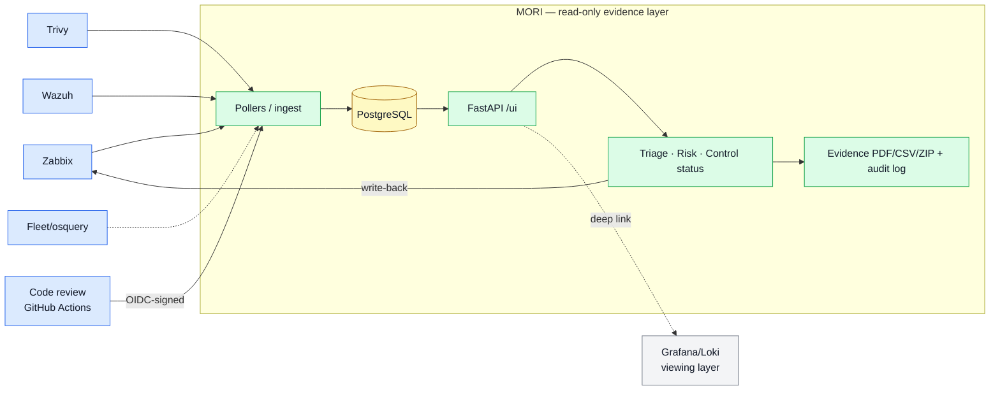

# MORI SOC — Audit-Ready Security Operations

**English (this page)** · [한국어](./README.ko.md) · [Full Guide](./README_FULL.md)

[](https://github.com/saranf/mori-soc/actions/workflows/test.yml)

-yellow)


---

A one-command **ISMS-P / ISO 27001 audit-evidence platform** (`docker compose up -d`).
It sits **read-only on top of your existing** **Zabbix · FleetDM · Wazuh · Trivy · Loki**, runs assets, vulnerabilities, alerts, incidents and control checks from a single screen (`/ui`), and **records every change as _who · when · what · on what basis_ automatically**.

> **Core in one line** — **operational signal → human decision → control evidence.** Everything else (monitoring, vulnerabilities, incidents, privacy, code review) is a source or a vertical feeding that spine.

> **An "evidence layer," not a "viewing layer"** — time-series and log visualization are delegated to Grafana/Loki; MORI sits above them to handle **judge → record → prove** (triage → remediation → control mapping → evidence PDF → audit log).

> **Who it's for** — a **self-hosted technical evidence layer for teams that already run Zabbix and open-source security tools** and need to turn that operational reality into audit evidence. Not a SaaS GRC suite (no employee/vendor lifecycle); it complements those by covering the technical-operations side. This English page leads with ISO 27001 / security operations; the [Korean page](./README.ko.md) is the ISMS-P entry point.

> **Honest by design** — the catalog is **58 / 194 controls reviewed** today; the other 136 are draft skeletons, **labeled `draft` in the UI**. Coverage % counts only reviewed **and** evidence-wired controls — no inflation. Per-control **maturity** (draft → reviewed → mapped → auto-evidence) is derived from real signals and exposed at `GET /controls/maturity`, so "how far along is each control?" has an honest answer. Audit trust is the whole point, so the numbers stay honest.


---

## Architecture in one look



> **Design docs:** [Architecture & DB ERD](docs/DB_ERD.md) · [API design](docs/API_DESIGN.md) · [collection standards](docs/collection-standards.md). Deep dive → [Full Guide](./README_FULL.md).

---

## At a glance

- **Who it's for** — small/mid orgs preparing ISMS-P / ISO 27001 with 1–2 security staff + IT help desk
- **One-line start** — `./scripts/mori-start-demo.sh` → `http://localhost:18000/ui` (`admin / 1234`, demo only)
- **Core value** — a read-only-by-default layer that **does not replace** your tools; it turns their operational data into audit evidence

> **Read-only by default.** MORI never writes to your source systems unless you explicitly enable it. The one exception is **optional, opt-in, audited Zabbix write-back** (triage comment / ack / suppress) — off unless `MORI_ZABBIX_WRITEBACK_MODE` is set, and every write is recorded in the audit log. Everything else is ingest/read only.

## Key features

| Feature | Summary |
|---|---|
| **Unified operations UI** | Dashboard · Alert Triage · Incidents · Assets/Vulns · Compliance PDCA on one screen (`/ui`) |
| **Risk assessment** | Per-CVE 3×3 matrix = impact (asset criticality) × likelihood → **score (1–9)** + treatment decision, residual risk, DoA auto-classify (admin·security) |
| **Control catalog** | ISMS-P 101 + ISO 27001:2022 93 = **194 controls** (KO/EN) — **58 reviewed · 136 draft** (drafts labeled in UI; coverage counts reviewed+evidence-wired only) — tree + editable/persisted status + **admin direct edit (add/edit/delete)** + **regulation-text NLP import** (Claude/heuristic) + **documented manual evidence + detailed live-evidence snapshot (scheduled/bulk)** + **evidence document** (asset-inventory tables) **CSV/PDF** |
| **Code-review evidence (SDLC / 2.8)** | A 6th evidence source for **secure development** (ISMS-P 2.8.1·2.8.5 · ISO A.8.25·A.8.28) — each repo's CI runs **free Semgrep (SAST, default)** or **paid Claude deep review** and pushes findings to `/ingest/code-review`; **MORI never fetches code**. Findings become hostless `code_review` alerts (reused in Triage) + **scan run → auto-promoted to 2.8 control evidence** (even 0 findings = "control operated"). Provenance (repo·commit·run) is **verified by GitHub OIDC signature** — forgery-resistant. Findings CSV · backfill past scans. On-demand scan from the UI via `workflow_dispatch`. |
| **Personal-data lifecycle map (Privacy 3.x)** | From PII found by the scan (resident-reg no.·phone·card·email·gender·birth·address…), auto-builds a **collect→store→use→dispose** lifecycle — **free** (Prisma-schema/convention parser: candidate generation) / **paid Claude** (semantic enrichment: encryption·masking·3rd-party·disposal-gap suggestions). **A technical candidate map, not a legal determination — all results require human review.** Flow diagram (SVG)·summary cards·CSV·**auditor PDF**, promoted to controls **3.1.1·3.2.1·3.4.1**. Admin opts into **PII criteria (regex) + advanced options (route matching·extra ORM)**. Read-only evidence. (admin·security) |
| **Evidence trust layer** | Every result carries **provenance** (CODE/API/RULE/AI/HUMAN/POLICY — why it can be trusted) · **scan reproducibility** (input_signature: repo·commit·scanner·ruleset·model) · **scan diff & change cause** (new/removed findings → code vs ruleset vs AI) · **evidence approval/version/immutability** (draft→reviewed→approved→superseded, PDF SHA-256, past versions preserved) · **technical Gap workflow** (candidate→confirmed→remediation→resolved, deadlines & exception expiry — exceptions never auto-extend) |
| **Privacy flow completion (3.x)** | Auto-groups scanned PII into **processing-task drafts** · classifies **external recipients** (consignment/3rd-party/overseas candidates — human confirms) · **policy-vs-code mismatch** (declared items/retention vs reality) · **per-flow owner confirmation** (human judgment fixed as evidence) · **ISMS-P 3.x evidence package** (ZIP: manifest + CSVs + PDF) |
| **Audit usability** | **Control evidence freshness/quality** (no-evidence/stale/review-required/human-verified — not one green "Compliant") · **scope tags & coverage** (in-scope assets covered by technical signal) · **risk-based audit sampling** (deterministic: high-risk full + systematic; reproducible package) · **monthly evidence change report** (new evidence·approvals·gaps·transitions from MORI data) |
| **Control operating platform** | Framework · Version (immutable, content-hash, supersedes) · ControlDefinition (uid lineage + separated interpretation layers) · OrganizationControl (one internal control satisfies many frameworks) · AssuranceCycle · CycleControl (**evidence status ≠ assessment status**, append-only history, **as-of reproduction**) · EvidenceContract · version-diff & cycle migration (carry owner/applicability, reset assessment) · crosswalk · base+overlay. See [Control governance](docs/CONTROL_GOVERNANCE.md). |
| **Account governance** | Server/PC local accounts (osquery) × LDAP × approval ledger → detects leavers, unregistered privilege, unapproved sudo, dormant · IP team/purpose CSV export (defaults to admin·security, admin configures view roles) |
| **Automatic evidence** | Asset owner/criticality, CVE remediation/exception, risk assessment, triage & incident changes accrued as _who/when/what_ → **6 CSV/PDF reports** |
| **Role-based views** | Risk & controls are admin·security only; infra/help-desk see **only their own servers'remediation rate** |
| **LDAP SSO (optional)** | One account for MORI·Grafana·Zabbix·Fleet; approval creates the LDAP account; manage users from the admin console |
| **Bilingual UI** | Instant KO/EN toggle across login, dashboard and admin |
| **Persistence** | 10 UI operational-state stores write-through to PostgreSQL — survive restarts |

## Works now / Next — 30-second status

| Works now | Partially integrated | Next |
|---|---|---|
| **Zabbix live polling → alert (real-API verified)**<br>**Fleet live poller → PC assets (real-API verified)** | Trivy collector local polling | **Fleet vulns — verify with real CVEs** |
| **Trivy/CSOP remote push evidence ingest** (token) | Source freshness / worker cycle | **Wazuh live poller** |
| **Code-review evidence ingest** — GitHub OIDC-verified provenance (2.8/A.8.25) | CI enforces real PostgreSQL (fresh-install + migration E2E), Docker build, Trivy image scan, pip-audit | Reusable workflow · multi-repo dashboard |
| **Brownfield connect** — via `.env` config only | | LDAP/AD operational sync |
| Alert Triage / Incidents / **risk assessment** | | Slack / Email alerts |
| Login·RBAC · PostgreSQL persistence · CSV/PDF evidence | | Live-query caching |

> **Integration maturity** (so "works" is unambiguous): **Zabbix — verified with real API** end-to-end (_problem → collect → triage → incident → evidence → resolve_). **Fleet — asset path verified with real API** (real osquery host enrolled → poll cycle → PC asset in `/assets` + Fleet deep link; the vulnerability mapping exists but is **not yet verified against real CVEs** — see [Fleet setup](docs/FLEET_SETUP_AND_OPERATIONS.md#6-mori-연동-라이브-rest--설정만으로-동작)). **Trivy / code-review / Wazuh ingest — tested with sample payloads** over the real HTTP endpoints. **Wazuh live poller — parser/scaffold only** (no live API yet). None is claimed "production-tested at scale" — large-scale performance is not yet benchmarked.

> **Scope — single-tenant, self-hosted.** MORI targets one organization per deployment: no `organization_id`, tenant isolation, or hosted multi-tenant mode. Run one instance per org behind your own network controls. (Multi-tenant is out of scope, not a roadmap promise.)

---

## Quick start

**Demo (sample data)**
```bash
./scripts/mori-start-demo.sh          # .env → boot → schema/seed → worker
# → http://localhost:18000/ui  (admin / 1234, demo only)
```

**Brownfield (on top of existing Zabbix/Wazuh/Fleet)**
```bash
docker compose up -d                  # MORI core + LDAP + observability (no bundled Zabbix/Wazuh/Fleet)
# Wire existing infra in .env:
#   MORI_ZABBIX_API_URL=https://zabbix.your-corp.com/api_jsonrpc.php
#   MORI_ZABBIX_API_TOKEN=<token>
docker compose up -d mori-worker      # re-apply
```

> Default `up -d` starts: soc-postgres · mori-api · mori-worker · openldap · phpldapadmin · portal · grafana · loki · fluent-bit.
> Bundled demo stack (own Zabbix/Wazuh/Fleet): `docker compose --profile bundled up -d` (individual: `--profile zabbix`/`fleet`/`wazuh`). HTTPS proxy: `--profile https up -d mori-caddy` (after issuing certs — see [HTTPS setup](docs/HTTPS_SETUP.md)).
> Wazuh TLS certificates are generated automatically by the `generate-indexer-certs` service — nothing to do by hand. **Never bind-mount certificates file by file: if the file does not exist yet, Docker creates an empty directory with that name and the service dies with `is a directory`.** Mount the directory. See [Wazuh certificates](docs/WAZUH_CERTS.en.md).
> Full steps in the [Brownfield connect guide](docs/BROWNFIELD_CONNECT.en.md).

> **Demo credentials** — `admin`/`security`/`monitor` (password `1234`) are for the **isolated demo only**. For any real deployment, change `MORI_ADMIN_PASSWORD` in `.env` and set `MORI_DEMO_MODE=false`.

---

## Screenshots

> Screens below are from demo mode. The `<!-- -->` blocks are **capture guides** (what to shoot, framing, target filename). Uncomment the image tag right below each once you've captured it.

> Order note: MORI's core is **evidence**, not the AI query — so the control catalog leads and the natural-language query comes last (it's a convenience, not the headline).

### 1) Control catalog (ISMS-P × ISO 27001)


**Admins edit the catalog directly** — edit/delete controls inline, "Add control", and
**"Import regulation text (NLP)"**: paste CISA / privacy-law / notice text and it's auto-converted
and saved as draft controls (precise structuring via Claude when `MORI_ANTHROPIC_API_KEY` is set,
clause-level heuristic otherwise). Per control you can **document manual evidence**, or use
**"Auto-capture live evidence"** to snapshot the current live aggregation into a **dated detailed
evidence record** (control intent, status + the actual **live host list** — hostname·IP·status). Set a
**scheduled snapshot** (off/daily/weekly/monthly) and MORI bulk-snapshots all controls when due **on
boot / on view**, plus a **"Snapshot all now"** manual run. Download the **evidence document** as
**CSV or PDF** — not a catalog pack but clean tables: **asset inventory** (hostname·IP·status·source,
full) + **documented evidence** (on-screen shows 3 with "show more"; the download is always complete).
A top **"All evidence ZIP"** bundles every control's evidence **into one ZIP by folder**
(framework/control) with an `INDEX.csv`. Editing & scheduling are admin-only; evidence
documentation & ZIP are admin·security.

### 2) Vulnerabilities (Trivy) — per-CVE plans & exceptions
Per-host Critical/High counts + per-CVE remediation plan/exception/expiry + change history.


### 3) Risk assessment matrix


### 4) Account governance (access review)


The **IP list** in the Accounts tab lets you **filter by team/purpose (asset-owner metadata)**
and **export the filtered rows as CSV** (host/IP search + team & purpose dropdowns →
`hostname,ip,importance,team,category,status`).

**View access is admin-configurable.** It defaults to **admin·security**, but an admin can open it up
to other roles (infra/monitor, auditor, …) from the admin console **Access tab → "Account governance
view roles"** (admin is always included). Target users see the Accounts tab after re-login.

### 5) Admin console (/admin)


### 6) Natural-language query (NLQ) — convenience, not the headline
Ask a question ("show offline hosts") → matched to one of 12 intents → results + summary + CSV.


---

## Documentation

| Doc | Contents |
|---|---|
| [**Full Guide (README_FULL)**](./README_FULL.md) | Complete reference — architecture · API · testing · deployment · roadmap |
| [Getting Started](docs/GETTING_STARTED.en.md) | Demo boot → first operations → production (KO/EN) |
| [Brownfield Connect](docs/BROWNFIELD_CONNECT.en.md) | Read-only connect via `.env` only (KO/EN) |
| [LDAP Integration](docs/LDAP_INTEGRATION.en.md) | One account for MORI·Grafana·Zabbix·Fleet (KO/EN) |
| [Code-review evidence](docs/CODE_REVIEW_EVIDENCE.md) | SDLC/2.8 evidence source · free/paid modes · OIDC provenance · customer setup |
| [Personal-data flow](docs/PERSONAL_DATA_FLOW.md) | Privacy 3.x · collect→store→use→dispose · processing-task grouping · external-recipient split · policy-vs-code · owner confirm · 3.x package |
| [Control governance](docs/CONTROL_GOVERNANCE.md) | Control operating platform — framework versions · lineage · assurance cycles · evidence contracts · version diff · as-of · crosswalk · overlay |
| [Deployment](docs/DEPLOYMENT.md) | Server deploy · operations · troubleshooting |
| [Backup / restore](docs/BACKUP_RESTORE.md) | PostgreSQL dump = full backup · restore · disaster recovery runbook |
| [HTTPS setup](docs/HTTPS_SETUP.md) | Let's Encrypt · conflict-free nginx vhost · server run |
| [Functional Spec](docs/FUNCTIONAL_SPEC.md) · [Roadmap](docs/IMPLEMENTATION_ROADMAP.md) | Feature spec / Phase 0–5 roadmap |

---

## Acknowledgements

MORI's initial problem direction was shaped through conversations with a practitioner responsible for security operations, privacy, and product planning. Her feedback highlighted the challenges small teams face when connecting day-to-day operational activities with ISMS-P / ISO 27001 evidence preparation.

The architecture and design decisions, the ISMS-P / ISO 27001 control mapping, and integration testing against real Zabbix and Fleet instances were carried out by the project maintainer.

**On AI use — stated plainly:** a large share of the implementation and documentation was written with an AI coding assistant (Claude / Claude Code), then reviewed, tested, and corrected by the maintainer. MORI also *uses* an LLM as an **opt-in product feature** in two places — converting regulation text into **draft** controls, and an optional deep code-review mode. Both label their output as *draft / requires human review*, and neither is ever counted as verified evidence. The premise of this project is that audit evidence must be honest, so a model's guess is never presented as a fact.

---

> **Alpha / Work in Progress** — daily security operations + audit-evidence scenarios work, and UI operational state persists to PostgreSQL. Zabbix live polling and Fleet asset polling are real-API verified (other seed data is for demo). Wazuh live integration and Fleet vulnerability verification (real CVEs) are next.
>
> License: Apache 2.0 · Try the full feature set with a single `./scripts/mori-start-demo.sh`.
