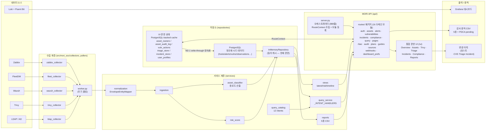
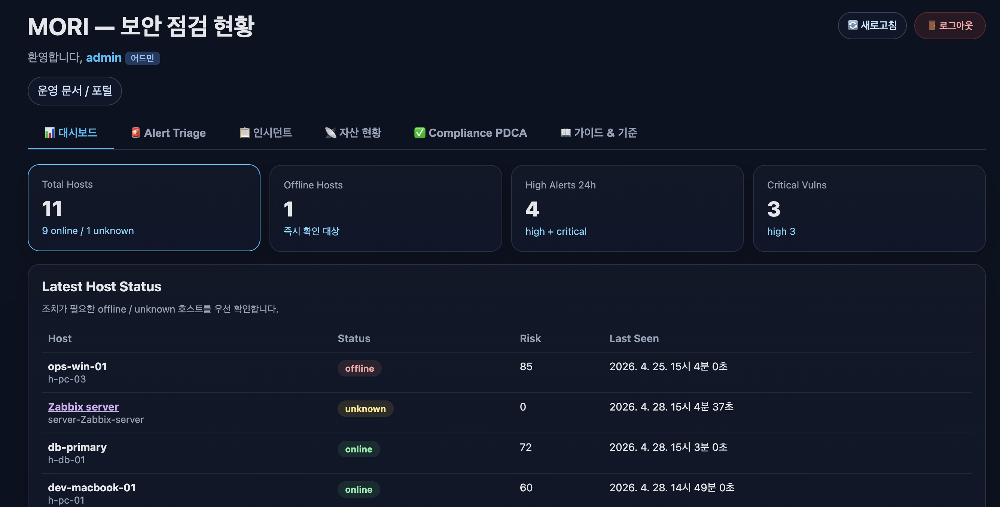
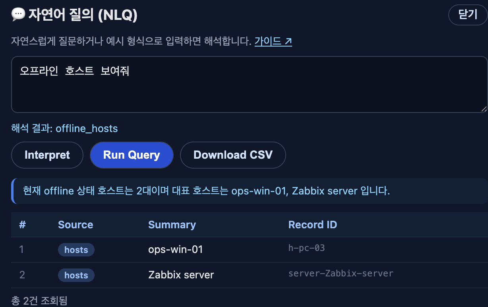
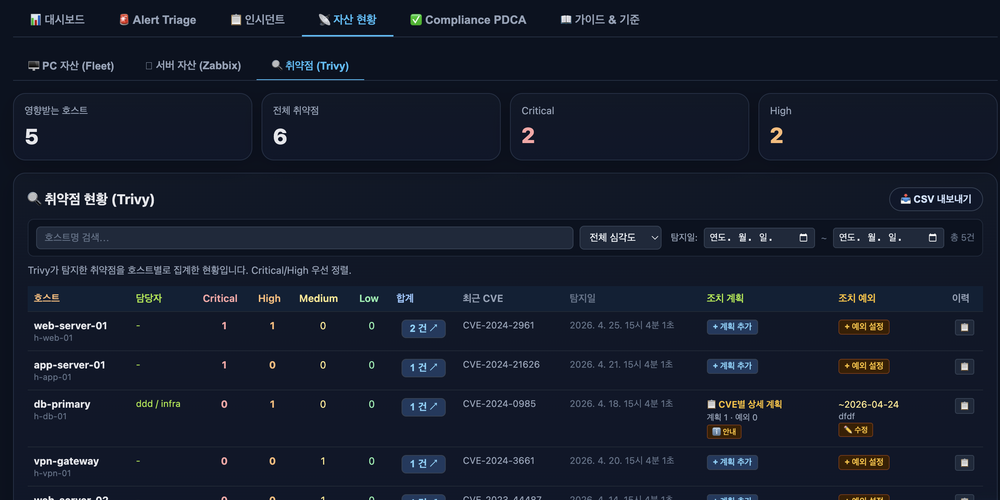

# MORI SOC — Audit-Ready Security Operations

**🇰🇷 한국어 (this page)** · [🇬🇧 English README](./README.en.md)

[](https://github.com/saranf/mori-soc/actions/workflows/test.yml)

-yellow)


## TL;DR

`docker compose up -d` 한 줄로 띄우는 **ISMS-P / ISO 27001 감사 증적 누적 플랫폼**. Zabbix · FleetDM · Wazuh · Trivy · Loki를 통합하여 자산·취약점·경보·인시던트 + 통제 점검을 한 화면(`/ui`)에서 운영하고, 모든 변경을 *who / when / what* 단위로 자동 누적합니다.

- 🎯 **대상** — 보안 담당자 1~2명 + IT 헬프데스크로 ISMS-P / ISO 27001을 준비해야 하는 중소형 조직
- 🚀 **한 줄 시작** — `./scripts/mori-start-demo.sh` → `http://localhost:18000/ui` (`admin / 1234`, 데모 전용)
- 📊 **화면** — 통합 대시보드 · Alert Triage · 인시던트 · 자산/취약점 · **위험성 평가 매트릭스** · Compliance PDCA · 6종 감사 증적 CSV/PDF
- 🎯 **위험성 평가 (R-series)** — 취약점(CVE)별 **위험도 = 영향도(자산 중요도 상/중/하) × 발생가능성(심각도)** 를 3×3 매트릭스로 산정, 위험처리 결정(조치/수용/이관/회피)·잔여위험·재평가일 기록. **어드민 전용 산정 근거(provenance)** 패널. ISMS-P 위험관리 / ISO 27001 6.1.2·8.8 기반
- 🔐 **역할별 화면** — 위험성 평가는 **admin·security 전용**, 인프라·헬프데스크는 **내 담당 서버 취약점·조치율**만 열람. 대시보드는 **역할별 보안 히어로 + 24h/12h 인프라 현황(Zabbix/Wazuh 딥링크)** 로 구성, **패널 편집**으로 개인별 위젯 선택·영속화
- 🌐 **다국어 UI** — 로그인·대시보드·어드민 콘솔 전 페이지 한국어/영어 토글 (우상단 고정 위젯 → **계정 메뉴(👤)**로 이동, 쿠키·localStorage 저장, 새로고침 없이 즉시 전환)
- 👤 **사용자 프로필 + 내 서버** — 이름·부서·담당 서버를 계정에 저장하고, 담당 자산만 모아 보는 **⭐ 내 서버** 뷰(프로필 메뉴 바로가기) 제공
- 🧾 **자동 증적** — 자산 담당자·중요도, 호스트/CVE 단위 조치 계획·예외, **CVE별 위험성 평가**, Triage·인시던트 상태 변경
- ✅ **영속화 (M2-1 + R-2 완료)** — UI 운영 상태 store(자산 담당자·감사로그·취약점 조치·Triage·인시던트·프로필 + **위험성 평가 대장 `ui_risk_register`**)는 PostgreSQL에 **write-through 영속화**되어 재시작 후에도 유지.
- 🔌 **실데이터 연동** — **Zabbix 실시간 폴링은 실 API로 검증됨**(problem→Triage→Incident→증적→해소). **Trivy/CSOP는 원격 토큰 push**(`/ingest/trivy`·`/ingest/evidence`)로 연동. **Fleet / Wazuh 라이브 연동은 다음 단계(Next)**.
- 🧩 **브라운필드** — 기존 Zabbix/Wazuh/Fleet 환경이면 **MORI 코어만 띄우고 `.env` 설정만으로** 연결(번들 소스 불필요). `docker compose up` = 코어만, `--profile bundled` = 번들 데모 포함. → [가이드](docs/BROWNFIELD_CONNECT.md)

> ⚠️ **Alpha / Work in Progress** — 일상 보안 운영 + 감사 증적 누적 시나리오가 동작하고, **UI 운영 상태는 PostgreSQL에 영속화(M2-1·R-2)** 되어 재시작 후에도 유지됩니다. **Zabbix 는 실시간 폴링이 실 API로 검증**되어 problem→alert→Triage 가 재시작 없이 흐릅니다(다른 시드 데이터는 데모용). **Fleet / Wazuh 라이브 연동은 다음 단계**입니다.

## ⚡ Status — 30초 요약

| ✅ 지금 되는 것 (Works now) | 🧪 부분 통합 (Partially integrated) | 🚧 다음 (Next) |
|---|---|---|
| **✅ Zabbix 실시간 폴링 → alert (검증됨)** | Trivy collector 로컬 폴링(수집 구현) | **FleetDM 라이브 API 폴러** |
| **✅ Trivy/CSOP 원격 push + 증적 인제스트** (`/ingest/trivy`·`/ingest/evidence`, 토큰) | Source freshness / Worker cycle | **Wazuh 라이브 API 폴러** |
| **✅ 브라운필드 연결** — 기존 Zabbix/Trivy에 `.env` config만으로 (번들 소스 불필요) | | LDAP/AD 운영 연동 |
| Alert Triage / Incident 워크플로우 · CVE별 **위험성 평가** | | Slack / Email 알림 |
| 로그인 / RBAC · PostgreSQL 영속 UI 상태 · CSV/PDF 증적 export | | 라이브 조회 캐싱(성능) |

> ✅ **Zabbix**는 실제 API로 *problem → 수집 → Triage → Incident → 증적 → 해소* 전 구간이 **검증됨** ([🎬 실전 시나리오](#-실전-시나리오--zabbix-운영-문제--감사-증적-실제-api-연동-검증됨)). **Fleet / Wazuh**는 컬렉터·파서는 준비됐으나 **라이브 연동은 다음 단계**입니다.

> 🔒 **데모 자격증명 안내** — 데모 계정(`admin` / `security` / `monitor`, 비밀번호 `1234`)은 **격리된 데모 전용**으로 의도적으로 단순합니다. 데모 인스턴스는 **시드 샘플 데이터만** 포함하며 **실제 비밀·고객 데이터를 저장하지 않습니다.** 데모가 아닌 배포에서는 **즉시 자격증명과 RBAC를 변경**하세요. (`.env`의 `MORI_ADMIN_PASSWORD` · `MORI_DEMO_MODE=false`)

## 🎬 실전 시나리오 — Zabbix 운영 문제 → 감사 증적 (실제 API 연동 검증됨)

MORI의 핵심 가치: **기존 Zabbix가 이미 만들어내는 운영 데이터를 ISMS-P / ISO 27001 감사 증적으로 전환.** 아래 파이프라인이 **실제 Zabbix API 연동으로 end-to-end 동작**합니다(API 재시작 불필요 — 매 요청 PostgreSQL 라이브 조회).

> 💡 이 시나리오는 번들 Zabbix가 필요합니다. 브라운필드 기본(`docker compose up`)은 코어만 띄우므로, 데모 Zabbix를 함께 올리려면 `docker compose --profile zabbix up -d`(또는 `--profile bundled`). 기존 Zabbix를 쓰면 `.env`의 `MORI_ZABBIX_API_URL`만 바꾸면 됩니다 → [브라운필드 가이드](docs/BROWNFIELD_CONNECT.md).

1. **Zabbix problem 발생** — 데모: `./scripts/mori-zabbix-demo-problem.sh` (Zabbix 서버에 트리거 발화 → 실제 problem 이벤트)
2. **MORI worker 수집** — `mori-worker` 가 30초 주기로 `problem.get` 폴링 → 정규화(severity/host/timestamp 매핑) → PostgreSQL `alerts` 적재 + source freshness 기록
3. **Alert Triage 노출** — `/ui` → 🚨 Alert Triage 에 `source=zabbix` 로 **즉시** 표시
4. **상태 처리** — 3단계 상태(🔴🟡🟢) + 분석관·변경자(actor)·변경이력 기록
5. **Incident 생성** — alert 를 인시던트로 승격, 담당자·상태·노트 관리
6. **증적 export** — 인시던트 / 월간 / **위험성 평가 대장** CSV·PDF 내보내기

> 즉, MORI 는 "새 보안 도구"가 아니라 **Zabbix 운영 데이터를 *누가·언제·무엇을·어떤 근거로* 형태의 ISMS-P / ISO 27001 감사 증적으로 바꾸는 read-only 레이어**입니다.

오픈소스 보안 도구를 통합하여 **ISMS-P / ISO 27001 인증 심사에 필요한 증적·통제 점검·조치 이력**을 한 곳에서 수집·관리·내보내기 할 수 있도록 만든 경량 SOC 플랫폼입니다.

> **목표:** 중소형 조직에서 IT 헬프데스크 + 담당자 1명이 `docker compose` 한 줄로 배포하여 ISMS-P / ISO 27001 준비와 일상 보안 운영을 같이 할 수 있는 **"Compliance-Evidence Platform"**

> 🔌 **기존 도구 위에 얹는 read-only 증적 레이어** — MORI-SOC는 운영 중인 모니터링·보안 도구를 **대체하지 않습니다.** 기존 Zabbix / Wazuh / FleetDM / Trivy에 **config만으로(에이전트 설치·기존 도구 설정 변경 없이) read-only로 연결**해 운영 증적·인시던트 이력·취약점 조치·컴플라이언스 뷰를 정리합니다.
> *(MORI-SOC is designed to sit on top of existing monitoring and security tools, not replace them.)*

### 제품 포지셔닝 — "보는 층"이 아니라 "증적 층"

MORI는 **통합 관제 대시보드가 아닙니다.** 시계열·로그 탐색·실시간 시각화는 이미 잘하는 도구(**Grafana/Loki**)에 위임하고, MORI는 그 위층에서 **"판단·기록·증명"**을 담당합니다.

| 층 | 담당 | 도구 |
|---|---|---|
| **보는 층** | 시계열·로그·실시간 시각화 | Grafana · Loki *(딥링크로 위임)* |
| **증적 층 (MORI의 자리)** | 트리아지 → 조치 워크플로 → 통제 매핑 → 증적 PDF → 감사 로그 | **MORI API** (`/ui`) |

> 핵심 명제: **"통합 관제"가 제품이 아니라, "관제가 그대로 ISMS-P / ISO 27001 증적이 되는 것"**이 제품입니다.

### 왜 이 다섯 개를 묶었나 — 소스별 ISMS-P 담당 구역

각 소스가 **서로 겹치지 않는 인증기준**을 담당합니다. 이 매핑이 스택 구성의 근거이자, 폴러 개발 순서("증적 공백이 큰 통제부터")의 기준입니다.

| 데이터 소스 | 담당 ISMS-P 인증기준(대표) | ISO 27001 Annex A | 증적 형태 | MORI 연동 상태 |
|---|---|---|---|---|
| **Fleet** (osquery) | 1.2.1 자산 식별 · 2.1.3 자산 관리 · 2.10.6 단말기 보안 | A.5.9 · A.8.9 | 자산 인벤토리·구성 상태 | 🔲 Phase 3 |
| **Zabbix** | 2.9.x 운영·모니터링 · 가용성 관리 | A.8.6 · A.8.16 | 가동률·임계치 알림+처리 이력 | ✅ 라이브(검증) |
| **Trivy** | 2.10.8 패치관리 · 2.11.2 취약점 점검·조치 | A.8.8 | 스캔 이력·조치계획·예외 승인 | ✅ 원격 push |
| **Wazuh** | 2.9.4~5 로그 관리 · 2.10.9 악성코드 · 2.11.3 이상행위 | A.8.7 · A.8.15 · A.8.16 | 탐지 이벤트·룰 매칭·대응 기록 | 🔲 Phase 3 |
| **Loki** | 2.9.4 로그 보존(접속기록 법정 보존기간) | A.8.15 | 로그 보존 정책+보관 증빙 | 🟡 수집 |
| **MORI 자체** | 1.x 관리체계 · 2.11.4~5 사고 대응 | A.5.24~27 | 인시던트 티켓·감사 로그·PDCA | ✅ 코어 |

> 💡 통제 카탈로그(Phase 2)가 붙으면 이 매핑에서 **"lite = 통제 커버리지 N% / full = M%"** 수치가 자동 산출됩니다.

---

## 🗺️ Architecture Diagram



> 실선은 현재 운영 중인 흐름. `MORI_QUERY_BACKEND=postgres` 환경에서 **API는 매 요청마다 PostgreSQL의 최신 스냅샷을 읽어(InMemoryQueryStore로 매 요청 materialize)** 질의에 사용합니다 — 즉 **부팅 스냅샷이 아니라 라이브 조회**입니다. 따라서 `mori-worker`가 폴링해 적재한 실데이터(예: **실제 Zabbix problem → alerts**)는 **API 재시작 없이 다음 요청에 바로** 반영됩니다. UI 운영 상태(triage / incidents / asset owners / vuln actions / asset audit log / user profiles + risk register)는 **cache-aside + write-through**로 PostgreSQL에 영속화됩니다(M2-1·R-2). ✅ **Zabbix 실시간 폴링은 동작 검증됨**([🎬 실전 시나리오](#-실전-시나리오--zabbix-운영-문제--감사-증적-실제-api-연동-검증됨)); Fleet/Wazuh 라이브 연동은 다음 단계입니다.
>
> **API 구조(Task J 완료):** `server.py`는 인메모리 상태와 헬퍼 클로저를 `RouteContext`로 조립한 뒤 16개 도메인 모듈을 등록하는 **얇은 오케스트레이터(888줄)** 로 슬림화되었습니다. 각 엔드포인트는 `routes/<domain>.py`의 `register_<domain>(ctx)`가 소유하며, 인메모리 6종 store는 `RouteContext`를 통해 모듈 간 공유됩니다.

---

## 🎯 핵심 컨셉 — Audit-Ready

심사에서 자주 요구되는 **"누가, 언제, 어떤 데이터로, 어떤 결정을 내렸는가"** 를 모든 컴플라이언스 민감 영역에서 자동으로 누적합니다.

| 영역 | 기록되는 변경 | 저장 위치 |
|---|---|---|
| 자산 담당자 / 팀 / 카테고리 / **중요도** | `field`, `old_value`, `new_value`, `changed_by`, `changed_at` | `asset_audit_log` (호스트별) |
| 호스트 단위 조치 계획 / 조치 예외 | 동일 (계획 내용·목표일·예외 만료일·사유) | `asset_audit_log` |
| **CVE별 조치 계획 / 조치 예외** | `vuln_plan_text [CVE-…]` / `vuln_exception_until [CVE-…]` 등 라벨로 동일 호스트 이력에 통합 | `asset_audit_log` (호스트별 📋 이력 모달에서 일괄 조회) |
| Alert Triage 상태 변경 (🔴🟡🟢) | `status`, `note`, `analyst`, `changed_by`, `changed_at` | `triage_store` + history |
| 인시던트 변경 이력 | 상태·담당자·영향도·노트 변경 + 작성자/시각 | 인시던트 history (`/incidents/{id}/history`) |

### 호스트 단위 vs CVE별 — UX 일관성

호스트 단위 일괄 계획과 CVE별 상세 계획이 충돌하지 않도록 안내 모달이 자동 노출됩니다.

- 호스트에 **CVE별 조치 계획/예외**가 1건이라도 있으면, 호스트 단위 편집 시 *"상세 계획이 정해져 있습니다. 합계 탭을 확인해 주세요"* 모달이 떠서 합계 탭(CVE별 편집 화면)으로 이동을 권유합니다.
- 변경 이력은 호스트의 📋 이력 모달 하나에서 호스트 단위 + CVE별 변경이 시간순으로 통합 표시됩니다.

---

## 🗺️ 현재 상태 한눈에 보기

### ✅ What works now — 시드 보안 데이터 + PostgreSQL 영속 UI 운영 상태

| 카테고리 | 기능 | 비고 |
|---|---|---|
| **인증/권한** | 로그인 / 세션 / RBAC (역할별 탭 on·off) / 가입 요청·승인 | 데모 계정 `admin` / `security` / `monitor` (비밀번호 `1234`) — **seeded sample data only · 데모 전용. 운영 배포 시 반드시 변경** |
| **개요 (Overview)** | 자산·경보·취약점 요약 카드 + Critical 취약점 상세 모달에 **조치 계획 / 조치 예외** 컬럼 노출 | 호스트별 진행 상태를 대시보드에서 즉시 확인 |
| **자산 (서버 / PC / Trivy)** | 호스트별 담당자·팀·카테고리 편집 + **서버 자산 중요도 수동 재정의** | 자동 분류(asset_classifier)보다 우선 적용. 변경분 감사 로그 |
| **취약점 관리 (Trivy)** | 호스트 단위 조치 계획 / 조치 예외 + **CVE별 상세 조치 계획 / 조치 예외** | 작성자·목표일·만료일·사유 기록. 충돌 안내 모달 |
| **📥 원격 인제스트 (v0.7)** | `POST /ingest/trivy`(원본 리포트, `?hostname=` 호스트 매핑) · `POST /ingest/evidence`(CSOP 조치 전/후 diff envelope) — `MORI_INGEST_TOKEN` 토큰으로 **무세션 push** | 증적은 `ui_evidence_events`(`schema/006`). 조회 `GET /evidence` admin·security 전용 |
| **🧩 브라운필드 모드 (v0.7)** | `docker compose up` = MORI 코어만 → 기존 Zabbix/Trivy에 `.env`로 연결. 번들 소스는 `--profile bundled`/`zabbix`/`fleet`/`wazuh` | [docs/BROWNFIELD_CONNECT.md](docs/BROWNFIELD_CONNECT.md) |
| **🎯 위험성 평가 (R-series)** | CVE별 **3×3 위험 매트릭스**(영향도×발생가능성) + 위험처리 결정(조치/수용/이관/회피)·승인자·잔여위험·재평가일. 매트릭스 셀/등급 클릭 → 해당 버킷 드릴다운. **어드민 전용 산정 근거** | ISMS-P 위험관리 / ISO 27001 6.1.2·8.8. **admin·security 전용**. `ui_risk_register` 영속화 |
| **🔐 역할별 대시보드** | 역할별 보안 히어로(위험 KPI/TOP ↔ 내 서버 조치율) + **24h/12h 인프라 현황**(Zabbix/Wazuh 딥링크) + **패널 편집**(위젯 on/off 개인 영속화) | 반응형 그리드. 인프라/헬프데스크는 위험등급 대신 조치율만 |
| **🚨 Alert Triage** | 3단계 상태(🔴🟡🟢) 변경, 분석관·**변경자(actor)** 분리 기록, 이력 표시 | UI에서 actor 미입력 시 세션 사용자 → "unknown" fallback |
| **📋 인시던트 관리** | 생성·상태변경·노트·날짜필터·텍스트검색·CSV 다운로드 + 변경 이력 | CSV 다운로드 시 "변경 내역 미포함" 안내 모달 표시 |
| **✅ Compliance PDCA** | Plan/Do/Check/Act 4단계 카드, 카테고리별 Pass/Fail/Warning 표 | **Do 카드 클릭 → 미조치 항목 모달** (통제 + Trivy + Alert 통합) |
| **미조치 / 기한 초과** | 통제 점검(fail/warning) + Trivy critical/high + Alert critical/high(7일) 통합 표시 | **📥 CSV 다운로드** (`/compliance/pdca/pending.csv`) |
| **📥 감사 증적 리포트** | 자산·계정·로그·취약점·월간 5종 CSV + **PDF** (NanumGothic 임베드) | **🔍 미리보기 모달**(상위 50행 + CSV/PDF 다운로드 버튼) |
| **📡 Source Freshness · Collector Lag** | 수집기별 마지막 성공 시각·lag·SLA 임계 시각화 (`/dashboard` `source_coverage`) | Admin Overview + 사용자 대시보드에 카드/표 노출 |
| **🔀 교차 검증** | Zabbix × Fleet × Trivy 호스트 매핑 차이 / 미매핑 자산 검출 | source_coverage / orphan check |
| **💬 자연어 질의 (FAB)** | 12개 인텐트 디스패치 (alert_summary, offline_hosts, top_vulnerable_hosts, host_timeline …) | `/interpret` + `/query` |
| **📚 가이드 시스템** | 7종 가이드 어드민 on/off + 직접 편집 | ISMS-P / ISO 27001 운영 가이드 |
| **🌐 다국어 (KO/EN)** | 로그인·대시보드·어드민 전 페이지 **계정 메뉴 내** 토글 + `data-i18n` 정적 치환 + `window.t()` 동적 메시지 | 쿠키·localStorage 저장, 토글 시 활성 탭 즉시 재렌더 |
| **👤 사용자 프로필 / ⭐ 내 서버** | 계정 메뉴 → 프로필 편집(이름·부서·담당 서버) + 자산 탭 **내 서버** 서브탭 | `assigned_servers` 또는 `owner == display_name` 인 Fleet+Zabbix 호스트만 필터링 |
| **API 문서** | Swagger `/docs` | FastAPI 자동 생성 |

> ✅ **저장소 영속화 안내 (M2-1 + R-2 완료)** — PostgreSQL은 **정규화된 시드 보안 데이터**(hosts/alerts/vulnerabilities/observations 등)를 부팅 시 InMemoryRepository로 로드해 질의에 사용합니다. 또한 **UI 운영 상태 store**(triage / incidents / asset owners / vuln actions / asset audit log / user profiles + **위험성 평가 대장 risk register**)는 `schema/003_*` · `schema/004_risk_register.sql` + `repositories/state_*.py`(StateRepository 계층)를 통해 **cache-aside + write-through**로 영속화되어 **재시작 후에도 유지**됩니다. (`MORI_QUERY_BACKEND=memory` 또는 `MORI_DATABASE_URL` 미설정 시 인메모리로 폴백.)

### 🟡 In progress / 다음 단계 (다음 마일스톤)

| 항목 | 현황 | 우선순위 |
|---|---|---|
| **UI 운영 상태 → PostgreSQL 영속화 (M2-1)** | ✅ 완료 — `schema/003_*` + `repositories/state_*.py`(StateRepository) cache-aside + write-through. 6종 store 재시작 후 유지, 통합 테스트(`tests/test_state_persistence.py`)로 검증 | ✅ 완료 |
| **Zabbix API polling** | ✅ **검증 완료** — 실 Zabbix API로 problem→수집→Triage→Incident→증적→해소 end-to-end 동작 (`collectors/zabbix_events.py`, `tests/test_zabbix_events.py`) | ✅ 완료 |
| **통제 카탈로그 (Phase 2)** | ISMS-P/ISO N:M 매핑 + 결함사례 + 인증기준 트리 화면 — **제품 정체성 전환의 핵심, 폴러보다 우선** | 🔴 최우선 |
| **Trivy 인제스트** | ✅ 원격 토큰 push(`/ingest/trivy`·`/ingest/evidence`) 완료 · 로컬 정기 스캔 자동화(스케줄)만 남음 | 🟡 중 |
| **Fleet / Wazuh API poller** | Parser·Collector 준비됨, REST poller 미연결 — **Phase 3**(통제 카탈로그 이후). 완료 기준 = 데이터 유입이 아니라 MORI 워크플로에 물림 | 🔴 높음 |

### 🔲 Planned / 추후 작업

| 항목 | 현황 | 우선순위 |
|---|---|---|
| LDAP 인증 운영 적용 | 코드 준비됨, `LDAP_URL` 설정 시 활성화 | 🟡 중간 |
| Slack / Email 알림 webhook | 미연결 (`SLACK_WEBHOOK_URL` 설정점만 존재) | 🟡 중간 |

---

## 🚀 Quick Start

### 데모 모드 (샘플 데이터)

```bash
# 한 줄로 .env 생성 → API 기동 → 스키마/시드 → 데모 인시던트 → 워커
./scripts/mori-start-demo.sh
```

→ `http://localhost:18000/ui` 에서 `admin / 1234` 로 로그인.

### 브라운필드 모드 — 기존 Zabbix/Wazuh/Fleet 위에 얹기

이미 운영 중인 Zabbix·Wazuh·FleetDM·Trivy가 있으면 **MORI 코어만 띄우고 `.env`로 연결**합니다(번들 소스 불필요). 자세한 절차는 [docs/BROWNFIELD_CONNECT.md](docs/BROWNFIELD_CONNECT.md).

```bash
# 1) MORI 코어만 기동 (api + worker + postgres, 번들 Zabbix/Fleet/Wazuh 제외)
docker compose up -d

# 2) .env 에서 기존 인프라로 연결 (예: Zabbix)
#    MORI_ZABBIX_API_URL=https://zabbix.your-corp.com/api_jsonrpc.php
#    MORI_ZABBIX_API_TOKEN=<토큰>   (또는 MORI_ZABBIX_USER/PASSWORD)
docker compose up -d mori-worker      # 재적용

# 3) Trivy/CSOP 는 토큰 push 로 연결 (MORI_INGEST_TOKEN 설정 후)
#    POST /ingest/trivy  ·  POST /ingest/evidence
```

> 연결 현황: **Zabbix**(라이브 REST) · **Trivy/CSOP**(토큰 push) 는 설정만으로 즉시 동작. **Fleet/Wazuh** 라이브 API 폴러는 Phase 3 예정(현재 `.env` 자리만 마련).

번들 데모 스택까지 함께 띄우려면:

```bash
docker compose --profile bundled up -d          # 전체(Zabbix+Fleet+Wazuh 데모)
# 개별: --profile zabbix / --profile fleet / --profile wazuh
```

### 데모 종료

```bash
./scripts/mori-stop-demo.sh             # 시드 데이터만 삭제 + 컨테이너 정지 (실제 폴러 데이터 보존)
./scripts/mori-stop-demo.sh --keep      # 시드만 삭제, 컨테이너는 유지
./scripts/mori-stop-demo.sh --purge     # 컨테이너 + 볼륨 통째로 제거
```

### 데모 화면 미리보기

데모 모드를 기동하면 아래와 같이 동작합니다.

#### 1) 통합 대시보드 — 자산·경보·취약점 현황 한눈에



- 상단 카드: Total Hosts / Offline Hosts / High Alerts 24h / Critical Vulns
- Latest Host Status: offline / unknown 호스트를 우선 노출하여 즉시 확인 대상 식별
- **Source Freshness · Collector Lag** 카드: Fleet/Wazuh/Zabbix/Trivy 수집기 last_sync + lag + SLA 표시
- 사용자 대시보드 탭: **대시보드 / Alert Triage / 인시던트 / 자산 현황 / Compliance PDCA / 가이드 & 기준** (RBAC 역할별 on·off)
- **어드민 콘솔(/admin) 8탭** (Phase 2 정렬): Overview · Compliance · Triage & Incidents · Remediation · 자산 / Owners · Access Control · Audit & Logs · Settings (역할별 노출 탭 자동 제한)

#### 2) 자연어 질의 (NLQ) — `interpret` → `query`



- "오프라인 호스트 보여줘" 같은 한국어 질문을 입력하면 12개 인텐트 중 매칭되는 항목으로 해석
- **Interpret** → 의도 표시(`offline_hosts`) / **Run Query** → 결과 + 요약 문장 / **Download CSV** → 증적용 다운로드
- 결과 테이블: Source / Summary / Record ID

#### 3) 취약점 (Trivy) — CVE별 조치 계획·예외



- 호스트별 Critical / High / Medium / Low 합계와 최근 CVE / 탐지일
- **조치 계획** / **조치 예외** 컬럼: `+ 계획 추가` / `+ 예외 설정` 버튼 또는 설정된 값 표시
- 호스트에 호스트 단위 계획·예외가 설정되면 "📋 CVE별 상세 계획"·만료일이 즉시 노출되며, **CVE 상세 모달(N건 ↗ 버튼)** 안에서도 호스트 단위 계획/예외 배너 + 각 CVE 행에 "호스트 단위 적용" 표시로 확인 가능
- **📋 이력** 버튼으로 호스트별 변경 이력(자산·계획·예외·CVE별 조치) 통합 조회

### 개별 스크립트

```bash
./scripts/mori-seed-sample-data.sh        # 샘플 데이터만 (재)삽입
./scripts/mori-run-workers.sh start       # 워커 시작
./scripts/mori-run-workers.sh status      # 상태 확인
./scripts/mori-run-workers.sh cycle       # 수동 1회 수집 사이클
./scripts/mori-run-workers.sh logs        # 로그 확인
./scripts/mori-run-workers.sh stop        # 워커 중지
./scripts/mori-backup.sh                  # pg_dump → backups/mori-soc-<ts>.dump
./scripts/mori-restore.sh backups/<file>.dump  # pg_restore (확인 프롬프트, --force 로 생략)
./scripts/trivy-fs-scan.sh .              # 파일시스템 취약점 스캔
./scripts/trivy-image-scan.sh <image>     # 이미지 취약점 스캔
```

---

## 🧱 아키텍처 / 모듈 구성

```text
src/mori_soc/
├── api/
│   ├── server.py          ← 얇은 오케스트레이터(888줄): RouteContext 조립 + 모듈 등록
│   ├── routes/            ← 16개 도메인 라우트 모듈 (register_<domain>(ctx))
│   │   ├── context.py     ← RouteContext (store + 헬퍼 클로저 ~35 필드)
│   │   ├── auth.py · assets.py · alerts.py · vulnerabilities.py
│   │   ├── incidents.py · compliance.py · query.py · pages.py
│   │   ├── rbac.py · audit.py · plans.py · guides.py · sources.py
│   │   └── webhooks.py · dashboard_prefs.py
│   ├── templates.py       ← /ui · /login · 대시보드 · 콘솔 HTML/JS 렌더러
│   ├── payloads.py        ← dashboard/pdca/query payload 빌더
│   ├── i18n.py            ← UI 다국어 문자열
│   ├── auth.py            ← 세션 미들웨어 · 자격증명 검증 · 역할 기본 권한
│   └── contracts.py       ← QueryRequest/Response, EvidenceRef, QueryScope
├── collectors/            ← Fleet · Wazuh · Zabbix · Trivy · LDAP 수집기
├── pollers/               ← 각 소스별 주기 폴러 (worker.py 가 오케스트레이션)
├── services/
│   ├── normalization.py   ← EnvelopeEntityMapper (host 자동 생성, alias 등록)
│   ├── ingestion.py       ← 수집 인제스천 파이프라인
│   ├── risk_score.py      ← Risk score 계산
│   ├── query_catalog.py   ← 12 intent 정의 (TemplateQuery)
│   ├── query_service.py   ← intent 디스패치 (_INTENT_HANDLERS 레지스트리)
│   ├── views.py           ← 논리 뷰 집계 (latest_host_status / risk_summary / timeline)
│   ├── reports.py         ← 6종 감사 증적 리포트 빌더(+ 위험성 평가 대장) + report_to_csv
│   └── asset_classifier.py← 자산 자동 분류 + 중요도 산출 (manual override 가능)
├── repositories/
│   ├── memory.py          ← InMemoryRepository / InMemoryQueryStore (시드 로드 후 질의용)
│   ├── postgres.py        ← Postgres 저장소 (정규화 시드 보유 → 질의 스냅샷)
│   ├── state_base.py      ← StateRepository ABC (UI 운영 상태 6종 인터페이스)
│   ├── state_memory.py    ← InMemoryStateRepository (기본·테스트/데모, 순수 dict)
│   └── state_postgres.py  ← PostgresStateRepository (6종 store write-through, schema/003)
├── models/entities.py     ← Host, HostAlias, Alert, Vulnerability, ControlCheckResult …
└── worker.py              ← 폴러 오케스트레이터
```

### 저장 영역 분리

| 저장 영역 | 현재 상태 | 위치 |
|---|---|---|
| **Normalized security data** (hosts / alerts / vulnerabilities / observations / fleet_query_results / control_checks / directory_accounts / source_syncs …) | PostgreSQL **시드 스키마 + 시드 데이터** 적재. 부팅 시 InMemoryRepository로 로드되어 질의에 사용 | `schema/001_phase1_initial.sql`, `repositories/postgres.py`, `repositories/memory.py` |
| **UI operational state — 6종 store** (재시작 후 유지) | cache-aside + write-through로 PostgreSQL 영속화. 부팅 시 DB→인메모리 워밍, 변경 즉시 DB 기록 | `schema/003_*`, `repositories/state_*.py`, `api/server.py` → `api/routes/context.py` |
| Phase 2 영속화 (6종 store → Postgres) | ✅ M2-1 완료 — StateRepository 계층 + `schema/003`. 통합 테스트로 라운드트립 검증 | `tests/test_state_persistence.py` |

#### 영속화된 6종 운영 store 상세 (cache-aside + write-through)

| 변수 | 내용 |
|---|---|
| `asset_owners` | hostname → {owner, team, importance, category, …} |
| `asset_audit_log` | hostname → list of {field, old_value, new_value, changed_by, changed_at} |
| `vuln_actions` | vuln_id → {plan_text, plan_target_date, plan_updated_by, exception_until, exception_reason, exception_updated_by} |
| `triage_store` | alert_id → {status, analyst, note, changed_by, changed_at, history[]} |
| `incident_store` | incident_id → {…, history[]} |
| `user_profiles` | username → {display_name, department, assigned_servers[], updated_at} |

→ 위 6개 store는 부팅 시 PostgreSQL에서 인메모리로 워밍 로드되고, 모든 변경이 즉시 DB로 write-through됩니다(M2-1 완료). 재시작 후에도 상태가 유지됩니다.

### 12개 자연어 질의 인텐트

| # | intent | 설명 |
|---|---|---|
| 1 | `alert_summary` | 지난 N시간 high/critical 경보 요약 |
| 2 | `offline_hosts` | 현재 오프라인/unknown 호스트 |
| 3 | `fleet_checkin_gap` | Fleet 체크인 누락 호스트 |
| 4 | `top_vulnerable_hosts` | 취약점 상위 호스트 Top N |
| 5 | `host_timeline` | 특정 호스트 타임라인 (alert+query+obs 병합) |
| 6 | `host_wazuh_alerts` | 특정 호스트 Wazuh 경보만 조회 |
| 7 | `host_fleet_queries` | 특정 호스트 Fleet 쿼리 결과 |
| 8 | `new_high_vulns` | 최근 신규 high+ 취약점 |
| 9 | `risky_hosts` | 경보 多 + offline/unknown 호스트 |
| 10 | `unmapped_assets` | Fleet/Wazuh/Zabbix 미매핑 자산 |
| 11 | `login_failure_spike` | 로그인 실패 급증 호스트 |
| 12 | `collection_errors` | 수집 오류 반복 호스트 |

#### 새 Intent 추가 방법

`QueryService._INTENT_HANDLERS` 딕셔너리로 intent → 핸들러 메서드를 디스패치합니다. 새 intent 추가는 3단계입니다.

1. `services/query_catalog.py` — `PHASE1_QUERY_CATALOG`에 `TemplateQuery` 추가
2. `services/query_service.py` — `_INTENT_HANDLERS`에 `"my_new_intent": "_my_new_intent"` 한 줄 + 핸들러 메서드 구현
3. `tests/test_query_service.py` — 동작 테스트 추가

`execute()`는 수정 불필요 — 자동 라우팅됩니다.

---

## 🔌 주요 API 엔드포인트

| 카테고리 | 메서드 / 경로 | 설명 |
|---|---|---|
| Health / Catalog | `GET /health`, `GET /catalog` | 헬스체크, 질의 카탈로그 |
| Auth / Profile | `POST /auth/login`, `GET /auth/logout`, `GET /auth/me`, `GET/POST /auth/profile` | 로그인/세션 + 사용자 프로필(이름·부서·담당 서버) 조회·업서트. `/auth/me`에 프로필 병합 |
| Query | `POST /query`, `POST /interpret` | 구조화 질의 / 자연어 해석 |
| Dashboard | `GET /dashboard/summary` | 개요 카드 + Critical 취약점 상세(plan/exception 포함) |
| Assets | `GET /assets`, `POST /assets/owners` | 자산 목록 / 담당자·중요도 변경(감사 로그) |
| Alert Triage | `PATCH /alerts/{id}/triage` | 상태/분석관/노트 변경 + actor 기록 |
| Vulnerability Actions | `PUT/DELETE /vulnerabilities/{id}/plan`, `/exception` | CVE별 조치 계획·예외 + 감사 로그 |
| **Risk Assessment (R-series)** | `GET/PUT /vulnerabilities/{id}/risk`, `GET /vulnerabilities/risk-summary` | CVE별 위험성 평가(영향도×발생가능성) 조회·저장(자동 제안 + 근거 provenance) / 전체 3×3 매트릭스 집계 |
| Incidents | `GET /incidents`, `POST /incidents`, `PATCH /incidents/{id}`, `GET /incidents/{id}/history`, `GET /incidents?format=csv` | 인시던트 CRUD + 이력 + CSV |
| Compliance | `GET /compliance/pdca`, `GET /compliance/crosscheck` | PDCA 집계 / 교차 검증 |
| **Compliance CSV** | `GET /compliance/pdca/pending.csv` | 미조치/기한초과 항목 CSV (출처/통제ID/대상/상태/담당자/조치기한/기한초과/비고) |
| Reports | `GET /compliance/reports`, `GET /compliance/reports/{type}?format=csv\|pdf` | 6종 감사 증적 리포트 (asset/account/log/vuln/**risk_register**/monthly). PDF는 NanumGothic 임베드 |

전체 스펙은 Swagger `/docs` 참조.

---


## 🧪 테스트

### 단위 테스트 (Docker)

```bash
# 실행 중인 컨테이너에서 전체 테스트 (가장 빠름)
docker compose cp tests/test_api_server.py mori-api:/app/tests/test_api_server.py
docker compose exec mori-api python -m unittest tests.test_api_server

# 특정 테스트 클래스만
docker compose exec mori-api python -m unittest tests.test_api_server.FastAPIAppTests

# 컨테이너가 없을 때 일회성 실행
docker compose run --rm \
  -v "$(pwd)/tests:/app/tests:ro" \
  mori-api \
  python -m unittest discover -s /app/tests
```

### 테스트 파일 목록

| 파일 | 대상 |
|---|---|
| `tests/test_api_server.py` | FastAPI 엔드포인트, PDCA payload, Triage actor, Compliance 통합 |
| `tests/test_query_service.py` | 12개 질의 인텐트 + 뷰 집계 |
| `tests/test_fleet_logs.py` | Fleet osquery 로그 수집기 |
| `tests/test_wazuh_alerts.py` | Wazuh alert 수집기 |
| `tests/test_zabbix_events.py` | Zabbix trigger/item 수집기 |
| `tests/test_trivy_collector.py` | Trivy 취약점 수집기 |
| `tests/test_ingestion.py` | 인제스천 파이프라인 |
| `tests/test_intent_parser.py` | 자연어 → intent 파서 |
| `tests/test_postgres_repository.py` | Postgres 저장소 (DB 필요) |

### API 수동 테스트

```bash
curl http://localhost:18000/health
curl http://localhost:18000/dashboard/summary
curl http://localhost:18000/compliance/pdca
curl -OJ http://localhost:18000/compliance/pdca/pending.csv
curl http://localhost:18000/compliance/crosscheck
curl http://localhost:18000/compliance/reports
curl -OJ "http://localhost:18000/compliance/reports/asset_inspection?format=csv"

curl -X POST http://localhost:18000/interpret \
  -H 'Content-Type: application/json' \
  -d '{"text":"오프라인 호스트 보여줘"}'

curl -X POST http://localhost:18000/query \
  -H 'Content-Type: application/json' \
  -d '{"intent":"offline_hosts","scope":{"time_range":"24h"}}'

# PDF 증적 리포트 (NanumGothic 임베드)
curl -OJ "http://localhost:18000/compliance/reports/monthly_operations?format=pdf"
```

### 백업 / 복원

```bash
./scripts/mori-backup.sh                          # backups/mori-soc-<timestamp>.dump 생성
./scripts/mori-restore.sh backups/<file>.dump     # 확인 후 복원
./scripts/mori-restore.sh backups/<file>.dump --force   # 확인 생략
docker compose restart mori-api                   # 복원 후 snapshot 재로드
```

### 코드 검증 (라우트 / 템플릿 변경 시)

Task J로 라우트는 `api/routes/`로, HTML/JS 렌더러는 `api/templates.py`로 분리되었습니다. 무손실 리팩터를 보장하기 위해 변경 후 **3중 게이트**를 수행합니다.

```bash
# 1) OpenAPI 라우트 diff — 등록된 경로/메서드/스키마가 baseline과 동일한지
#    _routes_snapshot.py 출력과 _routes_baseline.json 비교 → IDENTICAL 이어야 함
# 2) 렌더 템플릿 SHA — login/signup/dashboard/console 6종 해시가 baseline과 일치
#    python /app/_verify_templates.py
# 3) 전체 단위 테스트
docker compose run --rm --no-deps -e MORI_DEMO_SEED=0 \
  -v "$(pwd)/tests:/app/tests" -v "$(pwd)/src:/app/src" \
  mori-api python -m unittest discover -s tests   # → 115 OK (skipped=2)
```

각 도메인 라우트는 `routes/<domain>.py`의 `register_<domain>(ctx)`가 소유하며, 공유 상태/헬퍼는 `routes/context.py`의 `RouteContext`를 통해 주입됩니다.

---

## 📦 배포 / 인프라

### 공개 진입점

| 포트 | 서비스 |
|---|---|
| `37854` | Main Portal (Grafana / Zabbix / Fleet / MORI 링크 hub) |
| `18000` | MORI API + 통합 운영 UI |
| `13000` | Grafana |
| `18081` | Zabbix Web |
| `1337` | FleetDM |
| `127.0.0.1:8443` | Wazuh Dashboard (내부) |

### 서비스 포트

`10051` Zabbix Server · `1514` Wazuh agent · `1515` Wazuh registration · `514/udp` Syslog · `55000` Wazuh API.

### 배포 방식

GitHub Actions workflow가 다음 순서로 동작합니다.

1. 저장소 체크아웃
2. 서버 경로 `/backup/rmstudio/mori` 생성/확인
3. `rsync`로 코드 동기화
4. GitHub Secret의 `.env` 업로드
5. Wazuh 인증서 디렉터리 준비 (최초 1회 인증서 생성)
6. `docker compose pull` → `docker compose up -d --remove-orphans`

**필요한 GitHub Secrets**: `DEPLOY_HOST`, `DEPLOY_PORT`, `DEPLOY_USER`, `DEPLOY_SSH_KEY`, `DEPLOY_ENV_FILE`, `DEPLOY_KNOWN_HOSTS`(선택).

### 필수 환경변수 (`.env`)

`cp .env.example .env` 후 아래 값을 반드시 변경합니다.

- `GRAFANA_ADMIN_PASSWORD`
- `ZABBIX_DB_PASSWORD`
- `FLEET_DB_ROOT_PASSWORD`
- `FLEET_DB_PASSWORD`
- `FLEET_SERVER_PRIVATE_KEY`
- `MORI_DB_PASSWORD`
- `MORI_API_PORT` (기본 18000), `MORI_DB_NAME` (기본 mori_soc), `MORI_DB_USER` (기본 mori)

### 서버 사전 준비

- Docker Engine + Compose Plugin
- 배포 디렉터리: `/backup/rmstudio/mori`
- Wazuh Indexer용 커널: `vm.max_map_count=262144`

### 캐시 재빌드 (데이터 볼륨 유지)

```bash
docker builder prune -f
docker compose build --no-cache mori-api
docker compose up -d mori-api
```

---


## 🌱 시딩되는 샘플 데이터

초기 시드 스크립트(`mori-seed-sample-data.sh`)로 **PostgreSQL에 적재**되는 항목 (이후 부팅 시 InMemoryRepository로 로드되어 질의에 사용):

| 항목 | 수량 | 설명 |
|---|---|---|
| Hosts | 10 | 서버, PC, 방화벽, VPN 등 다양한 자산 |
| Host Aliases | 13 | Zabbix/Fleet/Trivy 소스별 매핑 |
| Alerts | 8 | Wazuh/Zabbix — SSH brute force, rootkit, disk/CPU 경보 등 |
| Vulnerabilities | 8 | Trivy 6 + Fleet 2 — CVE 기반 critical~medium |
| Observations | 9 | Zabbix/Fleet — CPU, Disk, Memory, 암호화 상태 |
| Fleet Query Results | 8 | osquery — 설치앱, 디스크 암호화, 시작 프로그램 등 |
| Control Checks | 12 | ISO 27001 / ISMS-P 통제 항목 점검 결과 |
| Directory Accounts | 7 | LDAP 사용자 (관리자, 개발자, DBA 등) |
| Privilege Bindings | 6 | sudo, domain_admin, db_admin 권한 |
| Group Memberships | 8 | Domain Admins, Developers, DBA 등 |
| Source Syncs | 4 | Zabbix/Fleet/Trivy/Wazuh 수집 상태 |

데모 시드 및 운영 중 생성되는 운영 상태 (6종 UI 운영 store는 PostgreSQL에 write-through 영속화 — 재시작 후에도 유지):

| 항목 | 수량 | 생성 시점 |
|---|---|---|
| Incidents | 3 | `mori-start-demo.sh`가 시드 후 `POST /incidents` 호출 |
| Triage / 자산 담당자 / 사용자 프로필 | `MORI_DEMO_SEED=1` 시 시드 | 앱 기동 시 in-memory 주입 (아래 참조) |
| 취약점 조치 / 인시던트 변경 | 0 | UI에서 직접 변경 시 누적 |

> 🌱 **`MORI_DEMO_SEED`** — `1/true` 일 때 앱 기동 시점에 `triage_store`(4건, reviewing/resolved/pending 분포) · `asset_owners`(web-server-01·02 / db-primary / app-server-01) · `user_profiles`(`admin`=시스템관리자 / `security`=보안담당자, 담당 서버 매핑)를 in-memory로 주입합니다. hostname/alert_id는 SQL 시드 값과 일치하므로 **⭐ 내 서버** 뷰가 실제 자산과 매칭됩니다. `docker-compose.yml` 기본값 `1`, **운영 배포 시 `0`으로 비활성화**하세요.

---

## 📖 참고 문서

| 문서 | 내용 |
|---|---|
| `docs/FUNCTIONAL_SPEC.md` | 기능 정의서 원문 |
| `docs/SECURITY_CONTROL_MAPPING.md` | 보안 통제(Security Controls) 매핑 |
| `docs/IMPLEMENTATION_ROADMAP.md` | 기능 정의서 기준 구현 로드맵 |
| `docs/SECURITY_DATA_QUERY_PLATFORM.md` | 데이터 중심 보안 질의 플랫폼 설계 |
| `docs/MORI_IMPLEMENTATION_SUMMARY.md` | 구현 현황·운영 전략·다음 단계 요약 |
| `docs/PHASE1_INPUT_SOURCES_AND_SCHEMA.md` | Phase 1 입력 소스·스키마·질의 명세 |
| `docs/PHASE1_LOGICAL_SCHEMA.md` | Phase 1 논리 스키마·테이블 관계 |
| `docs/DEPLOYMENT.md` | 서버 배포·운영·트러블슈팅 가이드 |
| **`docs/DEPLOY_SSH_SETUP.md`** | 배포용 SSH 키 생성 + GitHub Actions 시크릿 설정 (단계별) |
| **`docs/ZABBIX_AGENT_ACTIVE_SETUP.md`** | 실제 Zabbix Agent 2 설치 + Trivy 온보딩(원커맨드/curl) → MORI Triage 연동 (Zabbix 7.4) |
| **`docs/COMMUNITY_TEMPLATE_PR.md`** | MORI Zabbix 템플릿을 zabbix/community-templates 에 PR 제출하는 절차 |
| **`config/zabbix/templates/`** | Zabbix 공식 포맷 템플릿(YAML, LLD·매크로·태그) + 사용법 |
| `docs/TRIVY_USAGE.md` | Trivy 파일시스템/이미지 스캔 가이드 |
| **`docs/FLEET_SETUP_AND_OPERATIONS.md`** | FleetDM 설치·운영·단말 등록·라이브쿼리·정책 (상세) |
| **`docs/WAZUH_SETUP_AND_OPERATIONS.md`** | Wazuh 이해(3컴포넌트)·에이전트 등록·경보 운영 |
| `docs/FLEET_MACBOOK_ENROLLMENT_AND_TEST.md` | Fleet macOS 등록·검증 |
| `docs/FLEET_RESET_AND_REINSTALL_GUIDE.md` | Fleet 초기화·재설치 |
| `docs/collection-standards.md` | 수집 표준 |
| `schema/001_phase1_initial.sql` | Phase 1 Postgres 초기 DDL |
| `schema/002_phase2_compliance_identity.sql` | Phase 2 Compliance/Identity DDL |

---

## 🔌 Integrations & 확장 방향

MORI SOC는 오픈소스 보안 도구를 결합해 단일 운영 화면을 제공하며, 추후 **Zabbix 생태계 템플릿 / 경량 Agent 패키지로 배포**하는 방향까지 확장 예정입니다. Zabbix만 운영 중인 조직에서도 MORI의 자산·통제 점검·증적 누적 컨셉을 부분 도입할 수 있도록 하는 것이 목표입니다.

### 현재 통합 (Phase 1 / Phase 2 Alpha)

| 도구 | 통합 방식 | 상태 |
|---|---|---|
| **Zabbix** | problem/trigger collector(`collectors/zabbix_events.py`) → ingestion → alert. problem→Triage→Incident→증적→해소 | ✅ **실 API end-to-end 검증됨** |
| **FleetDM** | osquery 결과 + 호스트 등록 정보 normalization. 자산 식별 + 미매핑(orphan) 검출 | 🟡 parser/collector 준비됨, REST poller 미연결 |
| **Wazuh** | alert ingestion → 트리아지 파이프라인. SSH brute force / rootkit 등 보안 이벤트 증적 | 🟡 parser/collector 준비됨, REST poller 미연결 |
| **Trivy** | JSON 결과 ingest → CVE별 조치 계획·예외 + 호스트 단위 일괄 적용 | 🟡 자동 적재 패키징 중 |
| **Loki + Fluent Bit** | 로그 중앙화 (Grafana 시각화 경유) | ✅ 동작 |
| **LDAP / AD** | 디렉토리 계정 + 권한 바인딩 정합성 점검(시드) | 🔲 운영 적용 시 `LDAP_URL` 활성화 |
| **Grafana** | Postgres / Loki를 직접 조회하는 운영 대시보드 | ✅ 동작 |

## 🗺️ 로드맵 (Phase 0 → 5)

> **정체성 전환의 축**: 현재 MORI는 "감사 대응 운영 UI"입니다. 목표는 **"통제 카탈로그를 중심으로, 다섯 소스의 관제가 그대로 ISMS-P/ISO 27001 증적이 되는 플랫폼"**입니다. 그래서 순서가 중요합니다 — **통제 카탈로그(Phase 2)를 폴러(Phase 3)보다 먼저.** 각 Phase에 **완료 기준**을 달아 혼자 개발 시 늘어짐을 방지합니다.

> **핵심 원칙 3**: ① **보는 건 Grafana에 위임** — MORI 안에 시계열 차트 만들지 않음(딥링크만). ② **수집 ≠ 증적** — 폴러 완료 기준은 "데이터가 들어온다"가 아니라 "MORI 워크플로(트리아지→조치→기록)에 물렸다". ③ **lite/full 패키징** — 1~2인 조직용 lite(Wazuh 제외)와 full을 병행.

> **read-only 통합 5원칙** — ① read-only 토큰 권장 ② 기존 시스템 설정 변경 없음 ③ 소스 장애 격리(MORI 전체로 번지지 않음) ④ source freshness 표시 ⑤ 마지막 수집 시각·실패 사유 저장

### Phase 0 — 신뢰 기반 다지기 · *진행 중*
- 🟡 compose 프로파일 분리 — 브라운필드 기본(코어만) + `bundled`/`zabbix`/`fleet`/`wazuh` **(완료)**. → `lite`/`full`/`demo` 3종 명명 정리 **(예정)**
- 🟡 `MORI_ADMIN_PASSWORD`·`MORI_INGEST_TOKEN` 컨테이너 전달 + `/health` insecure 경고 **(완료)** → Wazuh 하드코딩 크리덴셜 제거, 약한 기본값 `:?required`화, `MORI_DEMO_SEED` 기본 0 **(예정)**
- 🔲 루트 임시파일(`_scan_*`, `_routes_*` 등) → `tools/` 이동, README-코드 싱크(라우트 snapshot CI화)
- ✅ **완료 기준**: 레포에 평문 비밀번호 0건 · `docker compose -f … lite up` 한 줄 기동

### Phase 1 — 구조 + 영속화 · ✅ *대부분 완료*
- ✅ **J**: `server.py` 모듈 분리 — `routes/`(16 도메인) + `RouteContext`, 2,962→888줄(-70%), 무손실 검증(OpenAPI diff·SHA·테스트)
- ✅ **M2-1 + R-2**: UI 운영 상태 6종 + 위험성 평가 대장 → PostgreSQL cache-aside + write-through(`schema/003·004`, `state_*.py`)
- ✅ **완료 기준**: 재시작 후 트리아지/인시던트/소유자/조치계획 생존 라운드트립 테스트 통과

### Phase 2 — 통제 카탈로그 (제품 정체성 전환) · 🔲 *다음 핵심*
- `controls/` 오픈 데이터 — ISMS-P 101 + ISO 93 + N:M 매핑 + `common_defects`(1차: 전 항목 골격 + 매핑 60~70건 + 결함사례 10~15건 깊게)
- `schema/007` 통제 테이블 + 기동 시 YAML→DB 싱크 + evidence mapper
- PDCA 화면 → **인증기준 트리 화면**(증적 소스 상태 / 마지막 갱신 / 담당자 / 증적 PDF 버튼)
- 대시보드 **GRC 프리셋**(오늘의 작업 큐 / 증적 공백 / 심사 D-day), 카탈로그 커뮤니티 공개
- ✅ **완료 기준**: 자연어 "2.11.2 증적 보여줘" → 실데이터 응답 · 통제 화면에서 PDF 1클릭

### Phase 3 — 수집 완성, "한방에 보기" 실현 · 🟡 *부분*
- ✅ **M2-2** Zabbix 폴러 실 API 검증 · ✅ Trivy/CSOP 원격 push(`/ingest/trivy`·`/ingest/evidence`)
- 🔲 Trivy 자동 스캔 기본화(`MORI_ENABLE_TRIVY` on + 스케줄)
- 🔲 **Wazuh 폴러 신규** — 탐지 이벤트 → MORI 알림 큐 → 처리 이력이 2.11.3 증적으로(compose 서비스 정의부터)
- 🔲 **Fleet 폴러 신규** — 자산 인벤토리 → MORI 자산 동기화(수동 등록 → 자동 발견, 1.2.1 증적)
- 🔲 Loki retention 을 통제와 연결 — 접속기록 법정 보존기간(기본 1년, 고유식별정보 취급 시 2년) 설정값을 2.9.4 증적으로 노출
- 🔲 Grafana 대시보드 JSON 5종 동봉(소스별 1 + 통합 1) — 통제 화면 → Grafana 패널 딥링크
- ✅ **완료 기준**: full 프로파일에서 5개 소스 데이터가 통제 화면에 매핑되어 표시

### Phase 4 — 심사 대응 완성 · 🔲
- 위험평가 UI(`schema/004` 활용): 자산 중요도 × 위협 × 실취약점 → 처리 결정 + 승인 기록
- **Evidence Gap Detector**(신규 인텐트 `evidence_gaps`) — freshness 만료 / 예외 만료 임박 / 조치계획 없는 Critical
- SoA 생성기 · **Evidence Pack**(P4-3): 통제 단위 증적 묶음 PDF · 심사 결함 트래커(지적 → 시정 → 완료 증적)
- ✅ **완료 기준**: "모의 심사 시나리오" — 심사원 요구 문서 목록을 도구에서 전부 export

### Phase 5 — 확산 · 🔲 *(병행 가능)*
- 온보딩 마법사(범위 → 자산 → 담당자, 30분 내 첫 가치) · 한국어 우선 문서 + "ISMS-P 결함 Top N 대응법" 콘텐츠 · 파일럿 조직 2~3곳

> 🚫 **AI 금지선**(수집·조사 보조까지만): 자동 패치 / 자동 예외 승인 / 자동 Incident close 금지.

### 그 외 백로그
- **Webhook 연동** — Slack / Teams / Email(`SLACK_WEBHOOK_URL` 자리만 존재)
- **CVE Lite collector** — JS/TS lockfile 의존성 취약점(`source=cve_lite`)
- **MORI → Zabbix export** — critical/high/pending/lag metric → zabbix_sender(Zabbix-only 도입 팩)
- **SQL 기반 읽기 최적화** — snapshot 조회를 Postgres view 로 점진 전환

---

---

`./scripts/mori-start-demo.sh` 한 줄로 전체 기능(위험성 평가 · Zabbix 실전 시나리오 포함)을 체험할 수 있습니다. 운영 환경에서는 `docker compose down && docker compose up -d` 로 적용합니다. 요약은 상단 [⚡ Status](#-status--30초-요약) 표를 참고하세요.
