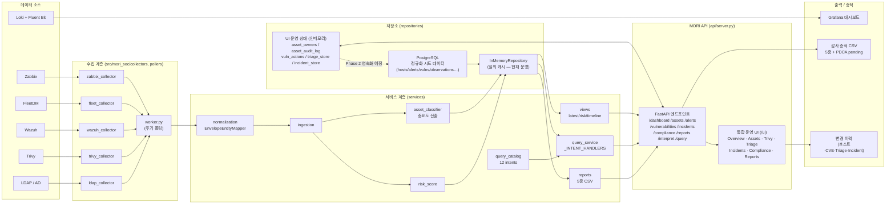

# MORI SOC — Audit-Ready Security Operations


-yellow)


## TL;DR

`docker compose up -d` 한 줄로 띄우는 **ISMS-P / ISO 27001 감사 증적 누적 플랫폼**. Zabbix · FleetDM · Wazuh · Trivy · Loki를 통합하여 자산·취약점·경보·인시던트 + 통제 점검을 한 화면(`/ui`)에서 운영하고, 모든 변경을 *who / when / what* 단위로 자동 누적합니다.

- 🎯 **대상** — 보안 담당자 1~2명 + IT 헬프데스크로 ISMS-P / ISO 27001을 준비해야 하는 중소형 조직
- 🚀 **한 줄 시작** — `./scripts/mori-start-demo.sh` → `http://localhost:18000/ui` (`admin / 1234`, 데모 전용)
- 📊 **화면** — 통합 대시보드 · Alert Triage · 인시던트 · 자산/취약점 · Compliance PDCA · 5종 감사 증적 CSV
- 🧾 **자동 증적** — 자산 담당자·중요도, 호스트/CVE 단위 조치 계획·예외, Triage·인시던트 상태 변경
- ⚠️ **Alpha** — 시드 + 인메모리 store 기반. PostgreSQL 영속화·실시간 폴러는 다음 마일스톤 ([Integrations & 확장 방향](#-integrations--확장-방향) 참조)

> ⚠️ **Alpha / Work in Progress** — 일상 보안 운영 + 감사 증적 누적 시나리오는 동작하지만, 데이터 영속성과 실시간 폴링은 다음 마일스톤입니다. 실제 데이터는 **시드(sample data) + 인메모리 store** 기반입니다.

오픈소스 보안 도구를 통합하여 **ISMS-P / ISO 27001 인증 심사에 필요한 증적·통제 점검·조치 이력**을 한 곳에서 수집·관리·내보내기 할 수 있도록 만든 경량 SOC 플랫폼입니다.

> **목표:** 중소형 조직에서 IT 헬프데스크 + 담당자 1명이 `docker compose` 한 줄로 배포하여 ISMS-P / ISO 27001 준비와 일상 보안 운영을 같이 할 수 있는 **"Compliance-Evidence Platform"**

| 영역 | 도구 | MORI 역할 |
|---|---|---|
| 인프라 모니터링 | Zabbix | 자산 현황·가용성 증적 |
| 로그 중앙화 | Loki + Fluent Bit | 로그 수집·보관 증적 |
| 엔드포인트 관리 | FleetDM | 자산 식별·구성 점검 |
| 보안 이벤트 | Wazuh | 경보 탐지·트리아지 증적 |
| 취약점 스캔 | Trivy | 취약점 점검·조치 계획·예외 처리 증적 |
| 시각화 | Grafana | 운영 현황 대시보드 |
| 통합 운영 UI | **MORI API** (`/ui`) | 통제·자산·취약점·알람·인시던트 통합 + 감사 로그 |

---

## 🗺️ Architecture Diagram



> 실선은 현재 운영 중인 흐름. PostgreSQL은 **정규화 시드 데이터**(hosts/alerts/vulns/observations)를 보유하며 부팅 시 InMemoryRepository로 로드되어 질의에 사용됩니다. UI 운영 상태(triage / incidents / asset owners / vuln actions / asset audit log) 5종은 현재 인메모리에서 동작하며, **점선 = 다음 마일스톤(Postgres 영속화 + 실시간 폴러 활성화)** 입니다.

---

## 🎯 핵심 컨셉 — Audit-Ready

심사에서 자주 요구되는 **"누가, 언제, 어떤 데이터로, 어떤 결정을 내렸는가"** 를 모든 컴플라이언스 민감 영역에서 자동으로 누적합니다.

| 영역 | 기록되는 변경 | 저장 위치 |
|---|---|---|
| 자산 담당자 / 팀 / 카테고리 / **중요도** | `field`, `old_value`, `new_value`, `changed_by`, `changed_at` | `asset_audit_log` (호스트별) |
| 호스트 단위 조치 계획 / 조치 예외 | 동일 (계획 내용·목표일·예외 만료일·사유) | `asset_audit_log` |
| **CVE별 조치 계획 / 조치 예외** | `vuln_plan_text [CVE-…]` / `vuln_exception_until [CVE-…]` 등 라벨로 동일 호스트 이력에 통합 | `asset_audit_log` (호스트별 📋 이력 모달에서 일괄 조회) |
| Alert Triage 상태 변경 (🔴🟡🟢) | `status`, `note`, `analyst`, `changed_by`, `changed_at` | `triage_store` + history |
| 인시던트 변경 이력 | 상태·담당자·영향도·노트 변경 + 작성자/시각 | 인시던트 history (`/incidents/{id}/history`) |

### 호스트 단위 vs CVE별 — UX 일관성

호스트 단위 일괄 계획과 CVE별 상세 계획이 충돌하지 않도록 안내 모달이 자동 노출됩니다.

- 호스트에 **CVE별 조치 계획/예외**가 1건이라도 있으면, 호스트 단위 편집 시 *"상세 계획이 정해져 있습니다. 합계 탭을 확인해 주세요"* 모달이 떠서 합계 탭(CVE별 편집 화면)으로 이동을 권유합니다.
- 변경 이력은 호스트의 📋 이력 모달 하나에서 호스트 단위 + CVE별 변경이 시간순으로 통합 표시됩니다.

---

## 🗺️ 현재 상태 한눈에 보기

### ✅ What works now — 시드 + 인메모리 store 기반 동작

| 카테고리 | 기능 | 비고 |
|---|---|---|
| **인증/권한** | 로그인 / 세션 / RBAC (역할별 탭 on·off) / 가입 요청·승인 | 데모 계정 `admin` / `security` / `moniter` (비밀번호 `1234`) — **seeded sample data only · 데모 전용. 운영 배포 시 반드시 변경** |
| **개요 (Overview)** | 자산·경보·취약점 요약 카드 + Critical 취약점 상세 모달에 **조치 계획 / 조치 예외** 컬럼 노출 | 호스트별 진행 상태를 대시보드에서 즉시 확인 |
| **자산 (서버 / PC / Trivy)** | 호스트별 담당자·팀·카테고리 편집 + **서버 자산 중요도 수동 재정의** | 자동 분류(asset_classifier)보다 우선 적용. 변경분 감사 로그 |
| **취약점 관리 (Trivy)** | 호스트 단위 조치 계획 / 조치 예외 + **CVE별 상세 조치 계획 / 조치 예외** | 작성자·목표일·만료일·사유 기록. 충돌 안내 모달 |
| **🚨 Alert Triage** | 3단계 상태(🔴🟡🟢) 변경, 분석관·**변경자(actor)** 분리 기록, 이력 표시 | UI에서 actor 미입력 시 세션 사용자 → "unknown" fallback |
| **📋 인시던트 관리** | 생성·상태변경·노트·날짜필터·텍스트검색·CSV 다운로드 + 변경 이력 | CSV 다운로드 시 "변경 내역 미포함" 안내 모달 표시 |
| **✅ Compliance PDCA** | Plan/Do/Check/Act 4단계 카드, 카테고리별 Pass/Fail/Warning 표 | **Do 카드 클릭 → 미조치 항목 모달** (통제 + Trivy + Alert 통합) |
| **미조치 / 기한 초과** | 통제 점검(fail/warning) + Trivy critical/high + Alert critical/high(7일) 통합 표시 | **📥 CSV 다운로드** (`/compliance/pdca/pending.csv`) |
| **📥 감사 증적 리포트** | 자산·계정·로그·취약점·월간 5종 CSV | **🔍 미리보기 모달**(상위 50행 테이블 미리보기 + 다운로드 버튼) |
| **🔀 교차 검증** | Zabbix × Fleet × Trivy 호스트 매핑 차이 / 미매핑 자산 검출 | source_coverage / orphan check |
| **💬 자연어 질의 (FAB)** | 12개 인텐트 디스패치 (alert_summary, offline_hosts, top_vulnerable_hosts, host_timeline …) | `/interpret` + `/query` |
| **📚 가이드 시스템** | 7종 가이드 어드민 on/off + 직접 편집 | ISMS-P / ISO 27001 운영 가이드 |
| **API 문서** | Swagger `/docs` | FastAPI 자동 생성 |

> ⚠️ **저장소 분리 안내** — PostgreSQL은 **정규화된 시드 보안 데이터**(hosts/alerts/vulnerabilities/observations 등)를 보유하며 부팅 시 InMemoryRepository로 로드되어 질의에 사용됩니다. 한편 **UI 운영 상태 5종**(triage / incidents / asset owners / vuln actions / asset audit log)은 현재 API 프로세스의 인메모리 dict이므로 **재시작 시 초기화**됩니다. Postgres 영속화 매핑은 `repositories/postgres.py` + `schema/002_phase2_compliance_identity.sql`에 코드/스키마가 준비되어 있고 실제 연결만 미완입니다.

### 🟡 In progress / 다음 단계 (다음 마일스톤)

| 항목 | 현황 | 우선순위 |
|---|---|---|
| **UI 운영 상태 → PostgreSQL 영속화** | `repositories/postgres.py` + `schema/002_*.sql` 준비됨. 5종 store 매핑 미연결 | 🔴 높음 |
| **Zabbix API polling** | Collector 구현 완료(`collectors/zabbix_events.py`), 통합 검증 진행 중 | 🔴 높음 |
| **Fleet / Wazuh API polling** | Parser·Collector 준비됨, REST poller(`pollers/fleet.py`, `pollers/wazuh.py`) 미연결 | 🔴 높음 |
| **Trivy JSON ingestion** | Collector 구현 완료, 정기 실행 패키징/자동화 진행 중 | 🔴 높음 |

### 🔲 Planned / 추후 작업

| 항목 | 현황 | 우선순위 |
|---|---|---|
| LDAP 인증 운영 적용 | 코드 준비됨, `LDAP_URL` 설정 시 활성화 | 🟡 중간 |
| PDF 증적 리포트 | CSV 미리보기만 지원 (5종 CSV 출력 완료) | 🟡 중간 |
| Slack / Email 알림 webhook | 미연결 (`SLACK_WEBHOOK_URL` 설정점만 존재) | 🟡 중간 |
| Phase 3 — 조사형 multi-hop pivot 에이전트 | 미착수 | 🟢 낮음 |

---

## 🚀 Quick Start

### 데모 모드 (샘플 데이터)

```bash
# 한 줄로 .env 생성 → API 기동 → 스키마/시드 → 데모 인시던트 → 워커
./scripts/mori-start-demo.sh
```

→ `http://localhost:18000/ui` 에서 `admin / 1234` 로 로그인.

### 데모 종료

```bash
./scripts/mori-stop-demo.sh             # 시드 데이터만 삭제 + 컨테이너 정지 (실제 폴러 데이터 보존)
./scripts/mori-stop-demo.sh --keep      # 시드만 삭제, 컨테이너는 유지
./scripts/mori-stop-demo.sh --purge     # 컨테이너 + 볼륨 통째로 제거
```

### 데모 화면 미리보기

데모 모드를 기동하면 아래와 같이 동작합니다.

#### 1) 통합 대시보드 — 자산·경보·취약점 현황 한눈에


- 상단 카드: Total Hosts / Offline Hosts / High Alerts 24h / Critical Vulns
- Latest Host Status: offline / unknown 호스트를 우선 노출하여 즉시 확인 대상 식별
- 좌측 탭: **대시보드 / Alert Triage / 인시던트 / 자산 현황 / Compliance PDCA / 가이드 & 기준** (RBAC 역할별 on·off)

#### 2) 자연어 질의 (NLQ) — `interpret` → `query`


- "오프라인 호스트 보여줘" 같은 한국어 질문을 입력하면 12개 인텐트 중 매칭되는 항목으로 해석
- **Interpret** → 의도 표시(`offline_hosts`) / **Run Query** → 결과 + 요약 문장 / **Download CSV** → 증적용 다운로드
- 결과 테이블: Source / Summary / Record ID

#### 3) 취약점 (Trivy) — CVE별 조치 계획·예외


- 호스트별 Critical / High / Medium / Low 합계와 최근 CVE / 탐지일
- **조치 계획** / **조치 예외** 컬럼: `+ 계획 추가` / `+ 예외 설정` 버튼 또는 설정된 값 표시
- 호스트에 호스트 단위 계획·예외가 설정되면 "📋 CVE별 상세 계획"·만료일이 즉시 노출되며, **CVE 상세 모달(N건 ↗ 버튼)** 안에서도 호스트 단위 계획/예외 배너 + 각 CVE 행에 "호스트 단위 적용" 표시로 확인 가능
- **📋 이력** 버튼으로 호스트별 변경 이력(자산·계획·예외·CVE별 조치) 통합 조회

### 데모 공개 서버 (Demo Only)

> ⚠️ **아래 URL과 계정은 포트폴리오 데모용 인스턴스입니다.** 시드 데이터 + 인메모리 store 기반이며, 실제 운영 데이터가 아닙니다. 운영 환경에서는 **반드시 자체 도메인·HTTPS·강력한 비밀번호로 재배포**해야 합니다.

| 항목 | 데모 값 | 비고 |
|---|---|---|
| MORI Web UI (메인 포털) | `mori.rmstudio.co.kr:37854` | 데모 전용 |
| MORI API / 통합 운영 UI | `mori.rmstudio.co.kr:18000/ui` | 데모 전용 |
| Grafana | `mori.rmstudio.co.kr:13000` | 데모 전용 |
| Zabbix Web | `mori.rmstudio.co.kr:18081` | 데모 전용 |
| FleetDM | `mori.rmstudio.co.kr:1337` | 데모 전용 |
| 데모 계정 | `admin` / `security` / `moniter` (비밀번호 `1234`) | **seeded sample data only · 데모 전용. 운영 배포 시 즉시 비밀번호 변경 + RBAC 재설정 필수** |

배포 동작: `docker compose down && docker compose up -d` (GitHub Actions가 `/backup/rmstudio/mori`로 rsync 후 동일 명령을 수행).

### 개별 스크립트

```bash
./scripts/mori-seed-sample-data.sh        # 샘플 데이터만 (재)삽입
./scripts/mori-run-workers.sh start       # 워커 시작
./scripts/mori-run-workers.sh status      # 상태 확인
./scripts/mori-run-workers.sh cycle       # 수동 1회 수집 사이클
./scripts/mori-run-workers.sh logs        # 로그 확인
./scripts/mori-run-workers.sh stop        # 워커 중지
./scripts/trivy-fs-scan.sh .              # 파일시스템 취약점 스캔
./scripts/trivy-image-scan.sh <image>     # 이미지 취약점 스캔
```

---

## 🧱 아키텍처 / 모듈 구성

```text
src/mori_soc/
├── api/
│   ├── server.py          ← FastAPI 엔드포인트 + 통합 운영 UI(/ui) HTML/JS
│   └── contracts.py       ← QueryRequest/Response, EvidenceRef, QueryScope
├── collectors/            ← Fleet · Wazuh · Zabbix · Trivy · LDAP 수집기
├── pollers/               ← 각 소스별 주기 폴러 (worker.py 가 오케스트레이션)
├── services/
│   ├── normalization.py   ← EnvelopeEntityMapper (host 자동 생성, alias 등록)
│   ├── ingestion.py       ← 수집 인제스천 파이프라인
│   ├── risk_score.py      ← Risk score 계산
│   ├── query_catalog.py   ← 12 intent 정의 (TemplateQuery)
│   ├── query_service.py   ← intent 디스패치 (_INTENT_HANDLERS 레지스트리)
│   ├── views.py           ← 논리 뷰 집계 (latest_host_status / risk_summary / timeline)
│   ├── reports.py         ← 5종 감사 증적 리포트 빌더 + report_to_csv
│   └── asset_classifier.py← 자산 자동 분류 + 중요도 산출 (manual override 가능)
├── repositories/
│   ├── memory.py          ← InMemoryRepository / InMemoryQueryStore (시드 로드 후 질의용 — 현재 운영)
│   └── postgres.py        ← Postgres 저장소 (정규화 시드 보유 + UI 운영 상태 영속화 매핑 준비)
├── models/entities.py     ← Host, HostAlias, Alert, Vulnerability, ControlCheckResult …
└── worker.py              ← 폴러 오케스트레이터
```

### 저장 영역 분리

| 저장 영역 | 현재 상태 | 위치 |
|---|---|---|
| **Normalized security data** (hosts / alerts / vulnerabilities / observations / fleet_query_results / control_checks / directory_accounts / source_syncs …) | PostgreSQL **시드 스키마 + 시드 데이터** 적재. 부팅 시 InMemoryRepository로 로드되어 질의에 사용 | `schema/001_phase1_initial.sql`, `repositories/postgres.py`, `repositories/memory.py` |
| **UI operational state — 인메모리 5종** (재시작 시 초기화) | API 프로세스의 모듈 스코프 dict로 동작 중. Postgres 영속화 미연결 | `api/server.py` |
| Phase 2 영속화 (5종 store → Postgres) | 🔲 Planned — `schema/002_phase2_compliance_identity.sql` + `repositories/postgres.py`에 매핑 코드/스키마 준비됨 | — |

#### 인메모리 5종 store 상세

| 변수 | 내용 |
|---|---|
| `asset_owners` | hostname → {owner, team, importance, category, …} |
| `asset_audit_log` | hostname → list of {field, old_value, new_value, changed_by, changed_at} |
| `vuln_actions` | vuln_id → {plan_text, plan_target_date, plan_updated_by, exception_until, exception_reason, exception_updated_by} |
| `triage_store` | alert_id → {status, analyst, note, changed_by, changed_at, history[]} |
| `incident_store` | incident_id → {…, history[]} |

→ Phase 2의 다음 마일스톤은 위 5개 store를 **PostgreSQL 테이블로 매핑**하여 영속화하는 것.

### 12개 자연어 질의 인텐트

| # | intent | 설명 |
|---|---|---|
| 1 | `alert_summary` | 지난 N시간 high/critical 경보 요약 |
| 2 | `offline_hosts` | 현재 오프라인/unknown 호스트 |
| 3 | `fleet_checkin_gap` | Fleet 체크인 누락 호스트 |
| 4 | `top_vulnerable_hosts` | 취약점 상위 호스트 Top N |
| 5 | `host_timeline` | 특정 호스트 타임라인 (alert+query+obs 병합) |
| 6 | `host_wazuh_alerts` | 특정 호스트 Wazuh 경보만 조회 |
| 7 | `host_fleet_queries` | 특정 호스트 Fleet 쿼리 결과 |
| 8 | `new_high_vulns` | 최근 신규 high+ 취약점 |
| 9 | `risky_hosts` | 경보 多 + offline/unknown 호스트 |
| 10 | `unmapped_assets` | Fleet/Wazuh/Zabbix 미매핑 자산 |
| 11 | `login_failure_spike` | 로그인 실패 급증 호스트 |
| 12 | `collection_errors` | 수집 오류 반복 호스트 |

#### 새 Intent 추가 방법

`QueryService._INTENT_HANDLERS` 딕셔너리로 intent → 핸들러 메서드를 디스패치합니다. 새 intent 추가는 3단계입니다.

1. `services/query_catalog.py` — `PHASE1_QUERY_CATALOG`에 `TemplateQuery` 추가
2. `services/query_service.py` — `_INTENT_HANDLERS`에 `"my_new_intent": "_my_new_intent"` 한 줄 + 핸들러 메서드 구현
3. `tests/test_query_service.py` — 동작 테스트 추가

`execute()`는 수정 불필요 — 자동 라우팅됩니다.

---

## 🔌 주요 API 엔드포인트

| 카테고리 | 메서드 / 경로 | 설명 |
|---|---|---|
| Health / Catalog | `GET /health`, `GET /catalog` | 헬스체크, 질의 카탈로그 |
| Query | `POST /query`, `POST /interpret` | 구조화 질의 / 자연어 해석 |
| Dashboard | `GET /dashboard/summary` | 개요 카드 + Critical 취약점 상세(plan/exception 포함) |
| Assets | `GET /assets`, `POST /assets/owners` | 자산 목록 / 담당자·중요도 변경(감사 로그) |
| Alert Triage | `PATCH /alerts/{id}/triage` | 상태/분석관/노트 변경 + actor 기록 |
| Vulnerability Actions | `PUT/DELETE /vulnerabilities/{id}/plan`, `/exception` | CVE별 조치 계획·예외 + 감사 로그 |
| Incidents | `GET /incidents`, `POST /incidents`, `PATCH /incidents/{id}`, `GET /incidents/{id}/history`, `GET /incidents?format=csv` | 인시던트 CRUD + 이력 + CSV |
| Compliance | `GET /compliance/pdca`, `GET /compliance/crosscheck` | PDCA 집계 / 교차 검증 |
| **Compliance CSV** | `GET /compliance/pdca/pending.csv` | 미조치/기한초과 항목 CSV (출처/통제ID/대상/상태/담당자/조치기한/기한초과/비고) |
| Reports | `GET /compliance/reports`, `GET /compliance/reports/{type}?format=csv` | 5종 감사 증적 리포트 (asset/account/log/vuln/monthly) |

전체 스펙은 Swagger `/docs` 참조.

---


## 🧪 테스트

### 단위 테스트 (Docker)

```bash
# 전체 테스트
docker compose run --rm \
  -v "$(pwd)/tests:/app/tests:ro" \
  mori-api \
  sh -c "pip install -q pytest httpx && python -m pytest /app/tests/ -v"

# 특정 영역만
docker compose run --rm -v "$(pwd)/tests:/app/tests:ro" mori-api \
  sh -c "pip install -q pytest httpx && python -m pytest /app/tests/test_api_server.py -v -k 'alert_triage or pdca or vuln'"
```

### 테스트 파일 목록

| 파일 | 대상 |
|---|---|
| `tests/test_api_server.py` | FastAPI 엔드포인트, PDCA payload, Triage actor, Compliance 통합 |
| `tests/test_query_service.py` | 12개 질의 인텐트 + 뷰 집계 |
| `tests/test_fleet_logs.py` | Fleet osquery 로그 수집기 |
| `tests/test_wazuh_alerts.py` | Wazuh alert 수집기 |
| `tests/test_zabbix_events.py` | Zabbix trigger/item 수집기 |
| `tests/test_trivy_collector.py` | Trivy 취약점 수집기 |
| `tests/test_ingestion.py` | 인제스천 파이프라인 |
| `tests/test_intent_parser.py` | 자연어 → intent 파서 |
| `tests/test_postgres_repository.py` | Postgres 저장소 (DB 필요) |

### API 수동 테스트

```bash
curl http://localhost:18000/health
curl http://localhost:18000/dashboard/summary
curl http://localhost:18000/compliance/pdca
curl -OJ http://localhost:18000/compliance/pdca/pending.csv
curl http://localhost:18000/compliance/crosscheck
curl http://localhost:18000/compliance/reports
curl -OJ "http://localhost:18000/compliance/reports/asset_inspection?format=csv"

curl -X POST http://localhost:18000/interpret \
  -H 'Content-Type: application/json' \
  -d '{"text":"오프라인 호스트 보여줘"}'

curl -X POST http://localhost:18000/query \
  -H 'Content-Type: application/json' \
  -d '{"intent":"offline_hosts","scope":{"time_range":"24h"}}'
```

### 코드 검증 (server.py 변경 시)

`server.py`는 매우 크고 HTML/JS가 Python triple-quoted string 안에 포함됩니다. 편집 후 항상 다음 검증을 수행합니다.

```bash
python3 -c "import ast; ast.parse(open('src/mori_soc/api/server.py').read()); print('AST OK')"
```

추가로 `<script>...</script>` 블록의 중괄호 균형을 확인하는 헬퍼 스크립트(이 README의 Audit-Ready 작업에서 사용)를 활용해 JS 깨짐 여부를 사전에 잡을 수 있습니다.

---

## 📦 배포 / 인프라

### 공개 진입점

| 포트 | 서비스 |
|---|---|
| `37854` | Main Portal (Grafana / Zabbix / Fleet / MORI 링크 hub) |
| `18000` | MORI API + 통합 운영 UI |
| `13000` | Grafana |
| `18081` | Zabbix Web |
| `1337` | FleetDM |
| `127.0.0.1:8443` | Wazuh Dashboard (내부) |

### 서비스 포트

`10051` Zabbix Server · `1514` Wazuh agent · `1515` Wazuh registration · `514/udp` Syslog · `55000` Wazuh API.

### 배포 방식

GitHub Actions workflow가 다음 순서로 동작합니다.

1. 저장소 체크아웃
2. 서버 경로 `/backup/rmstudio/mori` 생성/확인
3. `rsync`로 코드 동기화
4. GitHub Secret의 `.env` 업로드
5. Wazuh 인증서 디렉터리 준비 (최초 1회 인증서 생성)
6. `docker compose pull` → `docker compose up -d --remove-orphans`

**필요한 GitHub Secrets**: `DEPLOY_HOST`, `DEPLOY_PORT`, `DEPLOY_USER`, `DEPLOY_SSH_KEY`, `DEPLOY_ENV_FILE`, `DEPLOY_KNOWN_HOSTS`(선택).

### 필수 환경변수 (`.env`)

`cp .env.example .env` 후 아래 값을 반드시 변경합니다.

- `GRAFANA_ADMIN_PASSWORD`
- `ZABBIX_DB_PASSWORD`
- `FLEET_DB_ROOT_PASSWORD`
- `FLEET_DB_PASSWORD`
- `FLEET_SERVER_PRIVATE_KEY`
- `MORI_DB_PASSWORD`
- `MORI_API_PORT` (기본 18000), `MORI_DB_NAME` (기본 mori_soc), `MORI_DB_USER` (기본 mori)

### 서버 사전 준비

- Docker Engine + Compose Plugin
- 배포 디렉터리: `/backup/rmstudio/mori`
- Wazuh Indexer용 커널: `vm.max_map_count=262144`

### 캐시 재빌드 (데이터 볼륨 유지)

```bash
docker builder prune -f
docker compose build --no-cache mori-api
docker compose up -d mori-api
```

---


## 🌱 시딩되는 샘플 데이터

초기 시드 스크립트(`mori-seed-sample-data.sh`)로 **PostgreSQL에 적재**되는 항목 (이후 부팅 시 InMemoryRepository로 로드되어 질의에 사용):

| 항목 | 수량 | 설명 |
|---|---|---|
| Hosts | 10 | 서버, PC, 방화벽, VPN 등 다양한 자산 |
| Host Aliases | 13 | Zabbix/Fleet/Trivy 소스별 매핑 |
| Alerts | 8 | Wazuh/Zabbix — SSH brute force, rootkit, disk/CPU 경보 등 |
| Vulnerabilities | 8 | Trivy 6 + Fleet 2 — CVE 기반 critical~medium |
| Observations | 9 | Zabbix/Fleet — CPU, Disk, Memory, 암호화 상태 |
| Fleet Query Results | 8 | osquery — 설치앱, 디스크 암호화, 시작 프로그램 등 |
| Control Checks | 12 | ISO 27001 / ISMS-P 통제 항목 점검 결과 |
| Directory Accounts | 7 | LDAP 사용자 (관리자, 개발자, DBA 등) |
| Privilege Bindings | 6 | sudo, domain_admin, db_admin 권한 |
| Group Memberships | 8 | Domain Admins, Developers, DBA 등 |
| Source Syncs | 4 | Zabbix/Fleet/Trivy/Wazuh 수집 상태 |

API 인메모리 저장(재시작 시 초기화)으로 별도 생성되는 항목:

| 항목 | 수량 | 생성 시점 |
|---|---|---|
| Incidents | 3 | `mori-start-demo.sh`가 시드 후 `POST /incidents` 호출 |
| Triage / 자산 담당자 / 취약점 조치 / 인시던트 변경 | 0 | UI에서 직접 변경 시 누적 |

---

## 📖 참고 문서

| 문서 | 내용 |
|---|---|
| `docs/FUNCTIONAL_SPEC.md` | 기능 정의서 원문 |
| `docs/SECURITY_CONTROL_MAPPING.md` | 보안 통제(Security Controls) 매핑 |
| `docs/IMPLEMENTATION_ROADMAP.md` | 기능 정의서 기준 구현 로드맵 |
| `docs/SECURITY_DATA_QUERY_PLATFORM.md` | 데이터 중심 보안 질의 플랫폼 설계 |
| `docs/MORI_IMPLEMENTATION_SUMMARY.md` | 구현 현황·운영 전략·다음 단계 요약 |
| `docs/PHASE1_INPUT_SOURCES_AND_SCHEMA.md` | Phase 1 입력 소스·스키마·질의 명세 |
| `docs/PHASE1_LOGICAL_SCHEMA.md` | Phase 1 논리 스키마·테이블 관계 |
| `docs/DEPLOYMENT.md` | 서버 배포·운영·트러블슈팅 가이드 |
| `docs/ZABBIX_AGENT_ACTIVE_SETUP.md` | Zabbix Agent 온보딩 |
| `docs/TRIVY_USAGE.md` | Trivy 파일시스템/이미지 스캔 가이드 |
| `docs/FLEET_MACBOOK_ENROLLMENT_AND_TEST.md` | Fleet macOS 등록·검증 |
| `docs/FLEET_RESET_AND_REINSTALL_GUIDE.md` | Fleet 초기화·재설치 |
| `docs/collection-standards.md` | 수집 표준 |
| `schema/001_phase1_initial.sql` | Phase 1 Postgres 초기 DDL |
| `schema/002_phase2_compliance_identity.sql` | Phase 2 Compliance/Identity DDL |

---

## 🔌 Integrations & 확장 방향

MORI SOC는 오픈소스 보안 도구를 결합해 단일 운영 화면을 제공하며, 추후 **Zabbix 생태계 템플릿 / 경량 Agent 패키지로 배포**하는 방향까지 확장 예정입니다. Zabbix만 운영 중인 조직에서도 MORI의 자산·통제 점검·증적 누적 컨셉을 부분 도입할 수 있도록 하는 것이 목표입니다.

### 현재 통합 (Phase 1 / Phase 2 Alpha)

| 도구 | 통합 방식 | 상태 |
|---|---|---|
| **Zabbix** | trigger / item collector(`collectors/zabbix_events.py`) → ingestion. 자산 가용성 + CPU·Disk·Memory 관측치 누적 | 🟡 통합 검증 중 |
| **FleetDM** | osquery 결과 + 호스트 등록 정보 normalization. 자산 식별 + 미매핑(orphan) 검출 | 🟡 parser/collector 준비됨, REST poller 미연결 |
| **Wazuh** | alert ingestion → 트리아지 파이프라인. SSH brute force / rootkit 등 보안 이벤트 증적 | 🟡 parser/collector 준비됨, REST poller 미연결 |
| **Trivy** | JSON 결과 ingest → CVE별 조치 계획·예외 + 호스트 단위 일괄 적용 | 🟡 자동 적재 패키징 중 |
| **Loki + Fluent Bit** | 로그 중앙화 (Grafana 시각화 경유) | ✅ 동작 |
| **LDAP / AD** | 디렉토리 계정 + 권한 바인딩 정합성 점검(시드) | 🔲 운영 적용 시 `LDAP_URL` 활성화 |
| **Grafana** | Postgres / Loki를 직접 조회하는 운영 대시보드 | ✅ 동작 |

### 🔭 확장 로드맵

1. **Zabbix 공식 템플릿 패키지로 배포** — MORI에서 정의한 자산·통제 점검·감사 증적 항목을 Zabbix 템플릿 YAML로 export하여, Zabbix만 운영 중인 조직에서도 MORI 컨셉을 부분 도입 가능.
   - *예상 산출물*: `templates/zabbix/mori-soc-template.yaml` + 가져오기 가이드 + Zabbix Share 등록
2. **MORI Agent 패키징** — 호스트 단위 수집/리포트용 경량 에이전트 (Linux systemd timer / macOS launchd) — Trivy 정기 스캔 + 결과 ingest 자동화 + Wazuh agent 보완
3. **Postgres 영속화 + REST poller 활성화** — 위 통합 도구의 라이브 데이터로 시드를 대체 (UI 운영 상태 5종 store 영속화 포함)
4. **Webhook 연동** — Slack / Teams / Email 알림 (`SLACK_WEBHOOK_URL` 자리만 존재)
5. **Phase 3 — 조사형 multi-hop pivot 에이전트** — alert → host → user → 다른 host로 이어지는 조사 자동화

---

## 🛣️ 다음 작업 후보

### 🔴 데이터 신뢰성

1. **PostgreSQL 영속화** — `asset_owners`, `asset_audit_log`, `vuln_actions`, `triage_store`, `incident_store` 5개 인메모리 store를 `repositories/postgres.py`로 매핑.
2. **실시간 수집 연동** — Zabbix · Fleet · Wazuh API 폴링을 `pollers/`에서 활성화 (현재 코드만 준비).

### 🟡 운영 안정성

3. **LDAP 인증** — `LDAP_URL` 환경변수 설정 + 조직 AD/LDAP 검증.
4. **HTTPS / 리버스 프록시** — Nginx/Caddy + TLS.
5. **PDF 증적 리포트** — CSV 미리보기 외 PDF 출력 추가.

### 🟢 기능 확장

6. **Trivy 자동 적재** — 온디맨드 스캔 결과를 ingestion 경로로 자동 적재.
7. **대시보드 보강** — source health, collector lag, 잔여 SLA 시각화.
8. **Phase 3 — 조사형 에이전트** — host/user/ip 다단계 pivot + 교차검증 자동화.

---

## 🔁 이어서 작업할 때 사용할 프롬프트

다른 환경에서 작업을 이어갈 때 가장 빠른 컨텍스트 복원 프롬프트:

```
이 저장소는 MORI SOC-lite (Audit-Ready Compliance-Evidence Platform).
Phase 1(데이터 수집/정규화 코어) 완료, Phase 2(관제 질의 엔진 + 운영 UI) Alpha 운영 중.
README의 "현재 상태 한눈에 보기"와 src/mori_soc/api/server.py,
docs/SECURITY_DATA_QUERY_PLATFORM.md, schema/*.sql을 확인하고
다음 우선순위(영속화 + 실시간 폴링)를 이어서 진행해줘.
```

### 짧은 버전

```
이 저장소 MORI SOC-lite에서 Phase 2 영속화/실시간 폴링 이어서 해줘.
README의 "🗺️ 현재 상태", src/mori_soc, schema/*.sql 읽고 바로 이어서.
```

---

## 📌 현재 상태 요약

| 구분 | 상태 |
|---|---|
| 인증·RBAC·자산·취약점·Triage·인시던트·PDCA·증적 리포트 | ✅ 운영 가능 (인메모리, 재시작 시 초기화) |
| 자산/취약점/Triage/인시던트 **변경 감사 로그** | ✅ 누적 (CVE별 라벨 포함) |
| PDCA Do 카드 클릭 → 미조치 모달 + CSV 다운로드 | ✅ 동작 |
| 감사 증적 리포트 미리보기 모달 | ✅ 동작 (5종) |
| 인시던트 CSV "변경 내역 미포함" 안내 모달 | ✅ 동작 |
| 대시보드 자산·경보 데이터 | ⚠️ 시드 + 인메모리 기반 (실시간 폴링 미연결) |
| PostgreSQL — 정규화 보안 데이터 (Phase 1 스키마) | ✅ 시드 적재 + 부팅 시 로드 |
| PostgreSQL — UI 운영 상태 5종 영속화 (Phase 2) | 🔲 미완 (`schema/002_*.sql` + `repositories/postgres.py` 매핑 준비됨) |
| Zabbix API polling | 🟡 In progress (Collector 구현 완료, 통합 검증 중) |
| Fleet / Wazuh API polling | 🔲 미완 (Parser·Collector 준비됨, REST poller 미연결) |
| Trivy JSON ingestion | 🟡 In progress (Collector 구현 완료, 자동화 패키징 중) |

`./scripts/mori-start-demo.sh` 한 줄로 전체 기능을 체험할 수 있습니다.
운영 환경에서는 `docker compose down && docker compose up -d` 로 적용합니다.
