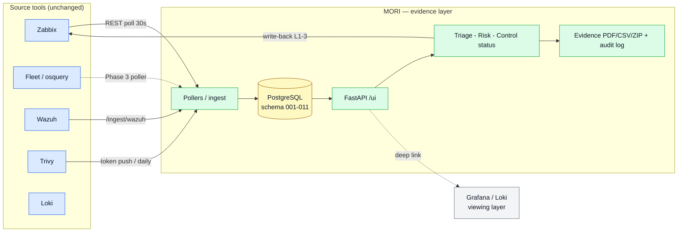

# MORI SOC — API Design

FastAPI (Python 3.12). `server.py` is a thin orchestrator that assembles a `RouteContext` and registers ~16 domain modules under [`src/mori_soc/api/routes/`](../src/mori_soc/api/routes/). OpenAPI is served at `/docs`.

## Auth & access model

| Mechanism | Where | Notes |
|---|---|---|
| **Session cookie** `mori_session` | browser `/ui`·`/admin` | issued by `POST /auth/login` (httponly, 7-day); local users + optional LDAP bind |
| **RBAC roles** | per request | `admin · security · monitor · auditor · helpdesk · user`. Risk/controls/evidence = `admin·security`; infra/help-desk see only their own servers |
| **Ingest token** | `POST /ingest/*` | `MORI_INGEST_TOKEN` via `Authorization: Bearer` or `X-MORI-Token` (session fallback) |
| **Language** | any | `?lang=`/`mori_lang` cookie → KO/EN response where localized (e.g. `/guides`) |

**Conventions** — JSON in/out; `200` ok · `400` bad body · `401` unauth · `403` role · `404` missing · `503` backend (e.g. ingest needs `MORI_DATABASE_URL`). Reads hit the query backend live per request; writes are cache-aside + write-through to Postgres.

---

## Endpoints by domain

### Auth · profile
`GET /login` · `POST /auth/login` · `GET /auth/logout` · `GET /auth/me` · `GET|POST /auth/profile` · `POST /auth/signup-request` · `GET /auth/signup-requests` · `PATCH /auth/signup-requests/{req_id}`

### Pages · health
`GET /` · `GET /ui` · `GET /admin` · `GET /catalog` · `GET /health` (insecure-config warning when demo creds/no token)

### Dashboard · query
`GET /dashboard/summary` · `POST /query` · `POST /interpret` (NLQ) · `GET|POST /dashboard/preferences` · `GET|POST /admin/dashboard/preferences` · `GET /admin/dashboard/user-preferences` · `DELETE /admin/dashboard/user-preferences/{username}`

### Assets
`GET /assets` (fleet+zabbix+trivy rollup) · `POST /assets/refresh` (on-demand poll: zabbix\|fleet\|wazuh\|trivy) · `GET|POST /assets/owners` · `DELETE /assets/owners/{hostname}` · `GET|PUT /assets/plans/{host_id}` · `GET /fleet/hosts` · `GET /zabbix/hosts` · `GET /trivy/vulnerabilities`

### Alerts · Triage · Incidents
`GET /alerts` · `PATCH /alerts/{alert_id}/triage` · `POST /alerts/{alert_id}/zabbix/suppress` · `POST /alerts/{alert_id}/zabbix/unsuppress` · `GET|POST /incidents` · `PATCH /incidents/{incident_id}` · `POST /incidents/{incident_id}/notes`

### Vulnerabilities · Risk
`GET /vulnerabilities/{vuln_id}/action` · `PUT /vulnerabilities/{vuln_id}/plan` · `PUT|DELETE /vulnerabilities/{vuln_id}/exception` · `GET|PUT /vulnerabilities/{vuln_id}/risk` (3×3 matrix) · `GET /vulnerabilities/risk-summary` · `GET|PUT /settings/risk`

### Compliance · Control catalog
`GET /compliance/pdca` · `GET /compliance/pdca/pending.csv` · `GET /compliance/reports` · `GET /compliance/reports/{report_type}` · `GET /dashboard/evidence-gaps` · `GET /dashboard/host-remediation/{hostname}` · `GET /controls/tree` (incl. `coverage.review` reviewed/draft) · `GET /controls/detail/{id}` · `PUT /controls/status/{id}` · `POST /controls` · `DELETE /controls/{id}` · `POST /controls/import-nlp` · `GET|PUT /controls/claude-key`

### Evidence (catalog)
`GET /controls/detail/{id}/evidence.pdf` · `…/evidence.csv` · `GET /controls/evidence-bundle.zip?scope=mapped|all` · `GET|POST /controls/detail/{id}/evidence-records` · `POST …/evidence-records/auto` (dated live snapshot) · `DELETE …/evidence-records/{evidence_id}` · `GET|POST /controls/evidence-snapshot/config` · `POST /controls/evidence-snapshot/run`

### Account governance
`GET /accounts/overview` · `GET /accounts/overview.csv` · `GET /accounts/host/{host_key}` · `…/privileged` · `GET|POST /accounts/approvals` · `DELETE /accounts/approvals/{id}` · `POST /accounts/approval-requests` · `POST /accounts/approvals/{id}/approve|reject` · `GET|POST /accounts/view-roles`

### Guides · settings · webhooks
`GET /guides` · `GET /guides/{id}` (KO/EN by `?lang=`) · `PUT /guides/{id}` · `GET|POST /webhooks` · `DELETE /webhooks/{id}` · `POST /webhooks/{id}/test`

### Admin: audit · RBAC · LDAP
`GET /admin/action-audit-log` · `POST /admin/action-audit-log` · `GET /admin/audit-log` · `GET /admin/logs` · `GET|POST /admin/role-permissions` · `GET /admin/user-tab-permissions` · `POST|DELETE /admin/user-tab-permissions/{username}` · `GET /admin/ldap/status` · `GET|POST /admin/ldap/users` · `POST /admin/ldap/users/{uid}/password|role` · `DELETE /admin/ldap/users/{uid}`

### Ingest (token-gated, push)
| Endpoint | Source → | Effect |
|---|---|---|
| `POST /ingest/trivy` | Trivy scan JSON | vulnerabilities + evidence |
| `POST /ingest/wazuh` | Wazuh alert(s) | → Alert Triage queue |
| `POST /ingest/evidence` | CSOP before/after diff | evidence envelope |
| `POST /ingest/accounts` | osquery local accounts | `host_accounts` (governance) |
| `GET /evidence` | — | list ingested evidence |

---

## Data flow (read-only evidence layer)

See also: [DB ERD](./DB_ERD.md) · [collection standards](./collection-standards.md) · [full reference](../README_FULL.md).
