# MORI SOC — DB Architecture & ERD

PostgreSQL, applied as ordered migrations in [`schema/`](../schema/) (`001` → `011`). The schema splits into **three layers**:

| Layer | Purpose | Written by | Tables |
|---|---|---|---|
| **A. Normalized source-of-truth** | Poller/ingest output — assets, alerts, vulns, accounts | worker / `/ingest/*` | `hosts` `host_aliases` `alerts` `vulnerabilities` `host_observations` `query_results` `source_syncs` `directory_accounts` `privilege_bindings` `group_memberships` `host_accounts` `account_approvals` |
| **B. UI operational state** | Operator judgements that must survive restarts (cache-aside + write-through) | `/ui` via `StateRepository` | `ui_triage_state` `ui_vuln_actions` `ui_risk_register` `ui_asset_owners` `ui_asset_audit_log` `ui_user_profiles` `ui_evidence_events` `ui_settings` |
| **C. Control catalog & evidence** | ISMS-P/ISO controls, per-control status & evidence | catalog sync + `/ui` | `controls` `control_mappings` `control_defects` `control_status` `catalog_controls` `control_evidence` `control_check_results` |

> **Design note** — only Layer A uses enforced foreign keys (`REFERENCES hosts(...)`). Layers B and C key off **business keys** (`hostname`, `vuln_id`, `alert_id`, `control_id`) rather than hard FKs, so operator state and catalog edits survive re-ingestion/re-sync of source data without cascade deletes. Logical joins are drawn dashed below.

---

## ERD

```mermaid
erDiagram
    %% ── Layer A: normalized source-of-truth ─────────────────
    hosts {
        text host_id PK
        text hostname
        text platform
        text primary_ip
        text status
        int  risk_score
        timestamptz last_seen_at
    }
    host_aliases {
        text alias_id PK
        text host_id FK
        text source
        text alias_type
        text alias_value
        bool is_primary
    }
    alerts {
        text alert_id PK
        text source
        text host_id FK
        text severity
        text rule_name
        text message
        timestamptz observed_at
        timestamptz resolved_at
    }
    vulnerabilities {
        text vuln_id PK
        text host_id FK
        text source "fleet|trivy"
        text cve
        text severity
        text package_name
        text fixed_version
        timestamptz detected_at
        timestamptz resolved_at
    }
    host_observations {
        text obs_id PK
        text host_id FK
    }
    source_syncs {
        text source PK
        text status
        timestamptz last_success_at
        int records_collected
    }
    directory_accounts {
        text account_id PK
        text username
        bool is_privileged
        text status
    }
    privilege_bindings {
        text binding_id PK
        text account_id FK
        text privilege_type
        timestamptz expires_at
    }
    group_memberships {
        text membership_id PK
        text account_id FK
        text group_name
        text source
    }
    host_accounts {
        text host_key PK
        text username PK
        text host_type "server|pc"
        bool is_privileged
        bool is_sudo
        jsonb groups
        text source "osquery"
    }
    account_approvals {
        text id PK
        text scope "global|host"
        text host_key
        text username
        text kind "account|sudo"
        date expires
    }

    %% ── Layer B: UI operational state ───────────────────────
    ui_triage_state {
        text alert_id PK
        text status "pending|investigating|resolved"
        text analyst
        text changed_by
        text updated_at
    }
    ui_vuln_actions {
        text vuln_id PK
        text plan_text
        text plan_target_date
        text exception_until
    }
    ui_risk_register {
        text vuln_id PK
        int  impact
        int  likelihood
        int  score
        text treatment
        text residual_level
        text accept_approver
    }
    ui_asset_owners {
        text hostname PK
        text owner
        text team
        text importance
        text category
        text exception_until
    }
    ui_asset_audit_log {
        text log_id PK
        text hostname
        text field
        text old_value
        text new_value
        text changed_by
    }
    ui_user_profiles {
        text username PK
        text display_name
        jsonb assigned_servers
    }
    ui_evidence_events {
        text id PK
        text host_id
        text cve
        text delta_type
        jsonb envelope
        text source "csop"
    }
    ui_settings {
        text key PK
        text value
        text updated_by
    }

    %% ── Layer C: control catalog & evidence ─────────────────
    controls {
        text framework PK "isms-p|iso27001"
        text id PK
        text domain
        text section
        text title_ko
        text title_en
        jsonb evidence_sources
        text status "draft|reviewed"
    }
    control_mappings {
        text isms_p_id PK
        text iso27001_id PK
        text relation "equivalent|subset|related"
    }
    control_defects {
        text id PK
        jsonb controls
        text severity
        text mori_signal
    }
    control_status {
        text control_id PK
        text status "이행|부분이행|미이행|해당없음|미정"
        text owner
        text improvement_plan
        date due_date
        text updated_by
    }
    catalog_controls {
        text control_id PK
        text op "upsert|delete"
        text framework
        jsonb evidence_sources
        text status "draft|reviewed"
        text origin "manual|nlp"
    }
    control_evidence {
        text id PK
        text control_id
        text title
        text body
        text collected_at
        text source "manual|auto"
    }
    control_check_results {
        text check_id PK
        text control_id
        text entity_type
        text entity_id
        text status
        jsonb evidence_refs
    }

    %% ── Enforced FK relationships (Layer A) ──────────────────
    hosts ||--o{ host_aliases : "has"
    hosts ||--o{ alerts : "raises"
    hosts ||--o{ vulnerabilities : "exposes"
    hosts ||--o{ host_observations : "observed"
    directory_accounts ||--o{ privilege_bindings : "grants"
    directory_accounts ||--o{ group_memberships : "member of"

    %% ── Logical joins by business key (dashed) ───────────────
    alerts ||..o| ui_triage_state : "alert_id"
    vulnerabilities ||..o| ui_vuln_actions : "vuln_id"
    vulnerabilities ||..o| ui_risk_register : "vuln_id"
    hosts ||..o| ui_asset_owners : "hostname"
    hosts ||..o{ ui_asset_audit_log : "hostname"
    hosts ||..o{ host_accounts : "host_key"
    host_accounts ||..o{ account_approvals : "host_key+username"
    controls ||..o| control_status : "control_id"
    controls ||..o{ control_evidence : "control_id"
    controls ||..o{ control_check_results : "control_id"
    controls ||..o{ control_mappings : "isms_p_id/iso27001_id"
    controls ||..o| catalog_controls : "admin overlay"
```

---

## Notes

- **`catalog_controls` is an overlay**, not a copy of `controls`. The base catalog ships from [`controls/*.yaml`](../controls/) and is synced into `controls` on boot; admin add/edit/delete and NLP imports land in `catalog_controls` (`op=upsert|delete`, `origin=manual|nlp`) and are layered on top at read time — so re-syncing the base never clobbers admin edits.
- **`control_status` vs `controls.status`** — different axes. `controls.status` = catalog **review** state (`draft|reviewed`, drives the honest coverage %). `control_status.status` = per-control **implementation** state the operator edits (`이행/부분이행/…`).
- **`ui_*` tables are cache-aside + write-through** via `repositories/state_*.py`; the API also runs fully in-memory when `MORI_DATABASE_URL` is unset (demo mode), so every `ui_*` table has an in-memory twin.
- **Evidence provenance** — `control_evidence.source=auto` rows are dated snapshots of live aggregation (host lists, counts) captured via `POST /controls/detail/{id}/evidence-records/auto`; `source=manual` are operator-documented.
- Round-trip persistence is covered by `tests/test_state_persistence.py`.

See also: [API design](./API_DESIGN.md) · [collection standards](./collection-standards.md) · [full reference](../README_FULL.md).
